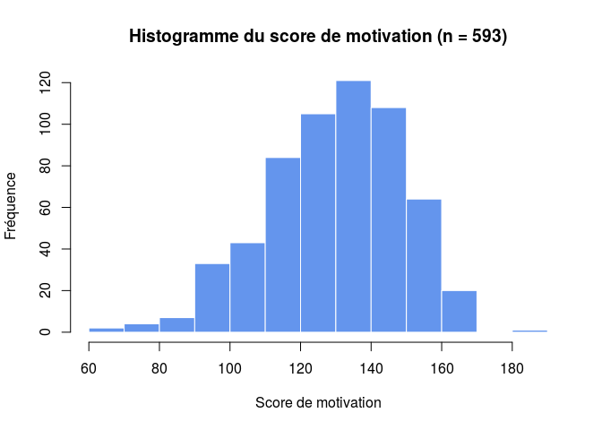
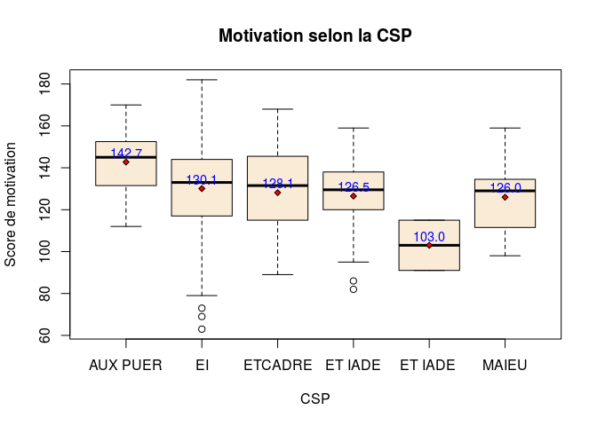
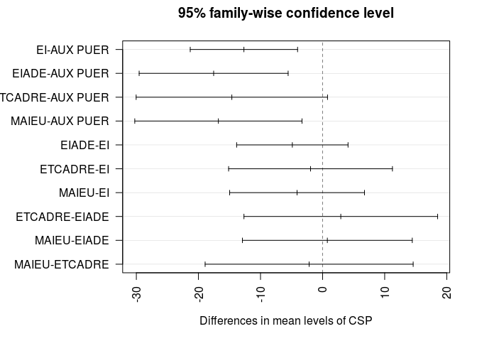
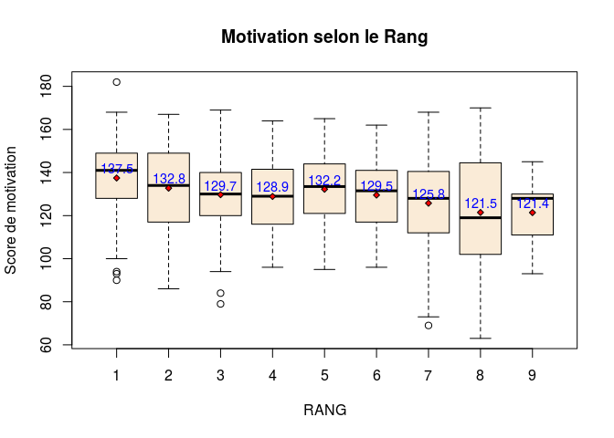
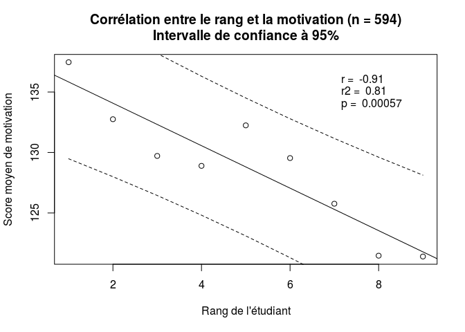

# Motivation et rang de l'étudiant
Sébastien Uffler & JcB  
17/02/2016  

TABLEAU FINAL MASTER 2
=======================

Le fichier __TABLEAU FINAL MASTER 2__ contient les données cumulées des 2 années d'étude soit un peu plus de 500 participants:
- les 400 premiers sont issus de la première étude
- les 100 derniers de la dernière. Ils possèdent une colonne __note__ complétée.

TODO: étude de la corrélation __motivation__ et __rang__, globalement et par catégorie socio-professionnels (CSP)

- les noms de colonnes ne snt pas identiques: QUESTION et QUESTIO
- caractères anormaux dans les colonnes 18,19,20,23

CSP <- as.character(CSP)
CSP[CSP=="ET IADE"] <- "EIADE"
CSP[CSP=="ET IADE "] <- "EIADE"
CSP[CSP=="ETCADRE "] <- "ECADRE"
CSP<-as.factor(CSP)

Session Info
------------

```r
sessionInfo()
```

```
## R version 3.2.3 (2015-12-10)
## Platform: x86_64-pc-linux-gnu (64-bit)
## Running under: Ubuntu 14.04.3 LTS
## 
## locale:
##  [1] LC_CTYPE=fr_FR.UTF-8       LC_NUMERIC=C              
##  [3] LC_TIME=fr_FR.UTF-8        LC_COLLATE=fr_FR.UTF-8    
##  [5] LC_MONETARY=fr_FR.UTF-8    LC_MESSAGES=fr_FR.UTF-8   
##  [7] LC_PAPER=fr_FR.UTF-8       LC_NAME=C                 
##  [9] LC_ADDRESS=C               LC_TELEPHONE=C            
## [11] LC_MEASUREMENT=fr_FR.UTF-8 LC_IDENTIFICATION=C       
## 
## attached base packages:
## [1] stats     graphics  grDevices utils     datasets  methods   base     
## 
## loaded via a namespace (and not attached):
##  [1] magrittr_1.5    formatR_1.2.1   tools_3.2.3     htmltools_0.3  
##  [5] yaml_2.1.13     stringi_1.0-1   rmarkdown_0.9.3 knitr_1.12.3   
##  [9] stringr_1.0.0   digest_0.6.9    evaluate_0.8
```

```r
citation()
```

```
## 
## To cite R in publications use:
## 
##   R Core Team (2015). R: A language and environment for
##   statistical computing. R Foundation for Statistical Computing,
##   Vienna, Austria. URL https://www.R-project.org/.
## 
## A BibTeX entry for LaTeX users is
## 
##   @Manual{,
##     title = {R: A Language and Environment for Statistical Computing},
##     author = {{R Core Team}},
##     organization = {R Foundation for Statistical Computing},
##     address = {Vienna, Austria},
##     year = {2015},
##     url = {https://www.R-project.org/},
##   }
## 
## We have invested a lot of time and effort in creating R, please
## cite it when using it for data analysis. See also
## 'citation("pkgname")' for citing R packages.
```

Analyse du fichier Master2
--------------------------


- on forme une colonne **motivation** qui est la somme des 26 questions posées:


```
##    Min. 1st Qu.  Median    Mean 3rd Qu.    Max.    NA's 
##    63.0   118.0   133.0   130.4   145.0   182.0       1
```

```
## AUX PUER       EI    EIADE  ETCADRE    MAIEU 
##       39      477       37       16       24
```

```
## [1] "Nombre d'étudiants par rang:"
```

```
##            1  2  3  4  5  6  7  8 9
## Rang       1  2  3  4  5  6  7  8 9
## Etudiants 60 89 99 87 94 74 52 32 5
```


La moyenne et la médiane sont proches ce qui permet de considérer (avec l'aspet de l'histogramme) que les données sont sensiblement normales.




Il y a __593 observations__.

On a 3 variables:
  - **motivation** est une variable quantitative
  - **RANG** est une variable qualitative
  - **CSP** est une variable qualitative
  
  Hypothèse: motivation ~ RANG + CSP ?
  
Motivation et CSP
-----------------


```
## AUX PUER       EI  ETCADRE  ET IADE ET IADE     MAIEU 
## 142.7436 130.0692 128.1250 126.5000 103.0000 125.9583
```



```
##              Df Sum Sq Mean Sq F value   Pr(>F)    
## CSP           4   7526  1881.5   5.227 0.000383 ***
## Residuals   587 211283   359.9                     
## ---
## Signif. codes:  0 '***' 0.001 '**' 0.01 '*' 0.05 '.' 0.1 ' ' 1
## 1 observation deleted due to missingness
```

```
##   Tukey multiple comparisons of means
##     95% family-wise confidence level
## 
## Fit: aov(formula = motivation ~ CSP, data = d)
## 
## $CSP
##                         diff       lwr        upr     p adj
## EI-AUX PUER      -12.6744074 -21.32022 -4.0285924 0.0006497
## EIADE-AUX PUER   -17.5491453 -29.54744 -5.5508469 0.0006741
## ETCADRE-AUX PUER -14.6185897 -30.03068  0.7935036 0.0724878
## MAIEU-AUX PUER   -16.7852564 -30.25331 -3.3171999 0.0062192
## EIADE-EI          -4.8747379 -13.84739  4.0979140 0.5716291
## ETCADRE-EI        -1.9441824 -15.13819 11.2498291 0.9944310
## MAIEU-EI          -4.1108491 -14.97077  6.7490711 0.8386890
## ETCADRE-EIADE      2.9305556 -12.66723 18.5283434 0.9859571
## MAIEU-EIADE        0.7638889 -12.91628 14.4440538 0.9998775
## MAIEU-ETCADRE     -2.1666667 -18.92138 14.5880452 0.9966388
```



La motivation parait inversement proprtionnelle à la catégorie socio-professionnelle (CSP), les aides-soignantes sont les plus motivées. La différence entre les motivations moyennes sont significativement différentes (p=0.00038). Dans le détail, la comparaison deux à deux des moyennes par le test HSD de Tukey montre que:
- les AUX PUER se distinguent de tous les autres groupes (p < 0.05) sauf les cadres (effectif faible)
- la différence n'est pas significative entre les autres groupes.

Rang et motivation
------------------

En supposant que la disposition des salles soit identique, le rang le plus utilisé est le troisième et d'une façon générale ce sont les rangs médians qui sont le plus utilisés.

```
##    1    2    3    4    5    6    7    8    9 NA's 
##   60   89   99   87   94   74   52   32    5    1
```
Si ont s'intérsse au CSP il n'y a pas de différence de comprtements, sauf peut être pour les cadres.
(première ligne = rang, deuxième = efectif)

```
## $`AUX PUER`
## 1 2 3 4 5 6 7 8 9 
## 3 3 6 5 3 1 8 8 2 
## 
## $EI
##    1    2    3    4    5    6    7    8    9 NA's 
##   47   73   78   68   73   69   41   24    3    1 
## 
## $ETCADRE
## 1 2 3 4 5 6 7 8 9 
## 5 4 2 1 4 0 0 0 0 
## 
## $`ET IADE`
## 1 2 3 4 5 6 7 8 9 
## 3 3 7 7 8 4 3 0 0 
## 
## $`ET IADE `
## 1 2 3 4 5 6 7 8 9 
## 0 2 0 0 0 0 0 0 0 
## 
## $MAIEU
## 1 2 3 4 5 6 7 8 9 
## 2 4 6 6 6 0 0 0 0
```

L'interaction motivation x rang est sigificative: le choix du rang dépend de la motivation, la motivation la plus forte s'observant au premier rang.


```
##        1        2        3        4        5        6        7        8 
## 137.4667 132.7528 129.7172 128.8966 132.2447 129.5405 125.7647 121.4688 
##        9 
## 121.4000
```

```
##        1        2        3        4        5        6        7        8 
## 19.04185 20.78367 17.26684 18.16144 16.87697 14.83719 22.54381 27.74072 
##        9 
## 19.93239
```

```
##             Rang 1    Rang 2    Rang 3    Rang 4    Rang 5    Rang 6
## moyenne  137.46667 132.75281 129.71717 128.89655 132.24468 129.54054
## Ecart-T   19.04185  20.78367  17.26684  18.16144  16.87697  14.83719
## Médiane  141.00000 134.00000 130.00000 129.00000 133.50000 131.50000
## effectif  60.00000  89.00000  99.00000  87.00000  94.00000  74.00000
##             Rang 7    Rang 8    Rang 9
## moyenne  125.76471 121.46875 121.40000
## Ecart-T   22.54381  27.74072  19.93239
## Médiane  128.00000 119.00000 128.00000
## effectif  52.00000  32.00000   5.00000
```



```
##              Df Sum Sq Mean Sq F value   Pr(>F)    
## RANG          1   5403    5403   14.93 0.000124 ***
## Residuals   589 213161     362                     
## ---
## Signif. codes:  0 '***' 0.001 '**' 0.01 '*' 0.05 '.' 0.1 ' ' 1
## 2 observations deleted due to missingness
```

```
## [1] "Etude de la corrélation"
```

```
## [1] -0.9136477
```

```
## [1] -0.91
```

```
## 
## 	Pearson's product-moment correlation
## 
## data:  means and rang
## t = -5.9465, df = 7, p-value = 0.0005721
## alternative hypothesis: true correlation is not equal to 0
## 95 percent confidence interval:
##  -0.9819490 -0.6345601
## sample estimates:
##        cor 
## -0.9136477
```

```
## 
## Call:
## lm(formula = means ~ rang)
## 
## Residuals:
##     Min      1Q  Median      3Q     Max 
## -2.6013 -1.6655 -0.3804  1.6356  3.4389 
## 
## Coefficients:
##             Estimate Std. Error t value Pr(>|t|)    
## (Intercept) 137.5874     1.6621  82.781 9.88e-12 ***
## rang         -1.7563     0.2954  -5.946 0.000572 ***
## ---
## Signif. codes:  0 '***' 0.001 '**' 0.01 '*' 0.05 '.' 0.1 ' ' 1
## 
## Residual standard error: 2.288 on 7 degrees of freedom
## Multiple R-squared:  0.8348,	Adjusted R-squared:  0.8111 
## F-statistic: 35.36 on 1 and 7 DF,  p-value: 0.0005721
```



Le __coefficient de corrélation R__ est égal à -0.91, traduisant une corrélation importante et négative entre le score de motivation et le rang. Son intervalle de confiance [-0.98 , -0.63] montre qu'il est significativement différent de 0 (pas de corrélation) avec une probablité de se tromper très faible (p = 5.7\times 10^{-4})

__R2 est le coefficient de détermination__: Plus cette valeur sera proche de 1 meilleur sera l’ajustement.
Im s’interprete comme la proportion de variabilité du score moyen de motivation expliqué par le rang. Dans cet échatillon, 81% du score s'explique par le rang. 19% du score moyen de la motivation est lié à d'autres facteurs.

Motivation versus RANG et CSP
----------------------------
On s'intéresse à la relation entre la motivation et les rang ET la CSP. En analyse individuelle on amontré qu'il y avait une relation entre la motivation et le rang et la CSP. Qu'est-ce qui se passe si on étudie cette relation quand on teste l'effet simultanné de ces 2 facteurs? On fabrique 2 modèles. Dans le premier on teste la motivation versus le rang et la CSP selon un modèle additif simple: la motivation peut s'explique par la somme du choix du rang et la CSP. Dans le second modèle on ajoute,le poids de l'interaction rang x CSP (le choix du rang dépend t il de la CSP ?). 
Dand le modèle 1, il y a une relation significative entre la motivation et le rang à CSP égale, mais également entre motivation et CSP à  rang égal.   
Dans le modèle 2 on motre qu'il y a une relation significative entre le rang et la CSP (selon son métier on ne choisit pas n'importe quel rang), mais que débarassé de cet "influence", le rang et la motivation conservent un effet propre significatif sur la motivation.

Limites de l'interprétation
- les groupes par CSP sont faibles et disproportionnés (EI écrase les autres)

RQ: sortie très longue car le programme teste toites les combinaisons possibles de CSP et de Rang...


```
##              Df Sum Sq Mean Sq F value   Pr(>F)    
## CSP           5   8579  1715.9   5.026 0.000162 ***
## RANG          8  13012  1626.5   4.765  1.1e-05 ***
## Residuals   577 196973   341.4                     
## ---
## Signif. codes:  0 '***' 0.001 '**' 0.01 '*' 0.05 '.' 0.1 ' ' 1
## 2 observations deleted due to missingness
```

```
##   Tukey multiple comparisons of means
##     95% family-wise confidence level
## 
## Fit: aov(formula = motivation ~ CSP + RANG)
## 
## $CSP
##                          diff       lwr       upr     p adj
## EI-AUX PUER       -12.7078755 -21.50714 -3.908608 0.0005935
## ETCADRE-AUX PUER  -14.6185897 -30.30298  1.065804 0.0839790
## ET IADE-AUX PUER  -16.2435897 -28.63921 -3.847967 0.0026972
## ET IADE -AUX PUER -39.7435897 -78.04575 -1.441425 0.0367924
## MAIEU-AUX PUER    -16.7852564 -30.49127 -3.079246 0.0065847
## ETCADRE-EI         -1.9107143 -15.33830 11.516867 0.9985669
## ET IADE-EI         -3.5357143 -12.91394  5.842515 0.8900756
## ET IADE -EI       -27.0357143 -64.47040 10.398970 0.3072522
## MAIEU-EI           -4.0773810 -15.12973  6.974968 0.8988452
## ET IADE-ETCADRE    -1.6250000 -17.64138 14.391376 0.9997237
## ET IADE -ETCADRE  -25.1250000 -64.74733 14.497325 0.4580266
## MAIEU-ETCADRE      -2.1666667 -19.21740 14.884067 0.9991709
## ET IADE -ET IADE  -23.5000000 -61.93930 14.939302 0.5004896
## MAIEU-ET IADE      -0.5416667 -14.62637 13.543034 0.9999977
## MAIEU-ET IADE      22.9583333 -15.92332 61.839989 0.5400688
## 
## $RANG
##             diff        lwr        upr     p adj
## 2-1  -3.98289046 -13.592401  5.6266198 0.9339744
## 3-1  -7.82048576 -17.232533  1.5915613 0.1942416
## 4-1  -8.54933976 -18.203226  1.1045462 0.1306530
## 5-1  -4.82160994 -14.327648  4.6844283 0.8159287
## 6-1  -7.74326531 -17.737273  2.2507420 0.2790715
## 7-1 -13.39322838 -24.349922 -2.4365346 0.0048968
## 8-1 -19.01141636 -31.604209 -6.4186238 0.0001125
## 9-1 -20.98634768 -47.764142  5.7914466 0.2642465
## 3-2  -3.83759530 -12.240803  4.5656119 0.8892167
## 4-2  -4.56644930 -13.239671  4.1067725 0.7826782
## 5-2  -0.83871947  -9.347070  7.6696309 0.9999977
## 6-2  -3.76037485 -12.810648  5.2898983 0.9330634
## 7-2  -9.41033792 -19.513625  0.6929488 0.0907847
## 8-2 -15.02852590 -26.886253 -3.1707990 0.0028620
## 9-2 -17.00345722 -43.443531  9.4366171 0.5423349
## 4-3  -0.72885400  -9.182771  7.7250634 0.9999992
## 5-3   2.99887583  -5.285807 11.2835585 0.9700085
## 6-3   0.07722045  -8.763107  8.9175477 1.0000000
## 7-3  -5.57274262 -15.488404  4.3429189 0.7150932
## 8-3 -11.19093060 -22.889205  0.5073440 0.0734233
## 9-3 -13.16586192 -39.534811 13.2030871 0.8287852
## 5-4   3.72772983  -4.830708 12.2861673 0.9134867
## 6-4   0.80607445  -8.291303  9.9034516 0.9999990
## 7-4  -4.84388862 -14.989391  5.3016143 0.8616616
## 8-4 -10.46207660 -22.355794  1.4316408 0.1366952
## 9-4 -12.43700792 -38.893243 14.0192268 0.8718270
## 6-5  -2.92165538 -11.861986  6.0186757 0.9841705
## 7-5  -8.57161845 -18.576541  1.4333042 0.1618968
## 8-5 -14.18980643 -25.963836 -2.4157773 0.0059782
## 9-5 -16.16473774 -42.567382 10.2379061 0.6096738
## 7-6  -5.64996307 -16.119629  4.8197025 0.7585334
## 8-6 -11.26815105 -23.439559  0.9032573 0.0950775
## 9-6 -13.24308237 -39.825314 13.3391490 0.8305337
## 8-7  -5.61818798 -18.591705  7.3553288 0.9161209
## 9-7  -7.59311930 -34.552051 19.3658121 0.9940750
## 9-8  -1.97493132 -29.639227 25.6893645 0.9999998
```

```
##              Df Sum Sq Mean Sq F value   Pr(>F)    
## CSP           5   8579  1715.9   5.145 0.000127 ***
## RANG          8  13012  1626.5   4.877 7.83e-06 ***
## CSP:RANG     22  11880   540.0   1.619 0.037448 *  
## Residuals   555 185093   333.5                     
## ---
## Signif. codes:  0 '***' 0.001 '**' 0.01 '*' 0.05 '.' 0.1 ' ' 1
## 2 observations deleted due to missingness
```

```
## Call:
##    aov(formula = motivation ~ CSP * RANG)
## 
## Terms:
##                       CSP      RANG  CSP:RANG Residuals
## Sum of Squares    8579.47  13011.87  11879.69 185093.48
## Deg. of Freedom         5         8        22       555
## 
## Residual standard error: 18.26203
## 18 out of 54 effects not estimable
## Estimated effects may be unbalanced
## 2 observations deleted due to missingness
```

```
##   Tukey multiple comparisons of means
##     95% family-wise confidence level
## 
## Fit: aov(formula = motivation ~ CSP * RANG)
## 
## $CSP
##                          diff       lwr        upr     p adj
## EI-AUX PUER       -12.7078755 -21.40625 -4.0095033 0.0004875
## ETCADRE-AUX PUER  -14.6185897 -30.12314  0.8859615 0.0775587
## ET IADE-AUX PUER  -16.2435897 -28.49708 -3.9900992 0.0022916
## ET IADE -AUX PUER -39.7435897 -77.60657 -1.8806109 0.0332634
## MAIEU-AUX PUER    -16.7852564 -30.33411 -3.2364043 0.0057106
## ETCADRE-EI         -1.9107143 -15.18433 11.3629013 0.9984838
## ET IADE-EI         -3.5357143 -12.80641  5.7349810 0.8850933
## ET IADE -EI       -27.0357143 -64.04116  9.9697303 0.2943613
## MAIEU-EI           -4.0773810 -15.00300  6.8482382 0.8942019
## ET IADE-ETCADRE    -1.6250000 -17.45773 14.2077263 0.9997074
## ET IADE -ETCADRE  -25.1250000 -64.29300 14.0430017 0.4444012
## MAIEU-ETCADRE      -2.1666667 -19.02189 14.6885576 0.9991224
## ET IADE -ET IADE  -23.5000000 -61.49854 14.4985431 0.4870402
## MAIEU-ET IADE      -0.5416667 -14.46487 13.3815336 0.9999976
## MAIEU-ET IADE      22.9583333 -15.47749 61.3941583 0.5269212
## 
## $RANG
##             diff        lwr        upr     p adj
## 2-1  -3.98289046 -13.482384  5.5166030 0.9295566
## 3-1  -7.82048576 -17.124777  1.4838052 0.1816366
## 4-1  -8.54933976 -18.092701  0.9940214 0.1206931
## 5-1  -4.82160994 -14.218816  4.5755961 0.8059362
## 6-1  -7.74326531 -17.622854  2.1363232 0.2640714
## 7-1 -13.39322838 -24.224482 -2.5619749 0.0041516
## 8-1 -19.01141636 -31.460037 -6.5627955 0.0000877
## 9-1 -20.98634768 -47.457570  5.4848745 0.2495846
## 3-2  -3.83759530 -12.144596  4.4694058 0.8824326
## 4-2  -4.56644930 -13.140374  4.0074750 0.7714602
## 5-2  -0.83871947  -9.249660  7.5722209 0.9999975
## 6-2  -3.76037485 -12.707034  5.1862841 0.9285938
## 7-2  -9.41033792 -19.397955  0.5772788 0.0829747
## 8-2 -15.02852590 -26.750497 -3.3065551 0.0023960
## 9-2 -17.00345722 -43.140826  9.1339114 0.5258838
## 4-3  -0.72885400  -9.085985  7.6282766 0.9999991
## 5-3   2.99887583  -5.190958 11.1887093 0.9677998
## 6-3   0.07722045  -8.661896  8.8163371 1.0000000
## 7-3  -5.57274262 -15.374882  4.2293970 0.7017792
## 8-3 -11.19093060 -22.755275  0.3734134 0.0667040
## 9-3 -13.16586192 -39.232920 12.9011957 0.8193031
## 5-4   3.72772983  -4.732724 12.1881840 0.9079414
## 6-4   0.80607445  -8.187149  9.7992981 0.9999989
## 7-4  -4.84388862 -14.873238  5.1854610 0.8535833
## 8-4 -10.46207660 -22.219626  1.2954727 0.1264462
## 9-4 -12.43700792 -38.590352 13.7163361 0.8642130
## 6-5  -2.92165538 -11.759631  5.9163202 0.9829377
## 7-5  -8.57161845 -18.461997  1.3187604 0.1505319
## 8-5 -14.18980643 -25.829038 -2.5505751 0.0050925
## 9-5 -16.16473774 -42.265105  9.9356290 0.5940755
## 7-6  -5.64996307 -15.999764  4.6998380 0.7465074
## 8-6 -11.26815105 -23.300212  0.7639100 0.0870137
## 9-6 -13.24308237 -39.520981 13.0348158 0.8211227
## 8-7  -5.61818798 -18.443174  7.2067983 0.9107161
## 9-7  -7.59311930 -34.243405 19.0571661 0.9935838
## 9-8  -1.97493132 -29.322506 25.3726431 0.9999998
## 
## $`CSP:RANG`
##                                diff         lwr         upr     p adj
## EI:1-AUX PUER:1       -1.112057e+01  -55.189772  32.9486376 1.0000000
## ETCADRE:1-AUX PUER:1  -7.533333e+00  -61.578783  46.5121163 1.0000000
## ET IADE:1-AUX PUER:1  -1.033333e+01  -70.757983  50.0913163 1.0000000
## ET IADE :1-AUX PUER:1            NA          NA          NA        NA
## MAIEU:1-AUX PUER:1    -3.333333e-01  -67.890145  67.2234787 1.0000000
## AUX PUER:2-AUX PUER:1 -6.666667e-01  -61.091316  59.7579829 1.0000000
## EI:2-AUX PUER:1       -1.167580e+01  -55.271585  31.9199866 1.0000000
## ETCADRE:2-AUX PUER:1  -3.283333e+01  -89.355417  23.6887508 0.9832592
## ET IADE:2-AUX PUER:1  -3.166667e+01  -92.091316  28.7579829 0.9977496
## ET IADE :2-AUX PUER:1 -4.433333e+01 -111.890145  23.2234787 0.8986511
## MAIEU:2-AUX PUER:1    -3.208333e+01  -88.605417  24.4387508 0.9889086
## AUX PUER:3-AUX PUER:1 -1.850000e+01  -70.829282  33.8292816 1.0000000
## EI:3-AUX PUER:1       -1.669231e+01  -60.232902  26.8482864 0.9999996
## ETCADRE:3-AUX PUER:1  -2.233333e+01  -89.890145  45.2234787 1.0000000
## ET IADE:3-AUX PUER:1  -1.819048e+01  -69.258626  32.8776735 1.0000000
## ET IADE :3-AUX PUER:1            NA          NA          NA        NA
## MAIEU:3-AUX PUER:1    -2.650000e+01  -78.829282  25.8292816 0.9989538
## AUX PUER:4-AUX PUER:1 -2.013333e+01  -74.178783  33.9121163 0.9999999
## EI:4-AUX PUER:1       -1.874510e+01  -62.404106  24.9139097 0.9999863
## ETCADRE:4-AUX PUER:1  -1.433333e+01  -99.786692  71.1200257 1.0000000
## ET IADE:4-AUX PUER:1  -1.590476e+01  -66.972912  35.1633878 1.0000000
## ET IADE :4-AUX PUER:1            NA          NA          NA        NA
## MAIEU:4-AUX PUER:1    -1.716667e+01  -69.495948  35.1626149 1.0000000
## AUX PUER:5-AUX PUER:1  5.666667e+00  -54.757983  66.0913163 1.0000000
## EI:5-AUX PUER:1       -1.445662e+01  -58.052407  29.1391647 1.0000000
## ETCADRE:5-AUX PUER:1  -1.983333e+01  -76.355417  36.6887508 1.0000000
## ET IADE:5-AUX PUER:1  -2.233333e+01  -72.434806  27.7681394 0.9999599
## ET IADE :5-AUX PUER:1            NA          NA          NA        NA
## MAIEU:5-AUX PUER:1    -2.033333e+01  -72.662615  31.9959482 0.9999994
## AUX PUER:6-AUX PUER:1  4.666667e+00  -80.786692  90.1200257 1.0000000
## EI:6-AUX PUER:1       -1.813043e+01  -61.776073  25.5152032 0.9999949
## ETCADRE:6-AUX PUER:1             NA          NA          NA        NA
## ET IADE:6-AUX PUER:1  -1.758333e+01  -74.105417  38.9387508 1.0000000
## ET IADE :6-AUX PUER:1            NA          NA          NA        NA
## MAIEU:6-AUX PUER:1               NA          NA          NA        NA
## AUX PUER:7-AUX PUER:1  4.416667e+00  -45.684806  54.5181394 1.0000000
## EI:7-AUX PUER:1       -2.538211e+01  -69.644371  18.8801429 0.9866596
## ETCADRE:7-AUX PUER:1             NA          NA          NA        NA
## ET IADE:7-AUX PUER:1  -4.733333e+01 -114.890145  20.2234787 0.7927545
## ET IADE :7-AUX PUER:1            NA          NA          NA        NA
## MAIEU:7-AUX PUER:1               NA          NA          NA        NA
## AUX PUER:8-AUX PUER:1 -3.333333e-01  -50.434806  49.7681394 1.0000000
## EI:8-AUX PUER:1       -3.437500e+01  -79.693487  10.9434872 0.6035352
## ETCADRE:8-AUX PUER:1             NA          NA          NA        NA
## ET IADE:8-AUX PUER:1             NA          NA          NA        NA
## ET IADE :8-AUX PUER:1            NA          NA          NA        NA
## MAIEU:8-AUX PUER:1               NA          NA          NA        NA
## AUX PUER:9-AUX PUER:1 -9.833333e+00  -77.390145  57.7234787 1.0000000
## EI:9-AUX PUER:1       -3.666667e+01  -97.091316  23.7579829 0.9657361
## ETCADRE:9-AUX PUER:1             NA          NA          NA        NA
## ET IADE:9-AUX PUER:1             NA          NA          NA        NA
## ET IADE :9-AUX PUER:1            NA          NA          NA        NA
## MAIEU:9-AUX PUER:1               NA          NA          NA        NA
## ETCADRE:1-EI:1         3.587234e+00  -31.224649  38.3991167 1.0000000
## ET IADE:1-EI:1         7.872340e-01  -43.281971  44.8564391 1.0000000
## ET IADE :1-EI:1                  NA          NA          NA        NA
## MAIEU:1-EI:1           1.078723e+01  -42.643837  64.2183055 1.0000000
## AUX PUER:2-EI:1        1.045390e+01  -33.615304  54.5231057 1.0000000
## EI:2-EI:1             -5.552317e-01  -14.395357  13.2848940 1.0000000
## ETCADRE:2-EI:1        -2.171277e+01  -60.257578  16.8320462 0.9903655
## ET IADE:2-EI:1        -2.054610e+01  -64.615304  23.5231057 0.9998643
## ET IADE :2-EI:1       -3.321277e+01  -86.643837  20.2183055 0.9508606
## MAIEU:2-EI:1          -2.096277e+01  -59.507578  17.5820462 0.9951225
## AUX PUER:3-EI:1       -7.379433e+00  -39.462298  24.7034329 1.0000000
## EI:3-EI:1             -5.571740e+00  -19.237021   8.0935401 0.9999971
## ETCADRE:3-EI:1        -1.121277e+01  -64.643837  42.2183055 1.0000000
## ET IADE:3-EI:1        -7.069909e+00  -37.051778  22.9119601 1.0000000
## ET IADE :3-EI:1                  NA          NA          NA        NA
## MAIEU:3-EI:1          -1.537943e+01  -47.462298  16.7034329 0.9997220
## AUX PUER:4-EI:1       -9.012766e+00  -43.824649  25.7991167 1.0000000
## EI:4-EI:1             -7.624531e+00  -21.662533   6.4134715 0.9952507
## ETCADRE:4-EI:1        -3.212766e+00  -78.000687  71.5751549 1.0000000
## ET IADE:4-EI:1        -4.784195e+00  -34.766063  25.1976744 1.0000000
## ET IADE :4-EI:1                  NA          NA          NA        NA
## MAIEU:4-EI:1          -6.046099e+00  -38.128965  26.0367662 1.0000000
## AUX PUER:5-EI:1        1.678723e+01  -27.281971  60.8564391 0.9999997
## EI:5-EI:1             -3.336054e+00  -17.176179  10.5040721 1.0000000
## ETCADRE:5-EI:1        -8.712766e+00  -47.257578  29.8320462 1.0000000
## ET IADE:5-EI:1        -1.121277e+01  -39.516725  17.0911934 0.9999989
## ET IADE :5-EI:1                  NA          NA          NA        NA
## MAIEU:5-EI:1          -9.212766e+00  -41.295631  22.8700996 1.0000000
## AUX PUER:6-EI:1        1.578723e+01  -59.000687  90.5751549 1.0000000
## EI:6-EI:1             -7.009867e+00  -21.006233   6.9864986 0.9991914
## ETCADRE:6-EI:1                   NA          NA          NA        NA
## ET IADE:6-EI:1        -6.462766e+00  -45.007578  32.0820462 1.0000000
## ET IADE :6-EI:1                  NA          NA          NA        NA
## MAIEU:6-EI:1                     NA          NA          NA        NA
## AUX PUER:7-EI:1        1.553723e+01  -12.766725  43.8411934 0.9941292
## EI:7-EI:1             -1.426155e+01  -30.076221   1.5531277 0.1750414
## ETCADRE:7-EI:1                   NA          NA          NA        NA
## ET IADE:7-EI:1        -3.621277e+01  -89.643837  17.2183055 0.8527473
## ET IADE :7-EI:1                  NA          NA          NA        NA
## MAIEU:7-EI:1                     NA          NA          NA        NA
## AUX PUER:8-EI:1        1.078723e+01  -17.516725  39.0911934 0.9999997
## EI:8-EI:1             -2.325443e+01  -41.821119  -4.6877465 0.0006688
## ETCADRE:8-EI:1                   NA          NA          NA        NA
## ET IADE:8-EI:1                   NA          NA          NA        NA
## ET IADE :8-EI:1                  NA          NA          NA        NA
## MAIEU:8-EI:1                     NA          NA          NA        NA
## AUX PUER:9-EI:1        1.287234e+00  -52.143837  54.7183055 1.0000000
## EI:9-EI:1             -2.554610e+01  -69.615304  18.5231057 0.9838559
## ETCADRE:9-EI:1                   NA          NA          NA        NA
## ET IADE:9-EI:1                   NA          NA          NA        NA
## ET IADE :9-EI:1                  NA          NA          NA        NA
## MAIEU:9-EI:1                     NA          NA          NA        NA
## ET IADE:1-ETCADRE:1   -2.800000e+00  -56.845450  51.2454496 1.0000000
## ET IADE :1-ETCADRE:1             NA          NA          NA        NA
## MAIEU:1-ETCADRE:1      7.200000e+00  -54.716841  69.1168410 1.0000000
## AUX PUER:2-ETCADRE:1   6.866667e+00  -47.178783  60.9121163 1.0000000
## EI:2-ETCADRE:1        -4.142466e+00  -38.353062  30.0681302 1.0000000
## ETCADRE:2-ETCADRE:1   -2.530000e+01  -74.943915  24.3439154 0.9987903
## ET IADE:2-ETCADRE:1   -2.413333e+01  -78.178783  29.9121163 0.9999579
## ET IADE :2-ETCADRE:1  -3.680000e+01  -98.716841  25.1168410 0.9753826
## MAIEU:2-ETCADRE:1     -2.455000e+01  -74.193915  25.0939154 0.9994017
## AUX PUER:3-ETCADRE:1  -1.096667e+01  -55.778786  33.8454528 1.0000000
## EI:3-ETCADRE:1        -9.158974e+00  -43.299210  24.9812612 1.0000000
## ETCADRE:3-ETCADRE:1   -1.480000e+01  -76.716841  47.1168410 1.0000000
## ET IADE:3-ETCADRE:1   -1.065714e+01  -53.989905  32.6756191 1.0000000
## ET IADE :3-ETCADRE:1             NA          NA          NA        NA
## MAIEU:3-ETCADRE:1     -1.896667e+01  -63.778786  25.8454528 0.9999911
## AUX PUER:4-ETCADRE:1  -1.260000e+01  -59.404732  34.2047323 1.0000000
## EI:4-ETCADRE:1        -1.121176e+01  -45.502890  23.0793610 1.0000000
## ETCADRE:4-ETCADRE:1   -6.800000e+00  -87.868174  74.2681744 1.0000000
## ET IADE:4-ETCADRE:1   -8.371429e+00  -51.704191  34.9613334 1.0000000
## ET IADE :4-ETCADRE:1             NA          NA          NA        NA
## MAIEU:4-ETCADRE:1     -9.633333e+00  -54.445453  35.1787862 1.0000000
## AUX PUER:5-ETCADRE:1   1.320000e+01  -40.845450  67.2454496 1.0000000
## EI:5-ETCADRE:1        -6.923288e+00  -41.133884  27.2873083 1.0000000
## ETCADRE:5-ETCADRE:1   -1.230000e+01  -61.943915  37.3439154 1.0000000
## ET IADE:5-ETCADRE:1   -1.480000e+01  -56.989216  27.3892156 1.0000000
## ET IADE :5-ETCADRE:1             NA          NA          NA        NA
## MAIEU:5-ETCADRE:1     -1.280000e+01  -57.612120  32.0121195 1.0000000
## AUX PUER:6-ETCADRE:1   1.220000e+01  -68.868174  93.2681744 1.0000000
## EI:6-ETCADRE:1        -1.059710e+01  -44.871203  23.6770004 1.0000000
## ETCADRE:6-ETCADRE:1              NA          NA          NA        NA
## ET IADE:6-ETCADRE:1   -1.005000e+01  -59.693915  39.5939154 1.0000000
## ET IADE :6-ETCADRE:1             NA          NA          NA        NA
## MAIEU:6-ETCADRE:1                NA          NA          NA        NA
## AUX PUER:7-ETCADRE:1   1.195000e+01  -30.239216  54.1392156 1.0000000
## EI:7-ETCADRE:1        -1.784878e+01  -52.904732  17.2071707 0.9988159
## ETCADRE:7-ETCADRE:1              NA          NA          NA        NA
## ET IADE:7-ETCADRE:1   -3.980000e+01 -101.716841  22.1168410 0.9220051
## ET IADE :7-ETCADRE:1             NA          NA          NA        NA
## MAIEU:7-ETCADRE:1                NA          NA          NA        NA
## AUX PUER:8-ETCADRE:1   7.200000e+00  -34.989216  49.3892156 1.0000000
## EI:8-ETCADRE:1        -2.684167e+01  -63.222123   9.5387900 0.6755735
## ETCADRE:8-ETCADRE:1              NA          NA          NA        NA
## ET IADE:8-ETCADRE:1              NA          NA          NA        NA
## ET IADE :8-ETCADRE:1             NA          NA          NA        NA
## MAIEU:8-ETCADRE:1                NA          NA          NA        NA
## AUX PUER:9-ETCADRE:1  -2.300000e+00  -64.216841  59.6168410 1.0000000
## EI:9-ETCADRE:1        -2.913333e+01  -83.178783  24.9121163 0.9959256
## ETCADRE:9-ETCADRE:1              NA          NA          NA        NA
## ET IADE:9-ETCADRE:1              NA          NA          NA        NA
## ET IADE :9-ETCADRE:1             NA          NA          NA        NA
## MAIEU:9-ETCADRE:1                NA          NA          NA        NA
## ET IADE :1-ET IADE:1             NA          NA          NA        NA
## MAIEU:1-ET IADE:1      1.000000e+01  -57.556812  77.5568120 1.0000000
## AUX PUER:2-ET IADE:1   9.666667e+00  -50.757983  70.0913163 1.0000000
## EI:2-ET IADE:1        -1.342466e+00  -44.938251  42.2533199 1.0000000
## ETCADRE:2-ET IADE:1   -2.250000e+01  -79.022084  34.0220841 0.9999987
## ET IADE:2-ET IADE:1   -2.133333e+01  -81.757983  39.0913163 1.0000000
## ET IADE :2-ET IADE:1  -3.400000e+01 -101.556812  33.5568120 0.9990938
## MAIEU:2-ET IADE:1     -2.175000e+01  -78.272084  34.7720841 0.9999996
## AUX PUER:3-ET IADE:1  -8.166667e+00  -60.495948  44.1626149 1.0000000
## EI:3-ET IADE:1        -6.358974e+00  -49.899568  37.1816198 1.0000000
## ETCADRE:3-ET IADE:1   -1.200000e+01  -79.556812  55.5568120 1.0000000
## ET IADE:3-ET IADE:1   -7.857143e+00  -58.925293  43.2110069 1.0000000
## ET IADE :3-ET IADE:1             NA          NA          NA        NA
## MAIEU:3-ET IADE:1     -1.616667e+01  -68.495948  36.1626149 1.0000000
## AUX PUER:4-ET IADE:1  -9.800000e+00  -63.845450  44.2454496 1.0000000
## EI:4-ET IADE:1        -8.411765e+00  -52.070772  35.2472430 1.0000000
## ETCADRE:4-ET IADE:1   -4.000000e+00  -89.453359  81.4533590 1.0000000
## ET IADE:4-ET IADE:1   -5.571429e+00  -56.639578  45.4967211 1.0000000
## ET IADE :4-ET IADE:1             NA          NA          NA        NA
## MAIEU:4-ET IADE:1     -6.833333e+00  -59.162615  45.4959482 1.0000000
## AUX PUER:5-ET IADE:1   1.600000e+01  -44.424650  76.4246496 1.0000000
## EI:5-ET IADE:1        -4.123288e+00  -47.719073  39.4724980 1.0000000
## ETCADRE:5-ET IADE:1   -9.500000e+00  -66.022084  47.0220841 1.0000000
## ET IADE:5-ET IADE:1   -1.200000e+01  -62.101473  38.1014727 1.0000000
## ET IADE :5-ET IADE:1             NA          NA          NA        NA
## MAIEU:5-ET IADE:1     -1.000000e+01  -62.329282  42.3292816 1.0000000
## AUX PUER:6-ET IADE:1   1.500000e+01  -70.453359 100.4533590 1.0000000
## EI:6-ET IADE:1        -7.797101e+00  -51.442739  35.8485365 1.0000000
## ETCADRE:6-ET IADE:1              NA          NA          NA        NA
## ET IADE:6-ET IADE:1   -7.250000e+00  -63.772084  49.2720841 1.0000000
## ET IADE :6-ET IADE:1             NA          NA          NA        NA
## MAIEU:6-ET IADE:1                NA          NA          NA        NA
## AUX PUER:7-ET IADE:1   1.475000e+01  -35.351473  64.8514727 1.0000000
## EI:7-ET IADE:1        -1.504878e+01  -59.311037  29.2134762 1.0000000
## ETCADRE:7-ET IADE:1              NA          NA          NA        NA
## ET IADE:7-ET IADE:1   -3.700000e+01 -104.556812  30.5568120 0.9943887
## ET IADE :7-ET IADE:1             NA          NA          NA        NA
## MAIEU:7-ET IADE:1                NA          NA          NA        NA
## AUX PUER:8-ET IADE:1   1.000000e+01  -40.101473  60.1014727 1.0000000
## EI:8-ET IADE:1        -2.404167e+01  -69.360154  21.2768205 0.9970783
## ETCADRE:8-ET IADE:1              NA          NA          NA        NA
## ET IADE:8-ET IADE:1              NA          NA          NA        NA
## ET IADE :8-ET IADE:1             NA          NA          NA        NA
## MAIEU:8-ET IADE:1                NA          NA          NA        NA
## AUX PUER:9-ET IADE:1   5.000000e-01  -67.056812  68.0568120 1.0000000
## EI:9-ET IADE:1        -2.633333e+01  -86.757983  34.0913163 0.9999789
## ETCADRE:9-ET IADE:1              NA          NA          NA        NA
## ET IADE:9-ET IADE:1              NA          NA          NA        NA
## ET IADE :9-ET IADE:1             NA          NA          NA        NA
## MAIEU:9-ET IADE:1                NA          NA          NA        NA
## MAIEU:1-ET IADE :1               NA          NA          NA        NA
## AUX PUER:2-ET IADE :1            NA          NA          NA        NA
## EI:2-ET IADE :1                  NA          NA          NA        NA
## ETCADRE:2-ET IADE :1             NA          NA          NA        NA
## ET IADE:2-ET IADE :1             NA          NA          NA        NA
## ET IADE :2-ET IADE :1            NA          NA          NA        NA
## MAIEU:2-ET IADE :1               NA          NA          NA        NA
## AUX PUER:3-ET IADE :1            NA          NA          NA        NA
## EI:3-ET IADE :1                  NA          NA          NA        NA
## ETCADRE:3-ET IADE :1             NA          NA          NA        NA
## ET IADE:3-ET IADE :1             NA          NA          NA        NA
## ET IADE :3-ET IADE :1            NA          NA          NA        NA
## MAIEU:3-ET IADE :1               NA          NA          NA        NA
## AUX PUER:4-ET IADE :1            NA          NA          NA        NA
## EI:4-ET IADE :1                  NA          NA          NA        NA
## ETCADRE:4-ET IADE :1             NA          NA          NA        NA
## ET IADE:4-ET IADE :1             NA          NA          NA        NA
## ET IADE :4-ET IADE :1            NA          NA          NA        NA
## MAIEU:4-ET IADE :1               NA          NA          NA        NA
## AUX PUER:5-ET IADE :1            NA          NA          NA        NA
## EI:5-ET IADE :1                  NA          NA          NA        NA
## ETCADRE:5-ET IADE :1             NA          NA          NA        NA
## ET IADE:5-ET IADE :1             NA          NA          NA        NA
## ET IADE :5-ET IADE :1            NA          NA          NA        NA
## MAIEU:5-ET IADE :1               NA          NA          NA        NA
## AUX PUER:6-ET IADE :1            NA          NA          NA        NA
## EI:6-ET IADE :1                  NA          NA          NA        NA
## ETCADRE:6-ET IADE :1             NA          NA          NA        NA
## ET IADE:6-ET IADE :1             NA          NA          NA        NA
## ET IADE :6-ET IADE :1            NA          NA          NA        NA
## MAIEU:6-ET IADE :1               NA          NA          NA        NA
## AUX PUER:7-ET IADE :1            NA          NA          NA        NA
## EI:7-ET IADE :1                  NA          NA          NA        NA
## ETCADRE:7-ET IADE :1             NA          NA          NA        NA
## ET IADE:7-ET IADE :1             NA          NA          NA        NA
## ET IADE :7-ET IADE :1            NA          NA          NA        NA
## MAIEU:7-ET IADE :1               NA          NA          NA        NA
## AUX PUER:8-ET IADE :1            NA          NA          NA        NA
## EI:8-ET IADE :1                  NA          NA          NA        NA
## ETCADRE:8-ET IADE :1             NA          NA          NA        NA
## ET IADE:8-ET IADE :1             NA          NA          NA        NA
## ET IADE :8-ET IADE :1            NA          NA          NA        NA
## MAIEU:8-ET IADE :1               NA          NA          NA        NA
## AUX PUER:9-ET IADE :1            NA          NA          NA        NA
## EI:9-ET IADE :1                  NA          NA          NA        NA
## ETCADRE:9-ET IADE :1             NA          NA          NA        NA
## ET IADE:9-ET IADE :1             NA          NA          NA        NA
## ET IADE :9-ET IADE :1            NA          NA          NA        NA
## MAIEU:9-ET IADE :1               NA          NA          NA        NA
## AUX PUER:2-MAIEU:1    -3.333333e-01  -67.890145  67.2234787 1.0000000
## EI:2-MAIEU:1          -1.134247e+01  -64.383743  41.6988116 1.0000000
## ETCADRE:2-MAIEU:1     -3.250000e+01  -96.590019  31.5900192 0.9989205
## ET IADE:2-MAIEU:1     -3.133333e+01  -98.890145  36.2234787 0.9998817
## ET IADE :2-MAIEU:1    -4.400000e+01 -118.004780  30.0047797 0.9752395
## MAIEU:2-MAIEU:1       -3.175000e+01  -95.840019  32.3400192 0.9993758
## AUX PUER:3-MAIEU:1    -1.816667e+01  -78.591316  42.2579829 1.0000000
## EI:3-MAIEU:1          -1.635897e+01  -69.354898  36.6369491 1.0000000
## ETCADRE:3-MAIEU:1     -2.200000e+01  -96.004780  52.0047797 1.0000000
## ET IADE:3-MAIEU:1     -1.785714e+01  -77.192971  41.4786851 1.0000000
## ET IADE :3-MAIEU:1               NA          NA          NA        NA
## MAIEU:3-MAIEU:1       -2.616667e+01  -86.591316  34.2579829 0.9999825
## AUX PUER:4-MAIEU:1    -1.980000e+01  -81.716841  42.1168410 1.0000000
## EI:4-MAIEU:1          -1.841176e+01  -71.505018  34.6814884 1.0000000
## ETCADRE:4-MAIEU:1     -1.400000e+01 -104.636974  76.6369744 1.0000000
## ET IADE:4-MAIEU:1     -1.557143e+01  -74.907257  43.7643994 1.0000000
## ET IADE :4-MAIEU:1               NA          NA          NA        NA
## MAIEU:4-MAIEU:1       -1.683333e+01  -77.257983  43.5913163 1.0000000
## AUX PUER:5-MAIEU:1     6.000000e+00  -61.556812  73.5568120 1.0000000
## EI:5-MAIEU:1          -1.412329e+01  -67.164565  38.9179897 1.0000000
## ETCADRE:5-MAIEU:1     -1.950000e+01  -83.590019  44.5900192 1.0000000
## ET IADE:5-MAIEU:1     -2.200000e+01  -80.505915  36.5059154 0.9999998
## ET IADE :5-MAIEU:1               NA          NA          NA        NA
## MAIEU:5-MAIEU:1       -2.000000e+01  -80.424650  40.4246496 1.0000000
## AUX PUER:6-MAIEU:1     5.000000e+00  -85.636974  95.6369744 1.0000000
## EI:6-MAIEU:1          -1.779710e+01  -70.879361  35.2851581 1.0000000
## ETCADRE:6-MAIEU:1                NA          NA          NA        NA
## ET IADE:6-MAIEU:1     -1.725000e+01  -81.340019  46.8400192 1.0000000
## ET IADE :6-MAIEU:1               NA          NA          NA        NA
## MAIEU:6-MAIEU:1                  NA          NA          NA        NA
## AUX PUER:7-MAIEU:1     4.750000e+00  -53.755915  63.2559154 1.0000000
## EI:7-MAIEU:1          -2.504878e+01  -78.639190  28.5416285 0.9998549
## ETCADRE:7-MAIEU:1                NA          NA          NA        NA
## ET IADE:7-MAIEU:1     -4.700000e+01 -121.004780  27.0047797 0.9335858
## ET IADE :7-MAIEU:1               NA          NA          NA        NA
## MAIEU:7-MAIEU:1                  NA          NA          NA        NA
## AUX PUER:8-MAIEU:1     2.842171e-14  -58.505915  58.5059154 1.0000000
## EI:8-MAIEU:1          -3.404167e+01  -88.507710  20.4243765 0.9468479
## ETCADRE:8-MAIEU:1                NA          NA          NA        NA
## ET IADE:8-MAIEU:1                NA          NA          NA        NA
## ET IADE :8-MAIEU:1               NA          NA          NA        NA
## MAIEU:8-MAIEU:1                  NA          NA          NA        NA
## AUX PUER:9-MAIEU:1    -9.500000e+00  -83.504780  64.5047797 1.0000000
## EI:9-MAIEU:1          -3.633333e+01 -103.890145  31.2234787 0.9961127
## ETCADRE:9-MAIEU:1                NA          NA          NA        NA
## ET IADE:9-MAIEU:1                NA          NA          NA        NA
## ET IADE :9-MAIEU:1               NA          NA          NA        NA
## MAIEU:9-MAIEU:1                  NA          NA          NA        NA
## EI:2-AUX PUER:2       -1.100913e+01  -54.604918  32.5866533 1.0000000
## ETCADRE:2-AUX PUER:2  -3.216667e+01  -88.688751  24.3554175 0.9883709
## ET IADE:2-AUX PUER:2  -3.100000e+01  -91.424650  29.4246496 0.9985932
## ET IADE :2-AUX PUER:2 -4.366667e+01 -111.223479  23.8901454 0.9161939
## MAIEU:2-AUX PUER:2    -3.141667e+01  -87.938751  25.1054175 0.9925178
## AUX PUER:3-AUX PUER:2 -1.783333e+01  -70.162615  34.4959482 1.0000000
## EI:3-AUX PUER:2       -1.602564e+01  -59.566235  27.5149531 0.9999999
## ETCADRE:3-AUX PUER:2  -2.166667e+01  -89.223479  45.8901454 1.0000000
## ET IADE:3-AUX PUER:2  -1.752381e+01  -68.591959  33.5443402 1.0000000
## ET IADE :3-AUX PUER:2            NA          NA          NA        NA
## MAIEU:3-AUX PUER:2    -2.583333e+01  -78.162615  26.4959482 0.9994260
## AUX PUER:4-AUX PUER:2 -1.946667e+01  -73.512116  34.5787830 1.0000000
## EI:4-AUX PUER:2       -1.807843e+01  -61.737439  25.5805764 0.9999954
## ETCADRE:4-AUX PUER:2  -1.366667e+01  -99.120026  71.7866923 1.0000000
## ET IADE:4-AUX PUER:2  -1.523810e+01  -66.306245  35.8300545 1.0000000
## ET IADE :4-AUX PUER:2            NA          NA          NA        NA
## MAIEU:4-AUX PUER:2    -1.650000e+01  -68.829282  35.8292816 1.0000000
## AUX PUER:5-AUX PUER:2  6.333333e+00  -54.091316  66.7579829 1.0000000
## EI:5-AUX PUER:2       -1.378995e+01  -57.385740  29.8058314 1.0000000
## ETCADRE:5-AUX PUER:2  -1.916667e+01  -75.688751  37.3554175 1.0000000
## ET IADE:5-AUX PUER:2  -2.166667e+01  -71.768139  28.4348060 0.9999831
## ET IADE :5-AUX PUER:2            NA          NA          NA        NA
## MAIEU:5-AUX PUER:2    -1.966667e+01  -71.995948  32.6626149 0.9999998
## AUX PUER:6-AUX PUER:2  5.333333e+00  -80.120026  90.7866923 1.0000000
## EI:6-AUX PUER:2       -1.746377e+01  -61.109406  26.1818698 0.9999984
## ETCADRE:6-AUX PUER:2             NA          NA          NA        NA
## ET IADE:6-AUX PUER:2  -1.691667e+01  -73.438751  39.6054175 1.0000000
## ET IADE :6-AUX PUER:2            NA          NA          NA        NA
## MAIEU:6-AUX PUER:2               NA          NA          NA        NA
## AUX PUER:7-AUX PUER:2  5.083333e+00  -45.018139  55.1848060 1.0000000
## EI:7-AUX PUER:2       -2.471545e+01  -68.977704  19.5468096 0.9918326
## ETCADRE:7-AUX PUER:2             NA          NA          NA        NA
## ET IADE:7-AUX PUER:2  -4.666667e+01 -114.223479  20.8901454 0.8199427
## ET IADE :7-AUX PUER:2            NA          NA          NA        NA
## MAIEU:7-AUX PUER:2               NA          NA          NA        NA
## AUX PUER:8-AUX PUER:2  3.333333e-01  -49.768139  50.4348060 1.0000000
## EI:8-AUX PUER:2       -3.370833e+01  -79.026821  11.6101539 0.6550048
## ETCADRE:8-AUX PUER:2             NA          NA          NA        NA
## ET IADE:8-AUX PUER:2             NA          NA          NA        NA
## ET IADE :8-AUX PUER:2            NA          NA          NA        NA
## MAIEU:8-AUX PUER:2               NA          NA          NA        NA
## AUX PUER:9-AUX PUER:2 -9.166667e+00  -76.723479  58.3901454 1.0000000
## EI:9-AUX PUER:2       -3.600000e+01  -96.424650  24.4246496 0.9743931
## ETCADRE:9-AUX PUER:2             NA          NA          NA        NA
## ET IADE:9-AUX PUER:2             NA          NA          NA        NA
## ET IADE :9-AUX PUER:2            NA          NA          NA        NA
## MAIEU:9-AUX PUER:2               NA          NA          NA        NA
## ETCADRE:2-EI:2        -2.115753e+01  -59.160169  16.8451005 0.9922800
## ET IADE:2-EI:2        -1.999087e+01  -63.586653  23.6049181 0.9999128
## ET IADE :2-EI:2       -3.265753e+01  -85.698812  20.3837431 0.9572780
## MAIEU:2-EI:2          -2.040753e+01  -58.410169  17.5951005 0.9962324
## AUX PUER:3-EI:2       -6.824201e+00  -38.253613  24.6052114 1.0000000
## EI:3-EI:2             -5.016509e+00  -17.067964   7.0349472 0.9999946
## ETCADRE:3-EI:2        -1.065753e+01  -63.698812  42.3837431 1.0000000
## ET IADE:3-EI:2        -6.514677e+00  -35.796244  22.7668899 1.0000000
## ET IADE :3-EI:2                  NA          NA          NA        NA
## MAIEU:3-EI:2          -1.482420e+01  -46.253613  16.6052114 0.9998162
## AUX PUER:4-EI:2       -8.457534e+00  -42.668130  25.7530617 1.0000000
## EI:4-EI:2             -7.069299e+00  -19.541797   5.4031990 0.9892035
## ETCADRE:4-EI:2        -2.657534e+00  -77.167472  71.8524034 1.0000000
## ET IADE:4-EI:2        -4.228963e+00  -33.510530  25.0526041 1.0000000
## ET IADE :4-EI:2                  NA          NA          NA        NA
## MAIEU:4-EI:2          -5.490868e+00  -36.920280  25.9385448 1.0000000
## AUX PUER:5-EI:2        1.734247e+01  -26.253320  60.9382514 0.9999987
## EI:5-EI:2             -2.780822e+00  -15.030180   9.4685364 1.0000000
## ETCADRE:5-EI:2        -8.157534e+00  -46.160169  29.8451005 1.0000000
## ET IADE:5-EI:2        -1.065753e+01  -38.218590  16.9035219 0.9999995
## ET IADE :5-EI:2                  NA          NA          NA        NA
## MAIEU:5-EI:2          -8.657534e+00  -40.086947  22.7718781 1.0000000
## AUX PUER:6-EI:2        1.634247e+01  -58.167472  90.8524034 1.0000000
## EI:6-EI:2             -6.454636e+00  -18.880253   5.9709814 0.9981440
## ETCADRE:6-EI:2                   NA          NA          NA        NA
## ET IADE:6-EI:2        -5.907534e+00  -43.910169  32.0951005 1.0000000
## ET IADE :6-EI:2                  NA          NA          NA        NA
## MAIEU:6-EI:2                     NA          NA          NA        NA
## AUX PUER:7-EI:2        1.609247e+01  -11.468590  43.6535219 0.9817117
## EI:7-EI:2             -1.370631e+01  -28.149362   0.7367327 0.0993667
## ETCADRE:7-EI:2                   NA          NA          NA        NA
## ET IADE:7-EI:2        -3.565753e+01  -88.698812  17.3837431 0.8654520
## ET IADE :7-EI:2                  NA          NA          NA        NA
## MAIEU:7-EI:2                     NA          NA          NA        NA
## AUX PUER:8-EI:2        1.134247e+01  -16.218590  38.9035219 0.9999962
## EI:8-EI:2             -2.269920e+01  -40.112401  -5.2860010 0.0002399
## ETCADRE:8-EI:2                   NA          NA          NA        NA
## ET IADE:8-EI:2                   NA          NA          NA        NA
## ET IADE :8-EI:2                  NA          NA          NA        NA
## MAIEU:8-EI:2                     NA          NA          NA        NA
## AUX PUER:9-EI:2        1.842466e+00  -51.198812  54.8837431 1.0000000
## EI:9-EI:2             -2.499087e+01  -68.586653  18.6049181 0.9867457
## ETCADRE:9-EI:2                   NA          NA          NA        NA
## ET IADE:9-EI:2                   NA          NA          NA        NA
## ET IADE :9-EI:2                  NA          NA          NA        NA
## MAIEU:9-EI:2                     NA          NA          NA        NA
## ET IADE:2-ETCADRE:2    1.166667e+00  -55.355417  57.6887508 1.0000000
## ET IADE :2-ETCADRE:2  -1.150000e+01  -75.590019  52.5900192 1.0000000
## MAIEU:2-ETCADRE:2      7.500000e-01  -51.579282  53.0792816 1.0000000
## AUX PUER:3-ETCADRE:2   1.433333e+01  -33.436547  62.1032132 1.0000000
## EI:3-ETCADRE:2         1.614103e+01  -21.798282  54.0803331 0.9999896
## ETCADRE:3-ETCADRE:2    1.050000e+01  -53.590019  74.5900192 1.0000000
## ET IADE:3-ETCADRE:2    1.464286e+01  -31.742093  61.0278076 1.0000000
## ET IADE :3-ETCADRE:2             NA          NA          NA        NA
## MAIEU:3-ETCADRE:2      6.333333e+00  -41.436547  54.1032132 1.0000000
## AUX PUER:4-ETCADRE:2   1.270000e+01  -36.943915  62.3439154 1.0000000
## EI:4-ETCADRE:2         1.408824e+01  -23.986910  52.1633803 0.9999999
## ETCADRE:4-ETCADRE:2    1.850000e+01  -64.239859 101.2398591 1.0000000
## ET IADE:4-ETCADRE:2    1.692857e+01  -29.456379  63.3135219 0.9999999
## ET IADE :4-ETCADRE:2             NA          NA          NA        NA
## MAIEU:4-ETCADRE:2      1.566667e+01  -32.103213  63.4365466 1.0000000
## AUX PUER:5-ETCADRE:2   3.850000e+01  -18.022084  95.0220841 0.8445343
## EI:5-ETCADRE:2         1.837671e+01  -19.625922  56.3793470 0.9996541
## ETCADRE:5-ETCADRE:2    1.300000e+01  -39.329282  65.3292816 1.0000000
## ET IADE:5-ETCADRE:2    1.050000e+01  -34.818487  55.8184872 1.0000000
## ET IADE :5-ETCADRE:2             NA          NA          NA        NA
## MAIEU:5-ETCADRE:2      1.250000e+01  -35.269880  60.2698799 1.0000000
## AUX PUER:6-ETCADRE:2   3.750000e+01  -45.239859 120.2398591 0.9999365
## EI:6-ETCADRE:2         1.470290e+01  -23.356915  52.7627124 0.9999995
## ETCADRE:6-ETCADRE:2              NA          NA          NA        NA
## ET IADE:6-ETCADRE:2    1.525000e+01  -37.079282  67.5792816 1.0000000
## ET IADE :6-ETCADRE:2             NA          NA          NA        NA
## MAIEU:6-ETCADRE:2                NA          NA          NA        NA
## AUX PUER:7-ETCADRE:2   3.725000e+01   -8.068487  82.5684872 0.3840357
## EI:7-ETCADRE:2         7.451220e+00  -31.314166  46.2166047 1.0000000
## ETCADRE:7-ETCADRE:2              NA          NA          NA        NA
## ET IADE:7-ETCADRE:2   -1.450000e+01  -78.590019  49.5900192 1.0000000
## ET IADE :7-ETCADRE:2             NA          NA          NA        NA
## MAIEU:7-ETCADRE:2                NA          NA          NA        NA
## AUX PUER:8-ETCADRE:2   3.250000e+01  -12.818487  77.8184872 0.7432646
## EI:8-ETCADRE:2        -1.541667e+00  -41.508816  38.4254823 1.0000000
## ETCADRE:8-ETCADRE:2              NA          NA          NA        NA
## ET IADE:8-ETCADRE:2              NA          NA          NA        NA
## ET IADE :8-ETCADRE:2             NA          NA          NA        NA
## MAIEU:8-ETCADRE:2                NA          NA          NA        NA
## AUX PUER:9-ETCADRE:2   2.300000e+01  -41.090019  87.0900192 1.0000000
## EI:9-ETCADRE:2        -3.833333e+00  -60.355417  52.6887508 1.0000000
## ETCADRE:9-ETCADRE:2              NA          NA          NA        NA
## ET IADE:9-ETCADRE:2              NA          NA          NA        NA
## ET IADE :9-ETCADRE:2             NA          NA          NA        NA
## MAIEU:9-ETCADRE:2                NA          NA          NA        NA
## ET IADE :2-ET IADE:2  -1.266667e+01  -80.223479  54.8901454 1.0000000
## MAIEU:2-ET IADE:2     -4.166667e-01  -56.938751  56.1054175 1.0000000
## AUX PUER:3-ET IADE:2   1.316667e+01  -39.162615  65.4959482 1.0000000
## EI:3-ET IADE:2         1.497436e+01  -28.566235  58.5149531 1.0000000
## ETCADRE:3-ET IADE:2    9.333333e+00  -58.223479  76.8901454 1.0000000
## ET IADE:3-ET IADE:2    1.347619e+01  -37.591959  64.5443402 1.0000000
## ET IADE :3-ET IADE:2             NA          NA          NA        NA
## MAIEU:3-ET IADE:2      5.166667e+00  -47.162615  57.4959482 1.0000000
## AUX PUER:4-ET IADE:2   1.153333e+01  -42.512116  65.5787830 1.0000000
## EI:4-ET IADE:2         1.292157e+01  -30.737439  56.5805764 1.0000000
## ETCADRE:4-ET IADE:2    1.733333e+01  -68.120026 102.7866923 1.0000000
## ET IADE:4-ET IADE:2    1.576190e+01  -35.306245  66.8300545 1.0000000
## ET IADE :4-ET IADE:2             NA          NA          NA        NA
## MAIEU:4-ET IADE:2      1.450000e+01  -37.829282  66.8292816 1.0000000
## AUX PUER:5-ET IADE:2   3.733333e+01  -23.091316  97.7579829 0.9550169
## EI:5-ET IADE:2         1.721005e+01  -26.385740  60.8058314 0.9999990
## ETCADRE:5-ET IADE:2    1.183333e+01  -44.688751  68.3554175 1.0000000
## ET IADE:5-ET IADE:2    9.333333e+00  -40.768139  59.4348060 1.0000000
## ET IADE :5-ET IADE:2             NA          NA          NA        NA
## MAIEU:5-ET IADE:2      1.133333e+01  -40.995948  63.6626149 1.0000000
## AUX PUER:6-ET IADE:2   3.633333e+01  -49.120026 121.7866923 0.9999898
## EI:6-ET IADE:2         1.353623e+01  -30.109406  57.1818698 1.0000000
## ETCADRE:6-ET IADE:2              NA          NA          NA        NA
## ET IADE:6-ET IADE:2    1.408333e+01  -42.438751  70.6054175 1.0000000
## ET IADE :6-ET IADE:2             NA          NA          NA        NA
## MAIEU:6-ET IADE:2                NA          NA          NA        NA
## AUX PUER:7-ET IADE:2   3.608333e+01  -14.018139  86.1848060 0.7336011
## EI:7-ET IADE:2         6.284553e+00  -37.977704  50.5468096 1.0000000
## ETCADRE:7-ET IADE:2              NA          NA          NA        NA
## ET IADE:7-ET IADE:2   -1.566667e+01  -83.223479  51.8901454 1.0000000
## ET IADE :7-ET IADE:2             NA          NA          NA        NA
## MAIEU:7-ET IADE:2                NA          NA          NA        NA
## AUX PUER:8-ET IADE:2   3.133333e+01  -18.768139  81.4348060 0.9463735
## EI:8-ET IADE:2        -2.708333e+00  -48.026821  42.6101539 1.0000000
## ETCADRE:8-ET IADE:2              NA          NA          NA        NA
## ET IADE:8-ET IADE:2              NA          NA          NA        NA
## ET IADE :8-ET IADE:2             NA          NA          NA        NA
## MAIEU:8-ET IADE:2                NA          NA          NA        NA
## AUX PUER:9-ET IADE:2   2.183333e+01  -45.723479  89.3901454 1.0000000
## EI:9-ET IADE:2        -5.000000e+00  -65.424650  55.4246496 1.0000000
## ETCADRE:9-ET IADE:2              NA          NA          NA        NA
## ET IADE:9-ET IADE:2              NA          NA          NA        NA
## ET IADE :9-ET IADE:2             NA          NA          NA        NA
## MAIEU:9-ET IADE:2                NA          NA          NA        NA
## MAIEU:2-ET IADE :2     1.225000e+01  -51.840019  76.3400192 1.0000000
## AUX PUER:3-ET IADE :2  2.583333e+01  -34.591316  86.2579829 0.9999880
## EI:3-ET IADE :2        2.764103e+01  -25.354898  80.6369491 0.9979718
## ETCADRE:3-ET IADE :2   2.200000e+01  -52.004780  96.0047797 1.0000000
## ET IADE:3-ET IADE :2   2.614286e+01  -33.192971  85.4786851 0.9999712
## ET IADE :3-ET IADE :2            NA          NA          NA        NA
## MAIEU:3-ET IADE :2     1.783333e+01  -42.591316  78.2579829 1.0000000
## AUX PUER:4-ET IADE :2  2.420000e+01  -37.716841  86.1168410 0.9999993
## EI:4-ET IADE :2        2.558824e+01  -27.505018  78.6814884 0.9996818
## ETCADRE:4-ET IADE :2   3.000000e+01  -60.636974 120.6369744 1.0000000
## ET IADE:4-ET IADE :2   2.842857e+01  -30.907257  87.7643994 0.9997257
## ET IADE :4-ET IADE :2            NA          NA          NA        NA
## MAIEU:4-ET IADE :2     2.716667e+01  -33.257983  87.5913163 0.9999491
## AUX PUER:5-ET IADE :2  5.000000e+01  -17.556812 117.5568120 0.6676884
## EI:5-ET IADE :2        2.987671e+01  -23.164565  82.9179897 0.9903780
## ETCADRE:5-ET IADE :2   2.450000e+01  -39.590019  88.5900192 0.9999996
## ET IADE:5-ET IADE :2   2.200000e+01  -36.505915  80.5059154 0.9999998
## ET IADE :5-ET IADE :2            NA          NA          NA        NA
## MAIEU:5-ET IADE :2     2.400000e+01  -36.424650  84.4246496 0.9999988
## AUX PUER:6-ET IADE :2  4.900000e+01  -41.636974 139.6369744 0.9956772
## EI:6-ET IADE :2        2.620290e+01  -26.879361  79.2851581 0.9994272
## ETCADRE:6-ET IADE :2             NA          NA          NA        NA
## ET IADE:6-ET IADE :2   2.675000e+01  -37.340019  90.8400192 0.9999941
## ET IADE :6-ET IADE :2            NA          NA          NA        NA
## MAIEU:6-ET IADE :2               NA          NA          NA        NA
## AUX PUER:7-ET IADE :2  4.875000e+01   -9.755915 107.2559154 0.3485462
## EI:7-ET IADE :2        1.895122e+01  -34.639190  72.5416285 1.0000000
## ETCADRE:7-ET IADE :2             NA          NA          NA        NA
## ET IADE:7-ET IADE :2  -3.000000e+00  -77.004780  71.0047797 1.0000000
## ET IADE :7-ET IADE :2            NA          NA          NA        NA
## MAIEU:7-ET IADE :2               NA          NA          NA        NA
## AUX PUER:8-ET IADE :2  4.400000e+01  -14.505915 102.5059154 0.6262880
## EI:8-ET IADE :2        9.958333e+00  -44.507710  64.4243765 1.0000000
## ETCADRE:8-ET IADE :2             NA          NA          NA        NA
## ET IADE:8-ET IADE :2             NA          NA          NA        NA
## ET IADE :8-ET IADE :2            NA          NA          NA        NA
## MAIEU:8-ET IADE :2               NA          NA          NA        NA
## AUX PUER:9-ET IADE :2  3.450000e+01  -39.504780 108.5047797 0.9998646
## EI:9-ET IADE :2        7.666667e+00  -59.890145  75.2234787 1.0000000
## ETCADRE:9-ET IADE :2             NA          NA          NA        NA
## ET IADE:9-ET IADE :2             NA          NA          NA        NA
## ET IADE :9-ET IADE :2            NA          NA          NA        NA
## MAIEU:9-ET IADE :2               NA          NA          NA        NA
## AUX PUER:3-MAIEU:2     1.358333e+01  -34.186547  61.3532132 1.0000000
## EI:3-MAIEU:2           1.539103e+01  -22.548282  53.3303331 0.9999976
## ETCADRE:3-MAIEU:2      9.750000e+00  -54.340019  73.8400192 1.0000000
## ET IADE:3-MAIEU:2      1.389286e+01  -32.492093  60.2778076 1.0000000
## ET IADE :3-MAIEU:2               NA          NA          NA        NA
## MAIEU:3-MAIEU:2        5.583333e+00  -42.186547  53.3532132 1.0000000
## AUX PUER:4-MAIEU:2     1.195000e+01  -37.693915  61.5939154 1.0000000
## EI:4-MAIEU:2           1.333824e+01  -24.736910  51.4133803 1.0000000
## ETCADRE:4-MAIEU:2      1.775000e+01  -64.989859 100.4898591 1.0000000
## ET IADE:4-MAIEU:2      1.617857e+01  -30.206379  62.5635219 1.0000000
## ET IADE :4-MAIEU:2               NA          NA          NA        NA
## MAIEU:4-MAIEU:2        1.491667e+01  -32.853213  62.6865466 1.0000000
## AUX PUER:5-MAIEU:2     3.775000e+01  -18.772084  94.2720841 0.8751066
## EI:5-MAIEU:2           1.762671e+01  -20.375922  55.6293470 0.9998815
## ETCADRE:5-MAIEU:2      1.225000e+01  -40.079282  64.5792816 1.0000000
## ET IADE:5-MAIEU:2      9.750000e+00  -35.568487  55.0684872 1.0000000
## ET IADE :5-MAIEU:2               NA          NA          NA        NA
## MAIEU:5-MAIEU:2        1.175000e+01  -36.019880  59.5198799 1.0000000
## AUX PUER:6-MAIEU:2     3.675000e+01  -45.989859 119.4898591 0.9999638
## EI:6-MAIEU:2           1.395290e+01  -24.106915  52.0127124 0.9999999
## ETCADRE:6-MAIEU:2                NA          NA          NA        NA
## ET IADE:6-MAIEU:2      1.450000e+01  -37.829282  66.8292816 1.0000000
## ET IADE :6-MAIEU:2               NA          NA          NA        NA
## MAIEU:6-MAIEU:2                  NA          NA          NA        NA
## AUX PUER:7-MAIEU:2     3.650000e+01   -8.818487  81.8184872 0.4387879
## EI:7-MAIEU:2           6.701220e+00  -32.064166  45.4666047 1.0000000
## ETCADRE:7-MAIEU:2                NA          NA          NA        NA
## ET IADE:7-MAIEU:2     -1.525000e+01  -79.340019  48.8400192 1.0000000
## ET IADE :7-MAIEU:2               NA          NA          NA        NA
## MAIEU:7-MAIEU:2                  NA          NA          NA        NA
## AUX PUER:8-MAIEU:2     3.175000e+01  -13.568487  77.0684872 0.7928907
## EI:8-MAIEU:2          -2.291667e+00  -42.258816  37.6754823 1.0000000
## ETCADRE:8-MAIEU:2                NA          NA          NA        NA
## ET IADE:8-MAIEU:2                NA          NA          NA        NA
## ET IADE :8-MAIEU:2               NA          NA          NA        NA
## MAIEU:8-MAIEU:2                  NA          NA          NA        NA
## AUX PUER:9-MAIEU:2     2.225000e+01  -41.840019  86.3400192 1.0000000
## EI:9-MAIEU:2          -4.583333e+00  -61.105417  51.9387508 1.0000000
## ETCADRE:9-MAIEU:2                NA          NA          NA        NA
## ET IADE:9-MAIEU:2                NA          NA          NA        NA
## ET IADE :9-MAIEU:2               NA          NA          NA        NA
## MAIEU:9-MAIEU:2                  NA          NA          NA        NA
## EI:3-AUX PUER:3        1.807692e+00  -29.545119  33.1605035 1.0000000
## ETCADRE:3-AUX PUER:3  -3.833333e+00  -64.257983  56.5913163 1.0000000
## ET IADE:3-AUX PUER:3   3.095238e-01  -40.862935  41.4819824 1.0000000
## ET IADE :3-AUX PUER:3            NA          NA          NA        NA
## MAIEU:3-AUX PUER:3    -8.000000e+00  -50.726679  34.7266795 1.0000000
## AUX PUER:4-AUX PUER:3 -1.633333e+00  -46.445453  43.1787862 1.0000000
## EI:4-AUX PUER:3       -2.450980e-01  -31.762147  31.2719511 1.0000000
## ETCADRE:4-AUX PUER:3   4.166667e+00  -75.767631  84.1009646 1.0000000
## ET IADE:4-AUX PUER:3   2.595238e+00  -38.577220  43.7676967 1.0000000
## ET IADE :4-AUX PUER:3            NA          NA          NA        NA
## MAIEU:4-AUX PUER:3     1.333333e+00  -41.393346  44.0600128 1.0000000
## AUX PUER:5-AUX PUER:3  2.416667e+01  -28.162615  76.4959482 0.9998945
## EI:5-AUX PUER:3        4.043379e+00  -27.386033  35.4727913 1.0000000
## ETCADRE:5-AUX PUER:3  -1.333333e+00  -49.103213  46.4365466 1.0000000
## ET IADE:5-AUX PUER:3  -3.833333e+00  -43.800482  36.1338157 1.0000000
## ET IADE :5-AUX PUER:3            NA          NA          NA        NA
## MAIEU:5-AUX PUER:3    -1.833333e+00  -44.560013  40.8933462 1.0000000
## AUX PUER:6-AUX PUER:3  2.316667e+01  -56.767631 103.1009646 1.0000000
## EI:6-AUX PUER:3        3.695652e-01  -31.128961  31.8680912 1.0000000
## ETCADRE:6-AUX PUER:3             NA          NA          NA        NA
## ET IADE:6-AUX PUER:3   9.166667e-01  -46.853213  48.6865466 1.0000000
## ET IADE :6-AUX PUER:3            NA          NA          NA        NA
## MAIEU:6-AUX PUER:3               NA          NA          NA        NA
## AUX PUER:7-AUX PUER:3  2.291667e+01  -17.050482  62.8838157 0.9866848
## EI:7-AUX PUER:3       -6.882114e+00  -39.229645  25.4654178 1.0000000
## ETCADRE:7-AUX PUER:3             NA          NA          NA        NA
## ET IADE:7-AUX PUER:3  -2.883333e+01  -89.257983  31.5913163 0.9997524
## ET IADE :7-AUX PUER:3            NA          NA          NA        NA
## MAIEU:7-AUX PUER:3               NA          NA          NA        NA
## AUX PUER:8-AUX PUER:3  1.816667e+01  -21.800482  58.1338157 0.9999313
## EI:8-AUX PUER:3       -1.587500e+01  -49.653406  17.9034060 0.9998326
## ETCADRE:8-AUX PUER:3             NA          NA          NA        NA
## ET IADE:8-AUX PUER:3             NA          NA          NA        NA
## ET IADE :8-AUX PUER:3            NA          NA          NA        NA
## MAIEU:8-AUX PUER:3               NA          NA          NA        NA
## AUX PUER:9-AUX PUER:3  8.666667e+00  -51.757983  69.0913163 1.0000000
## EI:9-AUX PUER:3       -1.816667e+01  -70.495948  34.1626149 1.0000000
## ETCADRE:9-AUX PUER:3             NA          NA          NA        NA
## ET IADE:9-AUX PUER:3             NA          NA          NA        NA
## ET IADE :9-AUX PUER:3            NA          NA          NA        NA
## MAIEU:9-AUX PUER:3               NA          NA          NA        NA
## ETCADRE:3-EI:3        -5.641026e+00  -58.636949  47.3548979 1.0000000
## ET IADE:3-EI:3        -1.498168e+00  -30.697500  27.7011632 1.0000000
## ET IADE :3-EI:3                  NA          NA          NA        NA
## MAIEU:3-EI:3          -9.807692e+00  -41.160503  21.5451189 1.0000000
## AUX PUER:4-EI:3       -3.441026e+00  -37.581261  30.6992099 1.0000000
## EI:4-EI:3             -2.052790e+00  -14.330983  10.2254022 1.0000000
## ETCADRE:4-EI:3         2.358974e+00  -72.118684  76.8366329 1.0000000
## ET IADE:4-EI:3         7.875458e-01  -28.411786  29.9868775 1.0000000
## ET IADE :4-EI:3                  NA          NA          NA        NA
## MAIEU:4-EI:3          -4.743590e-01  -31.827170  30.8784522 1.0000000
## AUX PUER:5-EI:3        2.235897e+01  -21.181620  65.8995685 0.9985630
## EI:5-EI:3              2.235687e+00   -9.815769  14.2871425 1.0000000
## ETCADRE:5-EI:3        -3.141026e+00  -41.080333  34.7982819 1.0000000
## ET IADE:5-EI:3        -5.641026e+00  -33.114697  21.8326459 1.0000000
## ET IADE :5-EI:3                  NA          NA          NA        NA
## MAIEU:5-EI:3          -3.641026e+00  -34.993837  27.7117855 1.0000000
## AUX PUER:6-EI:3        2.135897e+01  -53.118684  95.8366329 1.0000000
## EI:6-EI:3             -1.438127e+00  -13.668694  10.7924399 1.0000000
## ETCADRE:6-EI:3                   NA          NA          NA        NA
## ET IADE:6-EI:3        -8.910256e-01  -38.830333  37.0482819 1.0000000
## ET IADE :6-EI:3                  NA          NA          NA        NA
## MAIEU:6-EI:3                     NA          NA          NA        NA
## AUX PUER:7-EI:3        2.110897e+01   -6.364697  48.5826459 0.5687096
## EI:7-EI:3             -8.689806e+00  -22.965395   5.5857824 0.9640426
## ETCADRE:7-EI:3                   NA          NA          NA        NA
## ET IADE:7-EI:3        -3.064103e+01  -83.636949  22.3548979 0.9845725
## ET IADE :7-EI:3                  NA          NA          NA        NA
## MAIEU:7-EI:3                     NA          NA          NA        NA
## AUX PUER:8-EI:3        1.635897e+01  -11.114697  43.8326459 0.9746309
## EI:8-EI:3             -1.768269e+01  -34.957250  -0.4081347 0.0355083
## ETCADRE:8-EI:3                   NA          NA          NA        NA
## ET IADE:8-EI:3                   NA          NA          NA        NA
## ET IADE :8-EI:3                  NA          NA          NA        NA
## MAIEU:8-EI:3                     NA          NA          NA        NA
## AUX PUER:9-EI:3        6.858974e+00  -46.136949  59.8548979 1.0000000
## EI:9-EI:3             -1.997436e+01  -63.514953  23.5662352 0.9999117
## ETCADRE:9-EI:3                   NA          NA          NA        NA
## ET IADE:9-EI:3                   NA          NA          NA        NA
## ET IADE :9-EI:3                  NA          NA          NA        NA
## MAIEU:9-EI:3                     NA          NA          NA        NA
## ET IADE:3-ETCADRE:3    4.142857e+00  -55.192971  63.4786851 1.0000000
## ET IADE :3-ETCADRE:3             NA          NA          NA        NA
## MAIEU:3-ETCADRE:3     -4.166667e+00  -64.591316  56.2579829 1.0000000
## AUX PUER:4-ETCADRE:3   2.200000e+00  -59.716841  64.1168410 1.0000000
## EI:4-ETCADRE:3         3.588235e+00  -49.505018  56.6814884 1.0000000
## ETCADRE:4-ETCADRE:3    8.000000e+00  -82.636974  98.6369744 1.0000000
## ET IADE:4-ETCADRE:3    6.428571e+00  -52.907257  65.7643994 1.0000000
## ET IADE :4-ETCADRE:3             NA          NA          NA        NA
## MAIEU:4-ETCADRE:3      5.166667e+00  -55.257983  65.5913163 1.0000000
## AUX PUER:5-ETCADRE:3   2.800000e+01  -39.556812  95.5568120 0.9999953
## EI:5-ETCADRE:3         7.876712e+00  -45.164565  60.9179897 1.0000000
## ETCADRE:5-ETCADRE:3    2.500000e+00  -61.590019  66.5900192 1.0000000
## ET IADE:5-ETCADRE:3   -1.421085e-14  -58.505915  58.5059154 1.0000000
## ET IADE :5-ETCADRE:3             NA          NA          NA        NA
## MAIEU:5-ETCADRE:3      2.000000e+00  -58.424650  62.4246496 1.0000000
## AUX PUER:6-ETCADRE:3   2.700000e+01  -63.636974 117.6369744 1.0000000
## EI:6-ETCADRE:3         4.202899e+00  -48.879361  57.2851581 1.0000000
## ETCADRE:6-ETCADRE:3              NA          NA          NA        NA
## ET IADE:6-ETCADRE:3    4.750000e+00  -59.340019  68.8400192 1.0000000
## ET IADE :6-ETCADRE:3             NA          NA          NA        NA
## MAIEU:6-ETCADRE:3                NA          NA          NA        NA
## AUX PUER:7-ETCADRE:3   2.675000e+01  -31.755915  85.2559154 0.9999194
## EI:7-ETCADRE:3        -3.048780e+00  -56.639190  50.5416285 1.0000000
## ETCADRE:7-ETCADRE:3              NA          NA          NA        NA
## ET IADE:7-ETCADRE:3   -2.500000e+01  -99.004780  49.0047797 1.0000000
## ET IADE :7-ETCADRE:3             NA          NA          NA        NA
## MAIEU:7-ETCADRE:3                NA          NA          NA        NA
## AUX PUER:8-ETCADRE:3   2.200000e+01  -36.505915  80.5059154 0.9999998
## EI:8-ETCADRE:3        -1.204167e+01  -66.507710  42.4243765 1.0000000
## ETCADRE:8-ETCADRE:3              NA          NA          NA        NA
## ET IADE:8-ETCADRE:3              NA          NA          NA        NA
## ET IADE :8-ETCADRE:3             NA          NA          NA        NA
## MAIEU:8-ETCADRE:3                NA          NA          NA        NA
## AUX PUER:9-ETCADRE:3   1.250000e+01  -61.504780  86.5047797 1.0000000
## EI:9-ETCADRE:3        -1.433333e+01  -81.890145  53.2234787 1.0000000
## ETCADRE:9-ETCADRE:3              NA          NA          NA        NA
## ET IADE:9-ETCADRE:3              NA          NA          NA        NA
## ET IADE :9-ETCADRE:3             NA          NA          NA        NA
## MAIEU:9-ETCADRE:3                NA          NA          NA        NA
## ET IADE :3-ET IADE:3             NA          NA          NA        NA
## MAIEU:3-ET IADE:3     -8.309524e+00  -49.481982  32.8629348 1.0000000
## AUX PUER:4-ET IADE:3  -1.942857e+00  -45.275619  41.3899048 1.0000000
## EI:4-ET IADE:3        -5.546218e-01  -29.930234  28.8209903 1.0000000
## ETCADRE:4-ET IADE:3    3.857143e+00  -75.257294  82.9715802 1.0000000
## ET IADE:4-ET IADE:3    2.285714e+00  -37.271504  41.8429330 1.0000000
## ET IADE :4-ET IADE:3             NA          NA          NA        NA
## MAIEU:4-ET IADE:3      1.023810e+00  -40.148649  42.1962681 1.0000000
## AUX PUER:5-ET IADE:3   2.385714e+01  -27.211007  74.9252926 0.9998569
## EI:5-ET IADE:3         3.733855e+00  -25.547712  33.0154221 1.0000000
## ETCADRE:5-ET IADE:3   -1.642857e+00  -48.027808  44.7420933 1.0000000
## ET IADE:5-ET IADE:3   -4.142857e+00  -42.443969  34.1582551 1.0000000
## ET IADE :5-ET IADE:3             NA          NA          NA        NA
## MAIEU:5-ET IADE:3     -2.142857e+00  -43.315316  39.0296014 1.0000000
## AUX PUER:6-ET IADE:3   2.285714e+01  -56.257294 101.9715802 1.0000000
## EI:6-ET IADE:3         6.004141e-02  -29.295696  29.4157793 1.0000000
## ETCADRE:6-ET IADE:3              NA          NA          NA        NA
## ET IADE:6-ET IADE:3    6.071429e-01  -45.777808  46.9920933 1.0000000
## ET IADE :6-ET IADE:3             NA          NA          NA        NA
## MAIEU:6-ET IADE:3                NA          NA          NA        NA
## AUX PUER:7-ET IADE:3   2.260714e+01  -15.693969  60.9082551 0.9780394
## EI:7-ET IADE:3        -7.191638e+00  -37.456551  23.0732761 1.0000000
## ETCADRE:7-ET IADE:3              NA          NA          NA        NA
## ET IADE:7-ET IADE:3   -2.914286e+01  -88.478685  30.1929709 0.9994928
## ET IADE :7-ET IADE:3             NA          NA          NA        NA
## MAIEU:7-ET IADE:3                NA          NA          NA        NA
## AUX PUER:8-ET IADE:3   1.785714e+01  -20.443969  56.1582551 0.9998642
## EI:8-ET IADE:3        -1.618452e+01  -47.974191  15.6051430 0.9988179
## ETCADRE:8-ET IADE:3              NA          NA          NA        NA
## ET IADE:8-ET IADE:3              NA          NA          NA        NA
## ET IADE :8-ET IADE:3             NA          NA          NA        NA
## MAIEU:8-ET IADE:3                NA          NA          NA        NA
## AUX PUER:9-ET IADE:3   8.357143e+00  -50.978685  67.6929709 1.0000000
## EI:9-ET IADE:3        -1.847619e+01  -69.544340  32.5919592 0.9999999
## ETCADRE:9-ET IADE:3              NA          NA          NA        NA
## ET IADE:9-ET IADE:3              NA          NA          NA        NA
## ET IADE :9-ET IADE:3             NA          NA          NA        NA
## MAIEU:9-ET IADE:3                NA          NA          NA        NA
## MAIEU:3-ET IADE :3               NA          NA          NA        NA
## AUX PUER:4-ET IADE :3            NA          NA          NA        NA
## EI:4-ET IADE :3                  NA          NA          NA        NA
## ETCADRE:4-ET IADE :3             NA          NA          NA        NA
## ET IADE:4-ET IADE :3             NA          NA          NA        NA
## ET IADE :4-ET IADE :3            NA          NA          NA        NA
## MAIEU:4-ET IADE :3               NA          NA          NA        NA
## AUX PUER:5-ET IADE :3            NA          NA          NA        NA
## EI:5-ET IADE :3                  NA          NA          NA        NA
## ETCADRE:5-ET IADE :3             NA          NA          NA        NA
## ET IADE:5-ET IADE :3             NA          NA          NA        NA
## ET IADE :5-ET IADE :3            NA          NA          NA        NA
## MAIEU:5-ET IADE :3               NA          NA          NA        NA
## AUX PUER:6-ET IADE :3            NA          NA          NA        NA
## EI:6-ET IADE :3                  NA          NA          NA        NA
## ETCADRE:6-ET IADE :3             NA          NA          NA        NA
## ET IADE:6-ET IADE :3             NA          NA          NA        NA
## ET IADE :6-ET IADE :3            NA          NA          NA        NA
## MAIEU:6-ET IADE :3               NA          NA          NA        NA
## AUX PUER:7-ET IADE :3            NA          NA          NA        NA
## EI:7-ET IADE :3                  NA          NA          NA        NA
## ETCADRE:7-ET IADE :3             NA          NA          NA        NA
## ET IADE:7-ET IADE :3             NA          NA          NA        NA
## ET IADE :7-ET IADE :3            NA          NA          NA        NA
## MAIEU:7-ET IADE :3               NA          NA          NA        NA
## AUX PUER:8-ET IADE :3            NA          NA          NA        NA
## EI:8-ET IADE :3                  NA          NA          NA        NA
## ETCADRE:8-ET IADE :3             NA          NA          NA        NA
## ET IADE:8-ET IADE :3             NA          NA          NA        NA
## ET IADE :8-ET IADE :3            NA          NA          NA        NA
## MAIEU:8-ET IADE :3               NA          NA          NA        NA
## AUX PUER:9-ET IADE :3            NA          NA          NA        NA
## EI:9-ET IADE :3                  NA          NA          NA        NA
## ETCADRE:9-ET IADE :3             NA          NA          NA        NA
## ET IADE:9-ET IADE :3             NA          NA          NA        NA
## ET IADE :9-ET IADE :3            NA          NA          NA        NA
## MAIEU:9-ET IADE :3               NA          NA          NA        NA
## AUX PUER:4-MAIEU:3     6.366667e+00  -38.445453  51.1787862 1.0000000
## EI:4-MAIEU:3           7.754902e+00  -23.762147  39.2719511 1.0000000
## ETCADRE:4-MAIEU:3      1.216667e+01  -67.767631  92.1009646 1.0000000
## ET IADE:4-MAIEU:3      1.059524e+01  -30.577220  51.7676967 1.0000000
## ET IADE :4-MAIEU:3               NA          NA          NA        NA
## MAIEU:4-MAIEU:3        9.333333e+00  -33.393346  52.0600128 1.0000000
## AUX PUER:5-MAIEU:3     3.216667e+01  -20.162615  84.4959482 0.9583040
## EI:5-MAIEU:3           1.204338e+01  -19.386033  43.4727913 0.9999996
## ETCADRE:5-MAIEU:3      6.666667e+00  -41.103213  54.4365466 1.0000000
## ET IADE:5-MAIEU:3      4.166667e+00  -35.800482  44.1338157 1.0000000
## ET IADE :5-MAIEU:3               NA          NA          NA        NA
## MAIEU:5-MAIEU:3        6.166667e+00  -36.560013  48.8933462 1.0000000
## AUX PUER:6-MAIEU:3     3.116667e+01  -48.767631 111.1009646 0.9999993
## EI:6-MAIEU:3           8.369565e+00  -23.128961  39.8680912 1.0000000
## ETCADRE:6-MAIEU:3                NA          NA          NA        NA
## ET IADE:6-MAIEU:3      8.916667e+00  -38.853213  56.6865466 1.0000000
## ET IADE :6-MAIEU:3               NA          NA          NA        NA
## MAIEU:6-MAIEU:3                  NA          NA          NA        NA
## AUX PUER:7-MAIEU:3     3.091667e+01   -9.050482  70.8838157 0.5501533
## EI:7-MAIEU:3           1.117886e+00  -31.229645  33.4654178 1.0000000
## ETCADRE:7-MAIEU:3                NA          NA          NA        NA
## ET IADE:7-MAIEU:3     -2.083333e+01  -81.257983  39.5913163 1.0000000
## ET IADE :7-MAIEU:3               NA          NA          NA        NA
## MAIEU:7-MAIEU:3                  NA          NA          NA        NA
## AUX PUER:8-MAIEU:3     2.616667e+01  -13.800482  66.1338157 0.9015218
## EI:8-MAIEU:3          -7.875000e+00  -41.653406  25.9034060 1.0000000
## ETCADRE:8-MAIEU:3                NA          NA          NA        NA
## ET IADE:8-MAIEU:3                NA          NA          NA        NA
## ET IADE :8-MAIEU:3               NA          NA          NA        NA
## MAIEU:8-MAIEU:3                  NA          NA          NA        NA
## AUX PUER:9-MAIEU:3     1.666667e+01  -43.757983  77.0913163 1.0000000
## EI:9-MAIEU:3          -1.016667e+01  -62.495948  42.1626149 1.0000000
## ETCADRE:9-MAIEU:3                NA          NA          NA        NA
## ET IADE:9-MAIEU:3                NA          NA          NA        NA
## ET IADE :9-MAIEU:3               NA          NA          NA        NA
## MAIEU:9-MAIEU:3                  NA          NA          NA        NA
## EI:4-AUX PUER:4        1.388235e+00  -32.902890  35.6793610 1.0000000
## ETCADRE:4-AUX PUER:4   5.800000e+00  -75.268174  86.8681744 1.0000000
## ET IADE:4-AUX PUER:4   4.228571e+00  -39.104191  47.5613334 1.0000000
## ET IADE :4-AUX PUER:4            NA          NA          NA        NA
## MAIEU:4-AUX PUER:4     2.966667e+00  -41.845453  47.7787862 1.0000000
## AUX PUER:5-AUX PUER:4  2.580000e+01  -28.245450  79.8454496 0.9997498
## EI:5-AUX PUER:4        5.676712e+00  -28.533884  39.8873083 1.0000000
## ETCADRE:5-AUX PUER:4   3.000000e-01  -49.343915  49.9439154 1.0000000
## ET IADE:5-AUX PUER:4  -2.200000e+00  -44.389216  39.9892156 1.0000000
## ET IADE :5-AUX PUER:4            NA          NA          NA        NA
## MAIEU:5-AUX PUER:4    -2.000000e-01  -45.012120  44.6121195 1.0000000
## AUX PUER:6-AUX PUER:4  2.480000e+01  -56.268174 105.8681744 1.0000000
## EI:6-AUX PUER:4        2.002899e+00  -32.271203  36.2770004 1.0000000
## ETCADRE:6-AUX PUER:4             NA          NA          NA        NA
## ET IADE:6-AUX PUER:4   2.550000e+00  -47.093915  52.1939154 1.0000000
## ET IADE :6-AUX PUER:4            NA          NA          NA        NA
## MAIEU:6-AUX PUER:4               NA          NA          NA        NA
## AUX PUER:7-AUX PUER:4  2.455000e+01  -17.639216  66.7392156 0.9827495
## EI:7-AUX PUER:4       -5.248780e+00  -40.304732  29.8071707 1.0000000
## ETCADRE:7-AUX PUER:4             NA          NA          NA        NA
## ET IADE:7-AUX PUER:4  -2.720000e+01  -89.116841  34.7168410 0.9999735
## ET IADE :7-AUX PUER:4            NA          NA          NA        NA
## MAIEU:7-AUX PUER:4               NA          NA          NA        NA
## AUX PUER:8-AUX PUER:4  1.980000e+01  -22.389216  61.9892156 0.9998386
## EI:8-AUX PUER:4       -1.424167e+01  -50.622123  22.1387900 0.9999992
## ETCADRE:8-AUX PUER:4             NA          NA          NA        NA
## ET IADE:8-AUX PUER:4             NA          NA          NA        NA
## ET IADE :8-AUX PUER:4            NA          NA          NA        NA
## MAIEU:8-AUX PUER:4               NA          NA          NA        NA
## AUX PUER:9-AUX PUER:4  1.030000e+01  -51.616841  72.2168410 1.0000000
## EI:9-AUX PUER:4       -1.653333e+01  -70.578783  37.5121163 1.0000000
## ETCADRE:9-AUX PUER:4             NA          NA          NA        NA
## ET IADE:9-AUX PUER:4             NA          NA          NA        NA
## ET IADE :9-AUX PUER:4            NA          NA          NA        NA
## MAIEU:9-AUX PUER:4               NA          NA          NA        NA
## ETCADRE:4-EI:4         4.411765e+00  -70.135182  78.9587112 1.0000000
## ET IADE:4-EI:4         2.840336e+00  -26.535276  32.2159483 1.0000000
## ET IADE :4-EI:4                  NA          NA          NA        NA
## MAIEU:4-EI:4           1.578431e+00  -29.938618  33.0954805 1.0000000
## AUX PUER:5-EI:4        2.441176e+01  -19.247243  68.0707724 0.9916193
## EI:5-EI:4              4.288477e+00   -8.184021  16.7609750 1.0000000
## ETCADRE:5-EI:4        -1.088235e+00  -39.163380  36.9869098 1.0000000
## ET IADE:5-EI:4        -3.588235e+00  -31.249187  24.0727163 1.0000000
## ET IADE :5-EI:4                  NA          NA          NA        NA
## MAIEU:5-EI:4          -1.588235e+00  -33.105284  29.9288138 1.0000000
## AUX PUER:6-EI:4        2.341176e+01  -51.135182  97.9587112 1.0000000
## EI:6-EI:4              6.146633e-01  -12.030984  13.2603102 1.0000000
## ETCADRE:6-EI:4                   NA          NA          NA        NA
## ET IADE:6-EI:4         1.161765e+00  -36.913380  39.2369098 1.0000000
## ET IADE :6-EI:4                  NA          NA          NA        NA
## MAIEU:6-EI:4                     NA          NA          NA        NA
## AUX PUER:7-EI:4        2.316176e+01   -4.499187  50.8227163 0.3360944
## EI:7-EI:4             -6.637016e+00  -21.269789   7.9957572 0.9999352
## ETCADRE:7-EI:4                   NA          NA          NA        NA
## ET IADE:7-EI:4        -2.858824e+01  -81.681488  24.5050178 0.9960175
## ET IADE :7-EI:4                  NA          NA          NA        NA
## MAIEU:7-EI:4                     NA          NA          NA        NA
## AUX PUER:8-EI:4        1.841176e+01   -9.249187  46.0727163 0.8799134
## EI:8-EI:4             -1.562990e+01  -33.200786   1.9409818 0.2003932
## ETCADRE:8-EI:4                   NA          NA          NA        NA
## ET IADE:8-EI:4                   NA          NA          NA        NA
## ET IADE :8-EI:4                  NA          NA          NA        NA
## MAIEU:8-EI:4                     NA          NA          NA        NA
## AUX PUER:9-EI:4        8.911765e+00  -44.181488  62.0050178 1.0000000
## EI:9-EI:4             -1.792157e+01  -61.580576  25.7374391 0.9999965
## ETCADRE:9-EI:4                   NA          NA          NA        NA
## ET IADE:9-EI:4                   NA          NA          NA        NA
## ET IADE :9-EI:4                  NA          NA          NA        NA
## MAIEU:9-EI:4                     NA          NA          NA        NA
## ET IADE:4-ETCADRE:4   -1.571429e+00  -80.685866  77.5430088 1.0000000
## ET IADE :4-ETCADRE:4             NA          NA          NA        NA
## MAIEU:4-ETCADRE:4     -2.833333e+00  -82.767631  77.1009646 1.0000000
## AUX PUER:5-ETCADRE:4   2.000000e+01  -65.453359 105.4533590 1.0000000
## EI:5-ETCADRE:4        -1.232877e-01  -74.633225  74.3866500 1.0000000
## ETCADRE:5-ETCADRE:4   -5.500000e+00  -88.239859  77.2398591 1.0000000
## ET IADE:5-ETCADRE:4   -8.000000e+00  -86.493922  70.4939224 1.0000000
## ET IADE :5-ETCADRE:4             NA          NA          NA        NA
## MAIEU:5-ETCADRE:4     -6.000000e+00  -85.934298  73.9342980 1.0000000
## AUX PUER:6-ETCADRE:4   1.900000e+01  -85.658563 123.6585632 1.0000000
## EI:6-ETCADRE:4        -3.797101e+00  -78.336219  70.7420157 1.0000000
## ETCADRE:6-ETCADRE:4              NA          NA          NA        NA
## ET IADE:6-ETCADRE:4   -3.250000e+00  -85.989859  79.4898591 1.0000000
## ET IADE :6-ETCADRE:4             NA          NA          NA        NA
## MAIEU:6-ETCADRE:4                NA          NA          NA        NA
## AUX PUER:7-ETCADRE:4   1.875000e+01  -59.743922  97.2439224 1.0000000
## EI:7-ETCADRE:4        -1.104878e+01  -85.950621  63.8530596 1.0000000
## ETCADRE:7-ETCADRE:4              NA          NA          NA        NA
## ET IADE:7-ETCADRE:4   -3.300000e+01 -123.636974  57.6369744 0.9999999
## ET IADE :7-ETCADRE:4             NA          NA          NA        NA
## MAIEU:7-ETCADRE:4                NA          NA          NA        NA
## AUX PUER:8-ETCADRE:4   1.400000e+01  -64.493922  92.4939224 1.0000000
## EI:8-ETCADRE:4        -2.004167e+01  -95.572479  55.4891453 1.0000000
## ETCADRE:8-ETCADRE:4              NA          NA          NA        NA
## ET IADE:8-ETCADRE:4              NA          NA          NA        NA
## ET IADE :8-ETCADRE:4             NA          NA          NA        NA
## MAIEU:8-ETCADRE:4                NA          NA          NA        NA
## AUX PUER:9-ETCADRE:4   4.500000e+00  -86.136974  95.1369744 1.0000000
## EI:9-ETCADRE:4        -2.233333e+01 -107.786692  63.1200257 1.0000000
## ETCADRE:9-ETCADRE:4              NA          NA          NA        NA
## ET IADE:9-ETCADRE:4              NA          NA          NA        NA
## ET IADE :9-ETCADRE:4             NA          NA          NA        NA
## MAIEU:9-ETCADRE:4                NA          NA          NA        NA
## ET IADE :4-ET IADE:4             NA          NA          NA        NA
## MAIEU:4-ET IADE:4     -1.261905e+00  -42.434363  39.9105538 1.0000000
## AUX PUER:5-ET IADE:4   2.157143e+01  -29.496721  72.6395783 0.9999916
## EI:5-ET IADE:4         1.448141e+00  -27.833426  30.7297079 1.0000000
## ETCADRE:5-ET IADE:4   -3.928571e+00  -50.313522  42.4563790 1.0000000
## ET IADE:5-ET IADE:4   -6.428571e+00  -44.729684  31.8725409 1.0000000
## ET IADE :5-ET IADE:4             NA          NA          NA        NA
## MAIEU:5-ET IADE:4     -4.428571e+00  -45.601030  36.7438871 1.0000000
## AUX PUER:6-ET IADE:4   2.057143e+01  -58.543009  99.6858659 1.0000000
## EI:6-ET IADE:4        -2.225673e+00  -31.581411  27.1300650 1.0000000
## ETCADRE:6-ET IADE:4              NA          NA          NA        NA
## ET IADE:6-ET IADE:4   -1.678571e+00  -48.063522  44.7063790 1.0000000
## ET IADE :6-ET IADE:4             NA          NA          NA        NA
## MAIEU:6-ET IADE:4                NA          NA          NA        NA
## AUX PUER:7-ET IADE:4   2.032143e+01  -17.979684  58.6225409 0.9970707
## EI:7-ET IADE:4        -9.477352e+00  -39.742266  20.7875618 1.0000000
## ETCADRE:7-ET IADE:4              NA          NA          NA        NA
## ET IADE:7-ET IADE:4   -3.142857e+01  -90.764399  27.9072566 0.9971738
## ET IADE :7-ET IADE:4             NA          NA          NA        NA
## MAIEU:7-ET IADE:4                NA          NA          NA        NA
## AUX PUER:8-ET IADE:4   1.557143e+01  -22.729684  53.8725409 0.9999974
## EI:8-ET IADE:4        -1.847024e+01  -50.259905  13.3194287 0.9831992
## ETCADRE:8-ET IADE:4              NA          NA          NA        NA
## ET IADE:8-ET IADE:4              NA          NA          NA        NA
## ET IADE :8-ET IADE:4             NA          NA          NA        NA
## MAIEU:8-ET IADE:4                NA          NA          NA        NA
## AUX PUER:9-ET IADE:4   6.071429e+00  -53.264399  65.4072566 1.0000000
## EI:9-ET IADE:4        -2.076190e+01  -71.830054  30.3062449 0.9999974
## ETCADRE:9-ET IADE:4              NA          NA          NA        NA
## ET IADE:9-ET IADE:4              NA          NA          NA        NA
## ET IADE :9-ET IADE:4             NA          NA          NA        NA
## MAIEU:9-ET IADE:4                NA          NA          NA        NA
## MAIEU:4-ET IADE :4               NA          NA          NA        NA
## AUX PUER:5-ET IADE :4            NA          NA          NA        NA
## EI:5-ET IADE :4                  NA          NA          NA        NA
## ETCADRE:5-ET IADE :4             NA          NA          NA        NA
## ET IADE:5-ET IADE :4             NA          NA          NA        NA
## ET IADE :5-ET IADE :4            NA          NA          NA        NA
## MAIEU:5-ET IADE :4               NA          NA          NA        NA
## AUX PUER:6-ET IADE :4            NA          NA          NA        NA
## EI:6-ET IADE :4                  NA          NA          NA        NA
## ETCADRE:6-ET IADE :4             NA          NA          NA        NA
## ET IADE:6-ET IADE :4             NA          NA          NA        NA
## ET IADE :6-ET IADE :4            NA          NA          NA        NA
## MAIEU:6-ET IADE :4               NA          NA          NA        NA
## AUX PUER:7-ET IADE :4            NA          NA          NA        NA
## EI:7-ET IADE :4                  NA          NA          NA        NA
## ETCADRE:7-ET IADE :4             NA          NA          NA        NA
## ET IADE:7-ET IADE :4             NA          NA          NA        NA
## ET IADE :7-ET IADE :4            NA          NA          NA        NA
## MAIEU:7-ET IADE :4               NA          NA          NA        NA
## AUX PUER:8-ET IADE :4            NA          NA          NA        NA
## EI:8-ET IADE :4                  NA          NA          NA        NA
## ETCADRE:8-ET IADE :4             NA          NA          NA        NA
## ET IADE:8-ET IADE :4             NA          NA          NA        NA
## ET IADE :8-ET IADE :4            NA          NA          NA        NA
## MAIEU:8-ET IADE :4               NA          NA          NA        NA
## AUX PUER:9-ET IADE :4            NA          NA          NA        NA
## EI:9-ET IADE :4                  NA          NA          NA        NA
## ETCADRE:9-ET IADE :4             NA          NA          NA        NA
## ET IADE:9-ET IADE :4             NA          NA          NA        NA
## ET IADE :9-ET IADE :4            NA          NA          NA        NA
## MAIEU:9-ET IADE :4               NA          NA          NA        NA
## AUX PUER:5-MAIEU:4     2.283333e+01  -29.495948  75.1626149 0.9999782
## EI:5-MAIEU:4           2.710046e+00  -28.719367  34.1394580 1.0000000
## ETCADRE:5-MAIEU:4     -2.666667e+00  -50.436547  45.1032132 1.0000000
## ET IADE:5-MAIEU:4     -5.166667e+00  -45.133816  34.8004823 1.0000000
## ET IADE :5-MAIEU:4               NA          NA          NA        NA
## MAIEU:5-MAIEU:4       -3.166667e+00  -45.893346  39.5600128 1.0000000
## AUX PUER:6-MAIEU:4     2.183333e+01  -58.100965 101.7676313 1.0000000
## EI:6-MAIEU:4          -9.637681e-01  -32.462294  30.5347579 1.0000000
## ETCADRE:6-MAIEU:4                NA          NA          NA        NA
## ET IADE:6-MAIEU:4     -4.166667e-01  -48.186547  47.3532132 1.0000000
## ET IADE :6-MAIEU:4               NA          NA          NA        NA
## MAIEU:6-MAIEU:4                  NA          NA          NA        NA
## AUX PUER:7-MAIEU:4     2.158333e+01  -18.383816  61.5504823 0.9957724
## EI:7-MAIEU:4          -8.215447e+00  -40.562979  24.1320844 1.0000000
## ETCADRE:7-MAIEU:4                NA          NA          NA        NA
## ET IADE:7-MAIEU:4     -3.016667e+01  -90.591316  30.2579829 0.9992498
## ET IADE :7-MAIEU:4               NA          NA          NA        NA
## MAIEU:7-MAIEU:4                  NA          NA          NA        NA
## AUX PUER:8-MAIEU:4     1.683333e+01  -23.133816  56.8004823 0.9999923
## EI:8-MAIEU:4          -1.720833e+01  -50.986739  16.5700727 0.9988001
## ETCADRE:8-MAIEU:4                NA          NA          NA        NA
## ET IADE:8-MAIEU:4                NA          NA          NA        NA
## ET IADE :8-MAIEU:4               NA          NA          NA        NA
## MAIEU:8-MAIEU:4                  NA          NA          NA        NA
## AUX PUER:9-MAIEU:4     7.333333e+00  -53.091316  67.7579829 1.0000000
## EI:9-MAIEU:4          -1.950000e+01  -71.829282  32.8292816 0.9999998
## ETCADRE:9-MAIEU:4                NA          NA          NA        NA
## ET IADE:9-MAIEU:4                NA          NA          NA        NA
## ET IADE :9-MAIEU:4               NA          NA          NA        NA
## MAIEU:9-MAIEU:4                  NA          NA          NA        NA
## EI:5-AUX PUER:5       -2.012329e+01  -63.719073  23.4724980 0.9998959
## ETCADRE:5-AUX PUER:5  -2.550000e+01  -82.022084  31.0220841 0.9999440
## ET IADE:5-AUX PUER:5  -2.800000e+01  -78.101473  22.1014727 0.9916986
## ET IADE :5-AUX PUER:5            NA          NA          NA        NA
## MAIEU:5-AUX PUER:5    -2.600000e+01  -78.329282  26.3292816 0.9993305
## AUX PUER:6-AUX PUER:5 -1.000000e+00  -86.453359  84.4533590 1.0000000
## EI:6-AUX PUER:5       -2.379710e+01  -67.442739  19.8485365 0.9948683
## ETCADRE:6-AUX PUER:5             NA          NA          NA        NA
## ET IADE:6-AUX PUER:5  -2.325000e+01  -79.772084  33.2720841 0.9999962
## ET IADE :6-AUX PUER:5            NA          NA          NA        NA
## MAIEU:6-AUX PUER:5               NA          NA          NA        NA
## AUX PUER:7-AUX PUER:5 -1.250000e+00  -51.351473  48.8514727 1.0000000
## EI:7-AUX PUER:5       -3.104878e+01  -75.311037  13.2134762 0.7903863
## ETCADRE:7-AUX PUER:5             NA          NA          NA        NA
## ET IADE:7-AUX PUER:5  -5.300000e+01 -120.556812  14.5568120 0.5112520
## ET IADE :7-AUX PUER:5            NA          NA          NA        NA
## MAIEU:7-AUX PUER:5               NA          NA          NA        NA
## AUX PUER:8-AUX PUER:5 -6.000000e+00  -56.101473  44.1014727 1.0000000
## EI:8-AUX PUER:5       -4.004167e+01  -85.360154   5.2768205 0.2136510
## ETCADRE:8-AUX PUER:5             NA          NA          NA        NA
## ET IADE:8-AUX PUER:5             NA          NA          NA        NA
## ET IADE :8-AUX PUER:5            NA          NA          NA        NA
## MAIEU:8-AUX PUER:5               NA          NA          NA        NA
## AUX PUER:9-AUX PUER:5 -1.550000e+01  -83.056812  52.0568120 1.0000000
## EI:9-AUX PUER:5       -4.233333e+01 -102.757983  18.0913163 0.7928907
## ETCADRE:9-AUX PUER:5             NA          NA          NA        NA
## ET IADE:9-AUX PUER:5             NA          NA          NA        NA
## ET IADE :9-AUX PUER:5            NA          NA          NA        NA
## MAIEU:9-AUX PUER:5               NA          NA          NA        NA
## ETCADRE:5-EI:5        -5.376712e+00  -43.379347  32.6259224 1.0000000
## ET IADE:5-EI:5        -7.876712e+00  -35.437768  19.6843438 1.0000000
## ET IADE :5-EI:5                  NA          NA          NA        NA
## MAIEU:5-EI:5          -5.876712e+00  -37.306125  25.5527000 1.0000000
## AUX PUER:6-EI:5        1.912329e+01  -55.386650  93.6332253 1.0000000
## EI:6-EI:5             -3.673814e+00  -16.099431   8.7518033 1.0000000
## ETCADRE:6-EI:5                   NA          NA          NA        NA
## ET IADE:6-EI:5        -3.126712e+00  -41.129347  34.8759224 1.0000000
## ET IADE :6-EI:5                  NA          NA          NA        NA
## MAIEU:6-EI:5                     NA          NA          NA        NA
## AUX PUER:7-EI:5        1.887329e+01   -8.687768  46.4343438 0.8354903
## EI:7-EI:5             -1.092549e+01  -25.368540   3.5175546 0.6108358
## ETCADRE:7-EI:5                   NA          NA          NA        NA
## ET IADE:7-EI:5        -3.287671e+01  -85.917990  20.1645650 0.9528530
## ET IADE :7-EI:5                  NA          NA          NA        NA
## MAIEU:7-EI:5                     NA          NA          NA        NA
## AUX PUER:8-EI:5        1.412329e+01  -13.437768  41.6843438 0.9986298
## EI:8-EI:5             -1.991838e+01  -37.331579  -2.5051791 0.0050501
## ETCADRE:8-EI:5                   NA          NA          NA        NA
## ET IADE:8-EI:5                   NA          NA          NA        NA
## ET IADE :8-EI:5                  NA          NA          NA        NA
## MAIEU:8-EI:5                     NA          NA          NA        NA
## AUX PUER:9-EI:5        4.623288e+00  -48.417990  57.6645650 1.0000000
## EI:9-EI:5             -2.221005e+01  -65.805831  21.3857400 0.9987997
## ETCADRE:9-EI:5                   NA          NA          NA        NA
## ET IADE:9-EI:5                   NA          NA          NA        NA
## ET IADE :9-EI:5                  NA          NA          NA        NA
## MAIEU:9-EI:5                     NA          NA          NA        NA
## ET IADE:5-ETCADRE:5   -2.500000e+00  -47.818487  42.8184872 1.0000000
## ET IADE :5-ETCADRE:5             NA          NA          NA        NA
## MAIEU:5-ETCADRE:5     -5.000000e-01  -48.269880  47.2698799 1.0000000
## AUX PUER:6-ETCADRE:5   2.450000e+01  -58.239859 107.2398591 1.0000000
## EI:6-ETCADRE:5         1.702899e+00  -36.356915  39.7627124 1.0000000
## ETCADRE:6-ETCADRE:5              NA          NA          NA        NA
## ET IADE:6-ETCADRE:5    2.250000e+00  -50.079282  54.5792816 1.0000000
## ET IADE :6-ETCADRE:5             NA          NA          NA        NA
## MAIEU:6-ETCADRE:5                NA          NA          NA        NA
## AUX PUER:7-ETCADRE:5   2.425000e+01  -21.068487  69.5684872 0.9964992
## EI:7-ETCADRE:5        -5.548780e+00  -44.314166  33.2166047 1.0000000
## ETCADRE:7-ETCADRE:5              NA          NA          NA        NA
## ET IADE:7-ETCADRE:5   -2.750000e+01  -91.590019  36.5900192 0.9999866
## ET IADE :7-ETCADRE:5             NA          NA          NA        NA
## MAIEU:7-ETCADRE:5                NA          NA          NA        NA
## AUX PUER:8-ETCADRE:5   1.950000e+01  -25.818487  64.8184872 0.9999854
## EI:8-ETCADRE:5        -1.454167e+01  -54.508816  25.4254823 0.9999999
## ETCADRE:8-ETCADRE:5              NA          NA          NA        NA
## ET IADE:8-ETCADRE:5              NA          NA          NA        NA
## ET IADE :8-ETCADRE:5             NA          NA          NA        NA
## MAIEU:8-ETCADRE:5                NA          NA          NA        NA
## AUX PUER:9-ETCADRE:5   1.000000e+01  -54.090019  74.0900192 1.0000000
## EI:9-ETCADRE:5        -1.683333e+01  -73.355417  39.6887508 1.0000000
## ETCADRE:9-ETCADRE:5              NA          NA          NA        NA
## ET IADE:9-ETCADRE:5              NA          NA          NA        NA
## ET IADE :9-ETCADRE:5             NA          NA          NA        NA
## MAIEU:9-ETCADRE:5                NA          NA          NA        NA
## ET IADE :5-ET IADE:5             NA          NA          NA        NA
## MAIEU:5-ET IADE:5      2.000000e+00  -37.967149  41.9671490 1.0000000
## AUX PUER:6-ET IADE:5   2.700000e+01  -51.493922 105.4939224 1.0000000
## EI:6-ET IADE:5         4.202899e+00  -23.436946  31.8427430 1.0000000
## ETCADRE:6-ET IADE:5              NA          NA          NA        NA
## ET IADE:6-ET IADE:5    4.750000e+00  -40.568487  50.0684872 1.0000000
## ET IADE :6-ET IADE:5             NA          NA          NA        NA
## MAIEU:6-ET IADE:5                NA          NA          NA        NA
## AUX PUER:7-ET IADE:5   2.675000e+01  -10.252390  63.7523899 0.7248880
## EI:7-ET IADE:5        -3.048780e+00  -31.652393  25.5548322 1.0000000
## ETCADRE:7-ET IADE:5              NA          NA          NA        NA
## ET IADE:7-ET IADE:5   -2.500000e+01  -83.505915  33.5059154 0.9999881
## ET IADE :7-ET IADE:5             NA          NA          NA        NA
## MAIEU:7-ET IADE:5                NA          NA          NA        NA
## AUX PUER:8-ET IADE:5   2.200000e+01  -15.002390  59.0023899 0.9752395
## EI:8-ET IADE:5        -1.204167e+01  -42.253991  18.1706581 0.9999986
## ETCADRE:8-ET IADE:5              NA          NA          NA        NA
## ET IADE:8-ET IADE:5              NA          NA          NA        NA
## ET IADE :8-ET IADE:5             NA          NA          NA        NA
## MAIEU:8-ET IADE:5                NA          NA          NA        NA
## AUX PUER:9-ET IADE:5   1.250000e+01  -46.005915  71.0059154 1.0000000
## EI:9-ET IADE:5        -1.433333e+01  -64.434806  35.7681394 1.0000000
## ETCADRE:9-ET IADE:5              NA          NA          NA        NA
## ET IADE:9-ET IADE:5              NA          NA          NA        NA
## ET IADE :9-ET IADE:5             NA          NA          NA        NA
## MAIEU:9-ET IADE:5                NA          NA          NA        NA
## MAIEU:5-ET IADE :5               NA          NA          NA        NA
## AUX PUER:6-ET IADE :5            NA          NA          NA        NA
## EI:6-ET IADE :5                  NA          NA          NA        NA
## ETCADRE:6-ET IADE :5             NA          NA          NA        NA
## ET IADE:6-ET IADE :5             NA          NA          NA        NA
## ET IADE :6-ET IADE :5            NA          NA          NA        NA
## MAIEU:6-ET IADE :5               NA          NA          NA        NA
## AUX PUER:7-ET IADE :5            NA          NA          NA        NA
## EI:7-ET IADE :5                  NA          NA          NA        NA
## ETCADRE:7-ET IADE :5             NA          NA          NA        NA
## ET IADE:7-ET IADE :5             NA          NA          NA        NA
## ET IADE :7-ET IADE :5            NA          NA          NA        NA
## MAIEU:7-ET IADE :5               NA          NA          NA        NA
## AUX PUER:8-ET IADE :5            NA          NA          NA        NA
## EI:8-ET IADE :5                  NA          NA          NA        NA
## ETCADRE:8-ET IADE :5             NA          NA          NA        NA
## ET IADE:8-ET IADE :5             NA          NA          NA        NA
## ET IADE :8-ET IADE :5            NA          NA          NA        NA
## MAIEU:8-ET IADE :5               NA          NA          NA        NA
## AUX PUER:9-ET IADE :5            NA          NA          NA        NA
## EI:9-ET IADE :5                  NA          NA          NA        NA
## ETCADRE:9-ET IADE :5             NA          NA          NA        NA
## ET IADE:9-ET IADE :5             NA          NA          NA        NA
## ET IADE :9-ET IADE :5            NA          NA          NA        NA
## MAIEU:9-ET IADE :5               NA          NA          NA        NA
## AUX PUER:6-MAIEU:5     2.500000e+01  -54.934298 104.9342980 1.0000000
## EI:6-MAIEU:5           2.202899e+00  -29.295627  33.7014246 1.0000000
## ETCADRE:6-MAIEU:5                NA          NA          NA        NA
## ET IADE:6-MAIEU:5      2.750000e+00  -45.019880  50.5198799 1.0000000
## ET IADE :6-MAIEU:5               NA          NA          NA        NA
## MAIEU:6-MAIEU:5                  NA          NA          NA        NA
## AUX PUER:7-MAIEU:5     2.475000e+01  -15.217149  64.7171490 0.9534870
## EI:7-MAIEU:5          -5.048780e+00  -37.396312  27.2987511 1.0000000
## ETCADRE:7-MAIEU:5                NA          NA          NA        NA
## ET IADE:7-MAIEU:5     -2.700000e+01  -87.424650  33.4246496 0.9999571
## ET IADE :7-MAIEU:5               NA          NA          NA        NA
## MAIEU:7-MAIEU:5                  NA          NA          NA        NA
## AUX PUER:8-MAIEU:5     2.000000e+01  -19.967149  59.9671490 0.9992073
## EI:8-MAIEU:5          -1.404167e+01  -47.820073  19.7367393 0.9999948
## ETCADRE:8-MAIEU:5                NA          NA          NA        NA
## ET IADE:8-MAIEU:5                NA          NA          NA        NA
## ET IADE :8-MAIEU:5               NA          NA          NA        NA
## MAIEU:8-MAIEU:5                  NA          NA          NA        NA
## AUX PUER:9-MAIEU:5     1.050000e+01  -49.924650  70.9246496 1.0000000
## EI:9-MAIEU:5          -1.633333e+01  -68.662615  35.9959482 1.0000000
## ETCADRE:9-MAIEU:5                NA          NA          NA        NA
## ET IADE:9-MAIEU:5                NA          NA          NA        NA
## ET IADE :9-MAIEU:5               NA          NA          NA        NA
## MAIEU:9-MAIEU:5                  NA          NA          NA        NA
## EI:6-AUX PUER:6       -2.279710e+01  -97.336219  51.7420157 1.0000000
## ETCADRE:6-AUX PUER:6             NA          NA          NA        NA
## ET IADE:6-AUX PUER:6  -2.225000e+01 -104.989859  60.4898591 1.0000000
## ET IADE :6-AUX PUER:6            NA          NA          NA        NA
## MAIEU:6-AUX PUER:6               NA          NA          NA        NA
## AUX PUER:7-AUX PUER:6 -2.500000e-01  -78.743922  78.2439224 1.0000000
## EI:7-AUX PUER:6       -3.004878e+01 -104.950621  44.8530596 0.9999983
## ETCADRE:7-AUX PUER:6             NA          NA          NA        NA
## ET IADE:7-AUX PUER:6  -5.200000e+01 -142.636974  38.6369744 0.9865473
## ET IADE :7-AUX PUER:6            NA          NA          NA        NA
## MAIEU:7-AUX PUER:6               NA          NA          NA        NA
## AUX PUER:8-AUX PUER:6 -5.000000e+00  -83.493922  73.4939224 1.0000000
## EI:8-AUX PUER:6       -3.904167e+01 -114.572479  36.4891453 0.9983364
## ETCADRE:8-AUX PUER:6             NA          NA          NA        NA
## ET IADE:8-AUX PUER:6             NA          NA          NA        NA
## ET IADE :8-AUX PUER:6            NA          NA          NA        NA
## MAIEU:8-AUX PUER:6               NA          NA          NA        NA
## AUX PUER:9-AUX PUER:6 -1.450000e+01 -105.136974  76.1369744 1.0000000
## EI:9-AUX PUER:6       -4.133333e+01 -126.786692  44.1200257 0.9996518
## ETCADRE:9-AUX PUER:6             NA          NA          NA        NA
## ET IADE:9-AUX PUER:6             NA          NA          NA        NA
## ET IADE :9-AUX PUER:6            NA          NA          NA        NA
## MAIEU:9-AUX PUER:6               NA          NA          NA        NA
## ETCADRE:6-EI:6                   NA          NA          NA        NA
## ET IADE:6-EI:6         5.471014e-01  -37.512712  38.6069153 1.0000000
## ET IADE :6-EI:6                  NA          NA          NA        NA
## MAIEU:6-EI:6                     NA          NA          NA        NA
## AUX PUER:7-EI:6        2.254710e+01   -5.092743  50.1869459 0.4042472
## EI:7-EI:6             -7.251679e+00  -21.844513   7.3411549 0.9993279
## ETCADRE:7-EI:6                   NA          NA          NA        NA
## ET IADE:7-EI:6        -2.920290e+01  -82.285158  23.8793610 0.9938711
## ET IADE :7-EI:6                  NA          NA          NA        NA
## MAIEU:7-EI:6                     NA          NA          NA        NA
## AUX PUER:8-EI:6        1.779710e+01   -9.842743  45.4369459 0.9202532
## EI:8-EI:6             -1.624457e+01  -33.782202   1.2930718 0.1316509
## ETCADRE:8-EI:6                   NA          NA          NA        NA
## ET IADE:8-EI:6                   NA          NA          NA        NA
## ET IADE :8-EI:6                  NA          NA          NA        NA
## MAIEU:8-EI:6                     NA          NA          NA        NA
## AUX PUER:9-EI:6        8.297101e+00  -44.785158  61.3793610 1.0000000
## EI:9-EI:6             -1.853623e+01  -62.181870  25.1094061 0.9999901
## ETCADRE:9-EI:6                   NA          NA          NA        NA
## ET IADE:9-EI:6                   NA          NA          NA        NA
## ET IADE :9-EI:6                  NA          NA          NA        NA
## MAIEU:9-EI:6                     NA          NA          NA        NA
## ET IADE:6-ETCADRE:6              NA          NA          NA        NA
## ET IADE :6-ETCADRE:6             NA          NA          NA        NA
## MAIEU:6-ETCADRE:6                NA          NA          NA        NA
## AUX PUER:7-ETCADRE:6             NA          NA          NA        NA
## EI:7-ETCADRE:6                   NA          NA          NA        NA
## ETCADRE:7-ETCADRE:6              NA          NA          NA        NA
## ET IADE:7-ETCADRE:6              NA          NA          NA        NA
## ET IADE :7-ETCADRE:6             NA          NA          NA        NA
## MAIEU:7-ETCADRE:6                NA          NA          NA        NA
## AUX PUER:8-ETCADRE:6             NA          NA          NA        NA
## EI:8-ETCADRE:6                   NA          NA          NA        NA
## ETCADRE:8-ETCADRE:6              NA          NA          NA        NA
## ET IADE:8-ETCADRE:6              NA          NA          NA        NA
## ET IADE :8-ETCADRE:6             NA          NA          NA        NA
## MAIEU:8-ETCADRE:6                NA          NA          NA        NA
## AUX PUER:9-ETCADRE:6             NA          NA          NA        NA
## EI:9-ETCADRE:6                   NA          NA          NA        NA
## ETCADRE:9-ETCADRE:6              NA          NA          NA        NA
## ET IADE:9-ETCADRE:6              NA          NA          NA        NA
## ET IADE :9-ETCADRE:6             NA          NA          NA        NA
## MAIEU:9-ETCADRE:6                NA          NA          NA        NA
## ET IADE :6-ET IADE:6             NA          NA          NA        NA
## MAIEU:6-ET IADE:6                NA          NA          NA        NA
## AUX PUER:7-ET IADE:6   2.200000e+01  -23.318487  67.3184872 0.9996190
## EI:7-ET IADE:6        -7.798780e+00  -46.564166  30.9666047 1.0000000
## ETCADRE:7-ET IADE:6              NA          NA          NA        NA
## ET IADE:7-ET IADE:6   -2.975000e+01  -93.840019  34.3400192 0.9998791
## ET IADE :7-ET IADE:6             NA          NA          NA        NA
## MAIEU:7-ET IADE:6                NA          NA          NA        NA
## AUX PUER:8-ET IADE:6   1.725000e+01  -28.068487  62.5684872 0.9999997
## EI:8-ET IADE:6        -1.679167e+01  -56.758816  23.1754823 0.9999928
## ETCADRE:8-ET IADE:6              NA          NA          NA        NA
## ET IADE:8-ET IADE:6              NA          NA          NA        NA
## ET IADE :8-ET IADE:6             NA          NA          NA        NA
## MAIEU:8-ET IADE:6                NA          NA          NA        NA
## AUX PUER:9-ET IADE:6   7.750000e+00  -56.340019  71.8400192 1.0000000
## EI:9-ET IADE:6        -1.908333e+01  -75.605417  37.4387508 1.0000000
## ETCADRE:9-ET IADE:6              NA          NA          NA        NA
## ET IADE:9-ET IADE:6              NA          NA          NA        NA
## ET IADE :9-ET IADE:6             NA          NA          NA        NA
## MAIEU:9-ET IADE:6                NA          NA          NA        NA
## MAIEU:6-ET IADE :6               NA          NA          NA        NA
## AUX PUER:7-ET IADE :6            NA          NA          NA        NA
## EI:7-ET IADE :6                  NA          NA          NA        NA
## ETCADRE:7-ET IADE :6             NA          NA          NA        NA
## ET IADE:7-ET IADE :6             NA          NA          NA        NA
## ET IADE :7-ET IADE :6            NA          NA          NA        NA
## MAIEU:7-ET IADE :6               NA          NA          NA        NA
## AUX PUER:8-ET IADE :6            NA          NA          NA        NA
## EI:8-ET IADE :6                  NA          NA          NA        NA
## ETCADRE:8-ET IADE :6             NA          NA          NA        NA
## ET IADE:8-ET IADE :6             NA          NA          NA        NA
## ET IADE :8-ET IADE :6            NA          NA          NA        NA
## MAIEU:8-ET IADE :6               NA          NA          NA        NA
## AUX PUER:9-ET IADE :6            NA          NA          NA        NA
## EI:9-ET IADE :6                  NA          NA          NA        NA
## ETCADRE:9-ET IADE :6             NA          NA          NA        NA
## ET IADE:9-ET IADE :6             NA          NA          NA        NA
## ET IADE :9-ET IADE :6            NA          NA          NA        NA
## MAIEU:9-ET IADE :6               NA          NA          NA        NA
## AUX PUER:7-MAIEU:6               NA          NA          NA        NA
## EI:7-MAIEU:6                     NA          NA          NA        NA
## ETCADRE:7-MAIEU:6                NA          NA          NA        NA
## ET IADE:7-MAIEU:6                NA          NA          NA        NA
## ET IADE :7-MAIEU:6               NA          NA          NA        NA
## MAIEU:7-MAIEU:6                  NA          NA          NA        NA
## AUX PUER:8-MAIEU:6               NA          NA          NA        NA
## EI:8-MAIEU:6                     NA          NA          NA        NA
## ETCADRE:8-MAIEU:6                NA          NA          NA        NA
## ET IADE:8-MAIEU:6                NA          NA          NA        NA
## ET IADE :8-MAIEU:6               NA          NA          NA        NA
## MAIEU:8-MAIEU:6                  NA          NA          NA        NA
## AUX PUER:9-MAIEU:6               NA          NA          NA        NA
## EI:9-MAIEU:6                     NA          NA          NA        NA
## ETCADRE:9-MAIEU:6                NA          NA          NA        NA
## ET IADE:9-MAIEU:6                NA          NA          NA        NA
## ET IADE :9-MAIEU:6               NA          NA          NA        NA
## MAIEU:9-MAIEU:6                  NA          NA          NA        NA
## EI:7-AUX PUER:7       -2.979878e+01  -58.402393  -1.1951678 0.0270312
## ETCADRE:7-AUX PUER:7             NA          NA          NA        NA
## ET IADE:7-AUX PUER:7  -5.175000e+01 -110.255915   6.7559154 0.2114696
## ET IADE :7-AUX PUER:7            NA          NA          NA        NA
## MAIEU:7-AUX PUER:7               NA          NA          NA        NA
## AUX PUER:8-AUX PUER:7 -4.750000e+00  -41.752390  32.2523899 1.0000000
## EI:8-AUX PUER:7       -3.879167e+01  -69.003991  -8.5793419 0.0003574
## ETCADRE:8-AUX PUER:7             NA          NA          NA        NA
## ET IADE:8-AUX PUER:7             NA          NA          NA        NA
## ET IADE :8-AUX PUER:7            NA          NA          NA        NA
## MAIEU:8-AUX PUER:7               NA          NA          NA        NA
## AUX PUER:9-AUX PUER:7 -1.425000e+01  -72.755915  44.2559154 1.0000000
## EI:9-AUX PUER:7       -4.108333e+01  -91.184806   9.0181394 0.3903549
## ETCADRE:9-AUX PUER:7             NA          NA          NA        NA
## ET IADE:9-AUX PUER:7             NA          NA          NA        NA
## ET IADE :9-AUX PUER:7            NA          NA          NA        NA
## MAIEU:9-AUX PUER:7               NA          NA          NA        NA
## ETCADRE:7-EI:7                   NA          NA          NA        NA
## ET IADE:7-EI:7        -2.195122e+01  -75.541629  31.6391895 0.9999967
## ET IADE :7-EI:7                  NA          NA          NA        NA
## MAIEU:7-EI:7                     NA          NA          NA        NA
## AUX PUER:8-EI:7        2.504878e+01   -3.554832  53.6523932 0.2319616
## EI:8-EI:7             -8.992886e+00  -28.013253  10.0274811 0.9998045
## ETCADRE:8-EI:7                   NA          NA          NA        NA
## ET IADE:8-EI:7                   NA          NA          NA        NA
## ET IADE :8-EI:7                  NA          NA          NA        NA
## MAIEU:8-EI:7                     NA          NA          NA        NA
## AUX PUER:9-EI:7        1.554878e+01  -38.041629  69.1391895 1.0000000
## EI:9-EI:7             -1.128455e+01  -55.546810  32.9777039 1.0000000
## ETCADRE:9-EI:7                   NA          NA          NA        NA
## ET IADE:9-EI:7                   NA          NA          NA        NA
## ET IADE :9-EI:7                  NA          NA          NA        NA
## MAIEU:9-EI:7                     NA          NA          NA        NA
## ET IADE:7-ETCADRE:7              NA          NA          NA        NA
## ET IADE :7-ETCADRE:7             NA          NA          NA        NA
## MAIEU:7-ETCADRE:7                NA          NA          NA        NA
## AUX PUER:8-ETCADRE:7             NA          NA          NA        NA
## EI:8-ETCADRE:7                   NA          NA          NA        NA
## ETCADRE:8-ETCADRE:7              NA          NA          NA        NA
## ET IADE:8-ETCADRE:7              NA          NA          NA        NA
## ET IADE :8-ETCADRE:7             NA          NA          NA        NA
## MAIEU:8-ETCADRE:7                NA          NA          NA        NA
## AUX PUER:9-ETCADRE:7             NA          NA          NA        NA
## EI:9-ETCADRE:7                   NA          NA          NA        NA
## ETCADRE:9-ETCADRE:7              NA          NA          NA        NA
## ET IADE:9-ETCADRE:7              NA          NA          NA        NA
## ET IADE :9-ETCADRE:7             NA          NA          NA        NA
## MAIEU:9-ETCADRE:7                NA          NA          NA        NA
## ET IADE :7-ET IADE:7             NA          NA          NA        NA
## MAIEU:7-ET IADE:7                NA          NA          NA        NA
## AUX PUER:8-ET IADE:7   4.700000e+01  -11.505915 105.5059154 0.4458398
## EI:8-ET IADE:7         1.295833e+01  -41.507710  67.4243765 1.0000000
## ETCADRE:8-ET IADE:7              NA          NA          NA        NA
## ET IADE:8-ET IADE:7              NA          NA          NA        NA
## ET IADE :8-ET IADE:7             NA          NA          NA        NA
## MAIEU:8-ET IADE:7                NA          NA          NA        NA
## AUX PUER:9-ET IADE:7   3.750000e+01  -36.504780 111.5047797 0.9989387
## EI:9-ET IADE:7         1.066667e+01  -56.890145  78.2234787 1.0000000
## ETCADRE:9-ET IADE:7              NA          NA          NA        NA
## ET IADE:9-ET IADE:7              NA          NA          NA        NA
## ET IADE :9-ET IADE:7             NA          NA          NA        NA
## MAIEU:9-ET IADE:7                NA          NA          NA        NA
## MAIEU:7-ET IADE :7               NA          NA          NA        NA
## AUX PUER:8-ET IADE :7            NA          NA          NA        NA
## EI:8-ET IADE :7                  NA          NA          NA        NA
## ETCADRE:8-ET IADE :7             NA          NA          NA        NA
## ET IADE:8-ET IADE :7             NA          NA          NA        NA
## ET IADE :8-ET IADE :7            NA          NA          NA        NA
## MAIEU:8-ET IADE :7               NA          NA          NA        NA
## AUX PUER:9-ET IADE :7            NA          NA          NA        NA
## EI:9-ET IADE :7                  NA          NA          NA        NA
## ETCADRE:9-ET IADE :7             NA          NA          NA        NA
## ET IADE:9-ET IADE :7             NA          NA          NA        NA
## ET IADE :9-ET IADE :7            NA          NA          NA        NA
## MAIEU:9-ET IADE :7               NA          NA          NA        NA
## AUX PUER:8-MAIEU:7               NA          NA          NA        NA
## EI:8-MAIEU:7                     NA          NA          NA        NA
## ETCADRE:8-MAIEU:7                NA          NA          NA        NA
## ET IADE:8-MAIEU:7                NA          NA          NA        NA
## ET IADE :8-MAIEU:7               NA          NA          NA        NA
## MAIEU:8-MAIEU:7                  NA          NA          NA        NA
## AUX PUER:9-MAIEU:7               NA          NA          NA        NA
## EI:9-MAIEU:7                     NA          NA          NA        NA
## ETCADRE:9-MAIEU:7                NA          NA          NA        NA
## ET IADE:9-MAIEU:7                NA          NA          NA        NA
## ET IADE :9-MAIEU:7               NA          NA          NA        NA
## MAIEU:9-MAIEU:7                  NA          NA          NA        NA
## EI:8-AUX PUER:8       -3.404167e+01  -64.253991  -3.8293419 0.0067990
## ETCADRE:8-AUX PUER:8             NA          NA          NA        NA
## ET IADE:8-AUX PUER:8             NA          NA          NA        NA
## ET IADE :8-AUX PUER:8            NA          NA          NA        NA
## MAIEU:8-AUX PUER:8               NA          NA          NA        NA
## AUX PUER:9-AUX PUER:8 -9.500000e+00  -68.005915  49.0059154 1.0000000
## EI:9-AUX PUER:8       -3.633333e+01  -86.434806  13.7681394 0.7175451
## ETCADRE:9-AUX PUER:8             NA          NA          NA        NA
## ET IADE:9-AUX PUER:8             NA          NA          NA        NA
## ET IADE :9-AUX PUER:8            NA          NA          NA        NA
## MAIEU:9-AUX PUER:8               NA          NA          NA        NA
## ETCADRE:8-EI:8                   NA          NA          NA        NA
## ET IADE:8-EI:8                   NA          NA          NA        NA
## ET IADE :8-EI:8                  NA          NA          NA        NA
## MAIEU:8-EI:8                     NA          NA          NA        NA
## AUX PUER:9-EI:8        2.454167e+01  -29.924376  79.0077098 0.9999459
## EI:9-EI:8             -2.291667e+00  -47.610154  43.0268205 1.0000000
## ETCADRE:9-EI:8                   NA          NA          NA        NA
## ET IADE:9-EI:8                   NA          NA          NA        NA
## ET IADE :9-EI:8                  NA          NA          NA        NA
## MAIEU:9-EI:8                     NA          NA          NA        NA
## ET IADE:8-ETCADRE:8              NA          NA          NA        NA
## ET IADE :8-ETCADRE:8             NA          NA          NA        NA
## MAIEU:8-ETCADRE:8                NA          NA          NA        NA
## AUX PUER:9-ETCADRE:8             NA          NA          NA        NA
## EI:9-ETCADRE:8                   NA          NA          NA        NA
## ETCADRE:9-ETCADRE:8              NA          NA          NA        NA
## ET IADE:9-ETCADRE:8              NA          NA          NA        NA
## ET IADE :9-ETCADRE:8             NA          NA          NA        NA
## MAIEU:9-ETCADRE:8                NA          NA          NA        NA
## ET IADE :8-ET IADE:8             NA          NA          NA        NA
## MAIEU:8-ET IADE:8                NA          NA          NA        NA
## AUX PUER:9-ET IADE:8             NA          NA          NA        NA
## EI:9-ET IADE:8                   NA          NA          NA        NA
## ETCADRE:9-ET IADE:8              NA          NA          NA        NA
## ET IADE:9-ET IADE:8              NA          NA          NA        NA
## ET IADE :9-ET IADE:8             NA          NA          NA        NA
## MAIEU:9-ET IADE:8                NA          NA          NA        NA
## MAIEU:8-ET IADE :8               NA          NA          NA        NA
## AUX PUER:9-ET IADE :8            NA          NA          NA        NA
## EI:9-ET IADE :8                  NA          NA          NA        NA
## ETCADRE:9-ET IADE :8             NA          NA          NA        NA
## ET IADE:9-ET IADE :8             NA          NA          NA        NA
## ET IADE :9-ET IADE :8            NA          NA          NA        NA
## MAIEU:9-ET IADE :8               NA          NA          NA        NA
## AUX PUER:9-MAIEU:8               NA          NA          NA        NA
## EI:9-MAIEU:8                     NA          NA          NA        NA
## ETCADRE:9-MAIEU:8                NA          NA          NA        NA
## ET IADE:9-MAIEU:8                NA          NA          NA        NA
## ET IADE :9-MAIEU:8               NA          NA          NA        NA
## MAIEU:9-MAIEU:8                  NA          NA          NA        NA
## EI:9-AUX PUER:9       -2.683333e+01  -94.390145  40.7234787 0.9999988
## ETCADRE:9-AUX PUER:9             NA          NA          NA        NA
## ET IADE:9-AUX PUER:9             NA          NA          NA        NA
## ET IADE :9-AUX PUER:9            NA          NA          NA        NA
## MAIEU:9-AUX PUER:9               NA          NA          NA        NA
## ETCADRE:9-EI:9                   NA          NA          NA        NA
## ET IADE:9-EI:9                   NA          NA          NA        NA
## ET IADE :9-EI:9                  NA          NA          NA        NA
## MAIEU:9-EI:9                     NA          NA          NA        NA
## ET IADE:9-ETCADRE:9              NA          NA          NA        NA
## ET IADE :9-ETCADRE:9             NA          NA          NA        NA
## MAIEU:9-ETCADRE:9                NA          NA          NA        NA
## ET IADE :9-ET IADE:9             NA          NA          NA        NA
## MAIEU:9-ET IADE:9                NA          NA          NA        NA
## MAIEU:9-ET IADE :9               NA          NA          NA        NA
```

