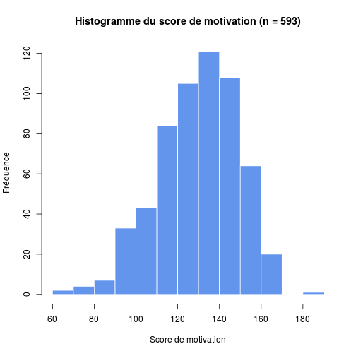
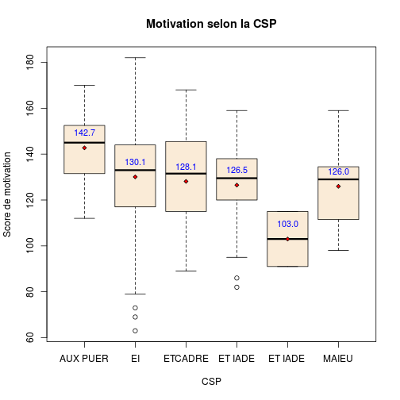
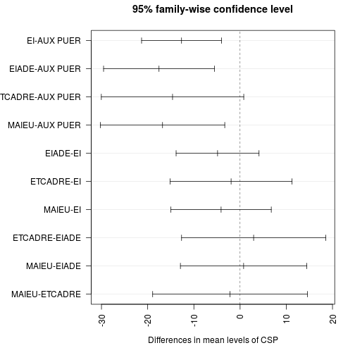
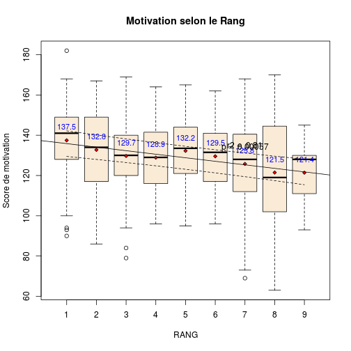

TABLEAU FINAL MASTER 2
=======================

Le fichier __TABLEAU FINAL MASTER 2__ contient les données cumulées des 2 années d'étude soit un peu plus de 500 participants:
- les 400 premiers sont issus de la première étude
- les 100 derniers de la dernière. Ils possèdent une colonne __note__ complétée.

TODO: étude de la corrélation __motivation__ et __rang__, globalement et par catégorie socio-professionnels (CSP)

- les noms de colonnes ne snt pas identiques: QUESTION et QUESTIO
- caractères anormaux dans les colonnes 18,19,20,23

CSP <- as.character(CSP)
CSP[CSP=="ET IADE"] <- "EIADE"
CSP[CSP=="ET IADE "] <- "EIADE"
CSP[CSP=="ETCADRE "] <- "ECADRE"
CSP<-as.factor(CSP)


- on forme une colonne **motivation** qui est la somme des 26 questions posées:


```
##    Min. 1st Qu.  Median    Mean 3rd Qu.    Max.    NA's 
##      63     118     133     130     145     182       1
```

```
## AUX PUER       EI    EIADE  ETCADRE    MAIEU 
##       39      477       37       16       24
```

```
##    1    2    3    4    5    6    7    8    9 NA's 
##   60   89   99   87   94   74   52   32    5    1
```

La moyenne et la médiane sont proches ce qui permet de considérer (avec l'aspet de l'histogramme) que les données sont sensiblement normales.

 


Il y a __593 observations__.

On a 3 variables:
  - **motivation** est une variable quantitative
  - **RANG** est une variable qualitative
  - **CSP** est une variable qualitative
  
  Hypothèse: motivation ~ RANG + CSP ?
  
Motivation et CSP
-----------------


```
## AUX PUER       EI  ETCADRE  ET IADE ET IADE     MAIEU 
##    142.7    130.1    128.1    126.5    103.0    126.0
```

 

```
##              Df Sum Sq Mean Sq F value  Pr(>F)    
## CSP           4   7526    1882    5.23 0.00038 ***
## Residuals   587 211283     360                    
## ---
## Signif. codes:  0 '***' 0.001 '**' 0.01 '*' 0.05 '.' 0.1 ' ' 1
## 1 observation deleted due to missingness
```

```
##   Tukey multiple comparisons of means
##     95% family-wise confidence level
## 
## Fit: aov(formula = motivation ~ CSP, data = d)
## 
## $CSP
##                      diff    lwr     upr  p adj
## EI-AUX PUER      -12.6744 -21.32 -4.0286 0.0006
## EIADE-AUX PUER   -17.5491 -29.55 -5.5508 0.0007
## ETCADRE-AUX PUER -14.6186 -30.03  0.7935 0.0725
## MAIEU-AUX PUER   -16.7853 -30.25 -3.3172 0.0062
## EIADE-EI          -4.8747 -13.85  4.0979 0.5716
## ETCADRE-EI        -1.9442 -15.14 11.2498 0.9944
## MAIEU-EI          -4.1108 -14.97  6.7491 0.8387
## ETCADRE-EIADE      2.9306 -12.67 18.5283 0.9860
## MAIEU-EIADE        0.7639 -12.92 14.4441 0.9999
## MAIEU-ETCADRE     -2.1667 -18.92 14.5880 0.9966
```

 

La motivation parait inversement proprtionnelle à la catégorie socio-professionnelle (CSP), les aides-soignantes sont les plus motivées. La différence entre les motivations moyennes sont significativement différentes (p=0.00038). Dans le détail, la comparaison deux à deux des moyennes par le test HSD de Tukey montre que:
- les AUX PUER se distinguent de tous les autres groupes (p < 0.05) sauf les cadres (effectif faible)
- la différence n'est pas significative entre les autres groupes.

Rang et motivation
------------------

En supposant que la disposition des salles soit identique, le rang le plus utilisé est le troisième et d'une façon générale ce sont les rangs médians qui sont le plus utilisés.

```
##    1    2    3    4    5    6    7    8    9 NA's 
##   60   89   99   87   94   74   52   32    5    1
```
Si ont s'intérsse au CSP il n'y a pas de différence de comprtements, sauf peut être pour les cadres.
(première ligne = rang, deuxième = efectif)

```
## $`AUX PUER`
## 1 2 3 4 5 6 7 8 9 
## 3 3 6 5 3 1 8 8 2 
## 
## $EI
##    1    2    3    4    5    6    7    8    9 NA's 
##   47   73   78   68   73   69   41   24    3    1 
## 
## $ETCADRE
## 1 2 3 4 5 6 7 8 9 
## 5 4 2 1 4 0 0 0 0 
## 
## $`ET IADE`
## 1 2 3 4 5 6 7 8 9 
## 3 3 7 7 8 4 3 0 0 
## 
## $`ET IADE `
## 1 2 3 4 5 6 7 8 9 
## 0 2 0 0 0 0 0 0 0 
## 
## $MAIEU
## 1 2 3 4 5 6 7 8 9 
## 2 4 6 6 6 0 0 0 0
```

L'interaction motivation x rang est sigificative: le choix du rang dépend de la motivation, la motivation la plus forte s'observant au premier rang.


```
##     1     2     3     4     5     6     7     8     9 
## 137.5 132.8 129.7 128.9 132.2 129.5 125.8 121.5 121.4
```

 

```
##              Df Sum Sq Mean Sq F value  Pr(>F)    
## RANG          1   5403    5403    14.9 0.00012 ***
## Residuals   589 213161     362                    
## ---
## Signif. codes:  0 '***' 0.001 '**' 0.01 '*' 0.05 '.' 0.1 ' ' 1
## 2 observations deleted due to missingness
```

```
## Warning: non-factors ignored: RANG
```

```
## Error: no factors in the fitted model
```

Motivation versus RANG et CSP
----------------------------
On s'intéresse à la relation entre la motivation et les rang ET la CSP. En analyse individuelle on amontré qu'il y avait une relation entre la motivation et le rang et la CSP. Qu'est-ce qui se passe si on étudie cette relation quand on teste l'effet simultanné de ces 2 facteurs? On fabrique 2 modèles. Dans le premier on teste la motivation versus le rang et la CSP selon un modèle additif simple: la motivation peut s'explique par la somme du choix du rang et la CSP. Dans le second modèle on ajoute,le poids de l'interaction rang x CSP (le choix du rang dépend t il de la CSP ?). 
Dand le modèle 1, il y a une relation significative entre la motivation et le rang à CSP égale, mais également entre motivation et CSP à  rang égal.   
Dans le modèle 2 on motre qu'il y a une relation significative entre le rang et la CSP (selon son métier on ne choisit pas n'importe quel rang), mais que débarassé de cet "influence", le rang et la motivation conservent un effet propre significatif sur la motivation.

Limites de l'interprétation
- les groupes par CSP sont faibles et disproportionnés (EI écrase les autres)


```
##              Df Sum Sq Mean Sq F value  Pr(>F)    
## CSP           5   8579    1716    5.03 0.00016 ***
## RANG          8  13012    1626    4.76 1.1e-05 ***
## Residuals   577 196973     341                    
## ---
## Signif. codes:  0 '***' 0.001 '**' 0.01 '*' 0.05 '.' 0.1 ' ' 1
## 2 observations deleted due to missingness
```

```
##   Tukey multiple comparisons of means
##     95% family-wise confidence level
## 
## Fit: aov(formula = motivation ~ CSP + RANG)
## 
## $CSP
##                       diff    lwr    upr  p adj
## EI-AUX PUER       -12.7079 -21.51 -3.909 0.0006
## ETCADRE-AUX PUER  -14.6186 -30.30  1.066 0.0840
## ET IADE-AUX PUER  -16.2436 -28.64 -3.848 0.0027
## ET IADE -AUX PUER -39.7436 -78.05 -1.441 0.0368
## MAIEU-AUX PUER    -16.7853 -30.49 -3.079 0.0066
## ETCADRE-EI         -1.9107 -15.34 11.517 0.9986
## ET IADE-EI         -3.5357 -12.91  5.843 0.8901
## ET IADE -EI       -27.0357 -64.47 10.399 0.3073
## MAIEU-EI           -4.0774 -15.13  6.975 0.8988
## ET IADE-ETCADRE    -1.6250 -17.64 14.391 0.9997
## ET IADE -ETCADRE  -25.1250 -64.75 14.497 0.4580
## MAIEU-ETCADRE      -2.1667 -19.22 14.884 0.9992
## ET IADE -ET IADE  -23.5000 -61.94 14.939 0.5005
## MAIEU-ET IADE      -0.5417 -14.63 13.543 1.0000
## MAIEU-ET IADE      22.9583 -15.92 61.840 0.5401
## 
## $RANG
##          diff     lwr     upr  p adj
## 2-1  -3.98289 -13.592  5.6266 0.9340
## 3-1  -7.82049 -17.233  1.5916 0.1942
## 4-1  -8.54934 -18.203  1.1045 0.1307
## 5-1  -4.82161 -14.328  4.6844 0.8159
## 6-1  -7.74327 -17.737  2.2507 0.2791
## 7-1 -13.39323 -24.350 -2.4365 0.0049
## 8-1 -19.01142 -31.604 -6.4186 0.0001
## 9-1 -20.98635 -47.764  5.7914 0.2642
## 3-2  -3.83760 -12.241  4.5656 0.8892
## 4-2  -4.56645 -13.240  4.1068 0.7827
## 5-2  -0.83872  -9.347  7.6696 1.0000
## 6-2  -3.76037 -12.811  5.2899 0.9331
## 7-2  -9.41034 -19.514  0.6929 0.0908
## 8-2 -15.02853 -26.886 -3.1708 0.0029
## 9-2 -17.00346 -43.444  9.4366 0.5423
## 4-3  -0.72885  -9.183  7.7251 1.0000
## 5-3   2.99888  -5.286 11.2836 0.9700
## 6-3   0.07722  -8.763  8.9175 1.0000
## 7-3  -5.57274 -15.488  4.3429 0.7151
## 8-3 -11.19093 -22.889  0.5073 0.0734
## 9-3 -13.16586 -39.535 13.2031 0.8288
## 5-4   3.72773  -4.831 12.2862 0.9135
## 6-4   0.80607  -8.291  9.9035 1.0000
## 7-4  -4.84389 -14.989  5.3016 0.8617
## 8-4 -10.46208 -22.356  1.4316 0.1367
## 9-4 -12.43701 -38.893 14.0192 0.8718
## 6-5  -2.92166 -11.862  6.0187 0.9842
## 7-5  -8.57162 -18.577  1.4333 0.1619
## 8-5 -14.18981 -25.964 -2.4158 0.0060
## 9-5 -16.16474 -42.567 10.2379 0.6097
## 7-6  -5.64996 -16.120  4.8197 0.7585
## 8-6 -11.26815 -23.440  0.9033 0.0951
## 9-6 -13.24308 -39.825 13.3391 0.8305
## 8-7  -5.61819 -18.592  7.3553 0.9161
## 9-7  -7.59312 -34.552 19.3658 0.9941
## 9-8  -1.97493 -29.639 25.6894 1.0000
```

```
##              Df Sum Sq Mean Sq F value  Pr(>F)    
## CSP           5   8579    1716    5.15 0.00013 ***
## RANG          8  13012    1626    4.88 7.8e-06 ***
## CSP:RANG     22  11880     540    1.62 0.03745 *  
## Residuals   555 185093     334                    
## ---
## Signif. codes:  0 '***' 0.001 '**' 0.01 '*' 0.05 '.' 0.1 ' ' 1
## 2 observations deleted due to missingness
```

```
## Call:
##    aov(formula = motivation ~ CSP * RANG)
## 
## Terms:
##                    CSP   RANG CSP:RANG Residuals
## Sum of Squares    8579  13012    11880    185093
## Deg. of Freedom      5      8       22       555
## 
## Residual standard error: 18.26
## 18 out of 54 effects not estimable
## Estimated effects may be unbalanced
## 2 observations deleted due to missingness
```

```
##   Tukey multiple comparisons of means
##     95% family-wise confidence level
## 
## Fit: aov(formula = motivation ~ CSP * RANG)
## 
## $CSP
##                       diff    lwr    upr  p adj
## EI-AUX PUER       -12.7079 -21.41 -4.010 0.0005
## ETCADRE-AUX PUER  -14.6186 -30.12  0.886 0.0776
## ET IADE-AUX PUER  -16.2436 -28.50 -3.990 0.0023
## ET IADE -AUX PUER -39.7436 -77.61 -1.881 0.0333
## MAIEU-AUX PUER    -16.7853 -30.33 -3.236 0.0057
## ETCADRE-EI         -1.9107 -15.18 11.363 0.9985
## ET IADE-EI         -3.5357 -12.81  5.735 0.8851
## ET IADE -EI       -27.0357 -64.04  9.970 0.2944
## MAIEU-EI           -4.0774 -15.00  6.848 0.8942
## ET IADE-ETCADRE    -1.6250 -17.46 14.208 0.9997
## ET IADE -ETCADRE  -25.1250 -64.29 14.043 0.4444
## MAIEU-ETCADRE      -2.1667 -19.02 14.689 0.9991
## ET IADE -ET IADE  -23.5000 -61.50 14.499 0.4870
## MAIEU-ET IADE      -0.5417 -14.46 13.382 1.0000
## MAIEU-ET IADE      22.9583 -15.48 61.394 0.5269
## 
## $RANG
##          diff     lwr     upr  p adj
## 2-1  -3.98289 -13.482  5.5166 0.9296
## 3-1  -7.82049 -17.125  1.4838 0.1816
## 4-1  -8.54934 -18.093  0.9940 0.1207
## 5-1  -4.82161 -14.219  4.5756 0.8059
## 6-1  -7.74327 -17.623  2.1363 0.2641
## 7-1 -13.39323 -24.224 -2.5620 0.0042
## 8-1 -19.01142 -31.460 -6.5628 0.0001
## 9-1 -20.98635 -47.458  5.4849 0.2496
## 3-2  -3.83760 -12.145  4.4694 0.8824
## 4-2  -4.56645 -13.140  4.0075 0.7715
## 5-2  -0.83872  -9.250  7.5722 1.0000
## 6-2  -3.76037 -12.707  5.1863 0.9286
## 7-2  -9.41034 -19.398  0.5773 0.0830
## 8-2 -15.02853 -26.750 -3.3066 0.0024
## 9-2 -17.00346 -43.141  9.1339 0.5259
## 4-3  -0.72885  -9.086  7.6283 1.0000
## 5-3   2.99888  -5.191 11.1887 0.9678
## 6-3   0.07722  -8.662  8.8163 1.0000
## 7-3  -5.57274 -15.375  4.2294 0.7018
## 8-3 -11.19093 -22.755  0.3734 0.0667
## 9-3 -13.16586 -39.233 12.9012 0.8193
## 5-4   3.72773  -4.733 12.1882 0.9079
## 6-4   0.80607  -8.187  9.7993 1.0000
## 7-4  -4.84389 -14.873  5.1855 0.8536
## 8-4 -10.46208 -22.220  1.2955 0.1264
## 9-4 -12.43701 -38.590 13.7163 0.8642
## 6-5  -2.92166 -11.760  5.9163 0.9829
## 7-5  -8.57162 -18.462  1.3188 0.1505
## 8-5 -14.18981 -25.829 -2.5506 0.0051
## 9-5 -16.16474 -42.265  9.9356 0.5941
## 7-6  -5.64996 -16.000  4.6998 0.7465
## 8-6 -11.26815 -23.300  0.7639 0.0870
## 9-6 -13.24308 -39.521 13.0348 0.8211
## 8-7  -5.61819 -18.443  7.2068 0.9107
## 9-7  -7.59312 -34.243 19.0572 0.9936
## 9-8  -1.97493 -29.323 25.3726 1.0000
## 
## $`CSP:RANG`
##                             diff      lwr      upr  p adj
## EI:1-AUX PUER:1       -1.112e+01  -55.190  32.9486 1.0000
## ETCADRE:1-AUX PUER:1  -7.533e+00  -61.579  46.5121 1.0000
## ET IADE:1-AUX PUER:1  -1.033e+01  -70.758  50.0913 1.0000
## ET IADE :1-AUX PUER:1         NA       NA       NA     NA
## MAIEU:1-AUX PUER:1    -3.333e-01  -67.890  67.2235 1.0000
## AUX PUER:2-AUX PUER:1 -6.667e-01  -61.091  59.7580 1.0000
## EI:2-AUX PUER:1       -1.168e+01  -55.272  31.9200 1.0000
## ETCADRE:2-AUX PUER:1  -3.283e+01  -89.355  23.6888 0.9833
## ET IADE:2-AUX PUER:1  -3.167e+01  -92.091  28.7580 0.9977
## ET IADE :2-AUX PUER:1 -4.433e+01 -111.890  23.2235 0.8987
## MAIEU:2-AUX PUER:1    -3.208e+01  -88.605  24.4388 0.9889
## AUX PUER:3-AUX PUER:1 -1.850e+01  -70.829  33.8293 1.0000
## EI:3-AUX PUER:1       -1.669e+01  -60.233  26.8483 1.0000
## ETCADRE:3-AUX PUER:1  -2.233e+01  -89.890  45.2235 1.0000
## ET IADE:3-AUX PUER:1  -1.819e+01  -69.259  32.8777 1.0000
## ET IADE :3-AUX PUER:1         NA       NA       NA     NA
## MAIEU:3-AUX PUER:1    -2.650e+01  -78.829  25.8293 0.9990
## AUX PUER:4-AUX PUER:1 -2.013e+01  -74.179  33.9121 1.0000
## EI:4-AUX PUER:1       -1.875e+01  -62.404  24.9139 1.0000
## ETCADRE:4-AUX PUER:1  -1.433e+01  -99.787  71.1200 1.0000
## ET IADE:4-AUX PUER:1  -1.590e+01  -66.973  35.1634 1.0000
## ET IADE :4-AUX PUER:1         NA       NA       NA     NA
## MAIEU:4-AUX PUER:1    -1.717e+01  -69.496  35.1626 1.0000
## AUX PUER:5-AUX PUER:1  5.667e+00  -54.758  66.0913 1.0000
## EI:5-AUX PUER:1       -1.446e+01  -58.052  29.1392 1.0000
## ETCADRE:5-AUX PUER:1  -1.983e+01  -76.355  36.6888 1.0000
## ET IADE:5-AUX PUER:1  -2.233e+01  -72.435  27.7681 1.0000
## ET IADE :5-AUX PUER:1         NA       NA       NA     NA
## MAIEU:5-AUX PUER:1    -2.033e+01  -72.663  31.9959 1.0000
## AUX PUER:6-AUX PUER:1  4.667e+00  -80.787  90.1200 1.0000
## EI:6-AUX PUER:1       -1.813e+01  -61.776  25.5152 1.0000
## ETCADRE:6-AUX PUER:1          NA       NA       NA     NA
## ET IADE:6-AUX PUER:1  -1.758e+01  -74.105  38.9388 1.0000
## ET IADE :6-AUX PUER:1         NA       NA       NA     NA
## MAIEU:6-AUX PUER:1            NA       NA       NA     NA
## AUX PUER:7-AUX PUER:1  4.417e+00  -45.685  54.5181 1.0000
## EI:7-AUX PUER:1       -2.538e+01  -69.644  18.8801 0.9867
## ETCADRE:7-AUX PUER:1          NA       NA       NA     NA
## ET IADE:7-AUX PUER:1  -4.733e+01 -114.890  20.2235 0.7928
## ET IADE :7-AUX PUER:1         NA       NA       NA     NA
## MAIEU:7-AUX PUER:1            NA       NA       NA     NA
## AUX PUER:8-AUX PUER:1 -3.333e-01  -50.435  49.7681 1.0000
## EI:8-AUX PUER:1       -3.437e+01  -79.693  10.9435 0.6035
## ETCADRE:8-AUX PUER:1          NA       NA       NA     NA
## ET IADE:8-AUX PUER:1          NA       NA       NA     NA
## ET IADE :8-AUX PUER:1         NA       NA       NA     NA
## MAIEU:8-AUX PUER:1            NA       NA       NA     NA
## AUX PUER:9-AUX PUER:1 -9.833e+00  -77.390  57.7235 1.0000
## EI:9-AUX PUER:1       -3.667e+01  -97.091  23.7580 0.9657
## ETCADRE:9-AUX PUER:1          NA       NA       NA     NA
## ET IADE:9-AUX PUER:1          NA       NA       NA     NA
## ET IADE :9-AUX PUER:1         NA       NA       NA     NA
## MAIEU:9-AUX PUER:1            NA       NA       NA     NA
## ETCADRE:1-EI:1         3.587e+00  -31.225  38.3991 1.0000
## ET IADE:1-EI:1         7.872e-01  -43.282  44.8564 1.0000
## ET IADE :1-EI:1               NA       NA       NA     NA
## MAIEU:1-EI:1           1.079e+01  -42.644  64.2183 1.0000
## AUX PUER:2-EI:1        1.045e+01  -33.615  54.5231 1.0000
## EI:2-EI:1             -5.552e-01  -14.395  13.2849 1.0000
## ETCADRE:2-EI:1        -2.171e+01  -60.258  16.8320 0.9904
## ET IADE:2-EI:1        -2.055e+01  -64.615  23.5231 0.9999
## ET IADE :2-EI:1       -3.321e+01  -86.644  20.2183 0.9509
## MAIEU:2-EI:1          -2.096e+01  -59.508  17.5820 0.9951
## AUX PUER:3-EI:1       -7.379e+00  -39.462  24.7034 1.0000
## EI:3-EI:1             -5.572e+00  -19.237   8.0935 1.0000
## ETCADRE:3-EI:1        -1.121e+01  -64.644  42.2183 1.0000
## ET IADE:3-EI:1        -7.070e+00  -37.052  22.9120 1.0000
## ET IADE :3-EI:1               NA       NA       NA     NA
## MAIEU:3-EI:1          -1.538e+01  -47.462  16.7034 0.9997
## AUX PUER:4-EI:1       -9.013e+00  -43.825  25.7991 1.0000
## EI:4-EI:1             -7.625e+00  -21.663   6.4135 0.9953
## ETCADRE:4-EI:1        -3.213e+00  -78.001  71.5752 1.0000
## ET IADE:4-EI:1        -4.784e+00  -34.766  25.1977 1.0000
## ET IADE :4-EI:1               NA       NA       NA     NA
## MAIEU:4-EI:1          -6.046e+00  -38.129  26.0368 1.0000
## AUX PUER:5-EI:1        1.679e+01  -27.282  60.8564 1.0000
## EI:5-EI:1             -3.336e+00  -17.176  10.5041 1.0000
## ETCADRE:5-EI:1        -8.713e+00  -47.258  29.8320 1.0000
## ET IADE:5-EI:1        -1.121e+01  -39.517  17.0912 1.0000
## ET IADE :5-EI:1               NA       NA       NA     NA
## MAIEU:5-EI:1          -9.213e+00  -41.296  22.8701 1.0000
## AUX PUER:6-EI:1        1.579e+01  -59.001  90.5752 1.0000
## EI:6-EI:1             -7.010e+00  -21.006   6.9865 0.9992
## ETCADRE:6-EI:1                NA       NA       NA     NA
## ET IADE:6-EI:1        -6.463e+00  -45.008  32.0820 1.0000
## ET IADE :6-EI:1               NA       NA       NA     NA
## MAIEU:6-EI:1                  NA       NA       NA     NA
## AUX PUER:7-EI:1        1.554e+01  -12.767  43.8412 0.9941
## EI:7-EI:1             -1.426e+01  -30.076   1.5531 0.1750
## ETCADRE:7-EI:1                NA       NA       NA     NA
## ET IADE:7-EI:1        -3.621e+01  -89.644  17.2183 0.8527
## ET IADE :7-EI:1               NA       NA       NA     NA
## MAIEU:7-EI:1                  NA       NA       NA     NA
## AUX PUER:8-EI:1        1.079e+01  -17.517  39.0912 1.0000
## EI:8-EI:1             -2.325e+01  -41.821  -4.6877 0.0007
## ETCADRE:8-EI:1                NA       NA       NA     NA
## ET IADE:8-EI:1                NA       NA       NA     NA
## ET IADE :8-EI:1               NA       NA       NA     NA
## MAIEU:8-EI:1                  NA       NA       NA     NA
## AUX PUER:9-EI:1        1.287e+00  -52.144  54.7183 1.0000
## EI:9-EI:1             -2.555e+01  -69.615  18.5231 0.9839
## ETCADRE:9-EI:1                NA       NA       NA     NA
## ET IADE:9-EI:1                NA       NA       NA     NA
## ET IADE :9-EI:1               NA       NA       NA     NA
## MAIEU:9-EI:1                  NA       NA       NA     NA
## ET IADE:1-ETCADRE:1   -2.800e+00  -56.845  51.2454 1.0000
## ET IADE :1-ETCADRE:1          NA       NA       NA     NA
## MAIEU:1-ETCADRE:1      7.200e+00  -54.717  69.1168 1.0000
## AUX PUER:2-ETCADRE:1   6.867e+00  -47.179  60.9121 1.0000
## EI:2-ETCADRE:1        -4.142e+00  -38.353  30.0681 1.0000
## ETCADRE:2-ETCADRE:1   -2.530e+01  -74.944  24.3439 0.9988
## ET IADE:2-ETCADRE:1   -2.413e+01  -78.179  29.9121 1.0000
## ET IADE :2-ETCADRE:1  -3.680e+01  -98.717  25.1168 0.9754
## MAIEU:2-ETCADRE:1     -2.455e+01  -74.194  25.0939 0.9994
## AUX PUER:3-ETCADRE:1  -1.097e+01  -55.779  33.8455 1.0000
## EI:3-ETCADRE:1        -9.159e+00  -43.299  24.9813 1.0000
## ETCADRE:3-ETCADRE:1   -1.480e+01  -76.717  47.1168 1.0000
## ET IADE:3-ETCADRE:1   -1.066e+01  -53.990  32.6756 1.0000
## ET IADE :3-ETCADRE:1          NA       NA       NA     NA
## MAIEU:3-ETCADRE:1     -1.897e+01  -63.779  25.8455 1.0000
## AUX PUER:4-ETCADRE:1  -1.260e+01  -59.405  34.2047 1.0000
## EI:4-ETCADRE:1        -1.121e+01  -45.503  23.0794 1.0000
## ETCADRE:4-ETCADRE:1   -6.800e+00  -87.868  74.2682 1.0000
## ET IADE:4-ETCADRE:1   -8.371e+00  -51.704  34.9613 1.0000
## ET IADE :4-ETCADRE:1          NA       NA       NA     NA
## MAIEU:4-ETCADRE:1     -9.633e+00  -54.445  35.1788 1.0000
## AUX PUER:5-ETCADRE:1   1.320e+01  -40.845  67.2454 1.0000
## EI:5-ETCADRE:1        -6.923e+00  -41.134  27.2873 1.0000
## ETCADRE:5-ETCADRE:1   -1.230e+01  -61.944  37.3439 1.0000
## ET IADE:5-ETCADRE:1   -1.480e+01  -56.989  27.3892 1.0000
## ET IADE :5-ETCADRE:1          NA       NA       NA     NA
## MAIEU:5-ETCADRE:1     -1.280e+01  -57.612  32.0121 1.0000
## AUX PUER:6-ETCADRE:1   1.220e+01  -68.868  93.2682 1.0000
## EI:6-ETCADRE:1        -1.060e+01  -44.871  23.6770 1.0000
## ETCADRE:6-ETCADRE:1           NA       NA       NA     NA
## ET IADE:6-ETCADRE:1   -1.005e+01  -59.694  39.5939 1.0000
## ET IADE :6-ETCADRE:1          NA       NA       NA     NA
## MAIEU:6-ETCADRE:1             NA       NA       NA     NA
## AUX PUER:7-ETCADRE:1   1.195e+01  -30.239  54.1392 1.0000
## EI:7-ETCADRE:1        -1.785e+01  -52.905  17.2072 0.9988
## ETCADRE:7-ETCADRE:1           NA       NA       NA     NA
## ET IADE:7-ETCADRE:1   -3.980e+01 -101.717  22.1168 0.9220
## ET IADE :7-ETCADRE:1          NA       NA       NA     NA
## MAIEU:7-ETCADRE:1             NA       NA       NA     NA
## AUX PUER:8-ETCADRE:1   7.200e+00  -34.989  49.3892 1.0000
## EI:8-ETCADRE:1        -2.684e+01  -63.222   9.5388 0.6756
## ETCADRE:8-ETCADRE:1           NA       NA       NA     NA
## ET IADE:8-ETCADRE:1           NA       NA       NA     NA
## ET IADE :8-ETCADRE:1          NA       NA       NA     NA
## MAIEU:8-ETCADRE:1             NA       NA       NA     NA
## AUX PUER:9-ETCADRE:1  -2.300e+00  -64.217  59.6168 1.0000
## EI:9-ETCADRE:1        -2.913e+01  -83.179  24.9121 0.9959
## ETCADRE:9-ETCADRE:1           NA       NA       NA     NA
## ET IADE:9-ETCADRE:1           NA       NA       NA     NA
## ET IADE :9-ETCADRE:1          NA       NA       NA     NA
## MAIEU:9-ETCADRE:1             NA       NA       NA     NA
## ET IADE :1-ET IADE:1          NA       NA       NA     NA
## MAIEU:1-ET IADE:1      1.000e+01  -57.557  77.5568 1.0000
## AUX PUER:2-ET IADE:1   9.667e+00  -50.758  70.0913 1.0000
## EI:2-ET IADE:1        -1.342e+00  -44.938  42.2533 1.0000
## ETCADRE:2-ET IADE:1   -2.250e+01  -79.022  34.0221 1.0000
## ET IADE:2-ET IADE:1   -2.133e+01  -81.758  39.0913 1.0000
## ET IADE :2-ET IADE:1  -3.400e+01 -101.557  33.5568 0.9991
## MAIEU:2-ET IADE:1     -2.175e+01  -78.272  34.7721 1.0000
## AUX PUER:3-ET IADE:1  -8.167e+00  -60.496  44.1626 1.0000
## EI:3-ET IADE:1        -6.359e+00  -49.900  37.1816 1.0000
## ETCADRE:3-ET IADE:1   -1.200e+01  -79.557  55.5568 1.0000
## ET IADE:3-ET IADE:1   -7.857e+00  -58.925  43.2110 1.0000
## ET IADE :3-ET IADE:1          NA       NA       NA     NA
## MAIEU:3-ET IADE:1     -1.617e+01  -68.496  36.1626 1.0000
## AUX PUER:4-ET IADE:1  -9.800e+00  -63.845  44.2454 1.0000
## EI:4-ET IADE:1        -8.412e+00  -52.071  35.2472 1.0000
## ETCADRE:4-ET IADE:1   -4.000e+00  -89.453  81.4534 1.0000
## ET IADE:4-ET IADE:1   -5.571e+00  -56.640  45.4967 1.0000
## ET IADE :4-ET IADE:1          NA       NA       NA     NA
## MAIEU:4-ET IADE:1     -6.833e+00  -59.163  45.4959 1.0000
## AUX PUER:5-ET IADE:1   1.600e+01  -44.425  76.4246 1.0000
## EI:5-ET IADE:1        -4.123e+00  -47.719  39.4725 1.0000
## ETCADRE:5-ET IADE:1   -9.500e+00  -66.022  47.0221 1.0000
## ET IADE:5-ET IADE:1   -1.200e+01  -62.101  38.1015 1.0000
## ET IADE :5-ET IADE:1          NA       NA       NA     NA
## MAIEU:5-ET IADE:1     -1.000e+01  -62.329  42.3293 1.0000
## AUX PUER:6-ET IADE:1   1.500e+01  -70.453 100.4534 1.0000
## EI:6-ET IADE:1        -7.797e+00  -51.443  35.8485 1.0000
## ETCADRE:6-ET IADE:1           NA       NA       NA     NA
## ET IADE:6-ET IADE:1   -7.250e+00  -63.772  49.2721 1.0000
## ET IADE :6-ET IADE:1          NA       NA       NA     NA
## MAIEU:6-ET IADE:1             NA       NA       NA     NA
## AUX PUER:7-ET IADE:1   1.475e+01  -35.351  64.8515 1.0000
## EI:7-ET IADE:1        -1.505e+01  -59.311  29.2135 1.0000
## ETCADRE:7-ET IADE:1           NA       NA       NA     NA
## ET IADE:7-ET IADE:1   -3.700e+01 -104.557  30.5568 0.9944
## ET IADE :7-ET IADE:1          NA       NA       NA     NA
## MAIEU:7-ET IADE:1             NA       NA       NA     NA
## AUX PUER:8-ET IADE:1   1.000e+01  -40.101  60.1015 1.0000
## EI:8-ET IADE:1        -2.404e+01  -69.360  21.2768 0.9971
## ETCADRE:8-ET IADE:1           NA       NA       NA     NA
## ET IADE:8-ET IADE:1           NA       NA       NA     NA
## ET IADE :8-ET IADE:1          NA       NA       NA     NA
## MAIEU:8-ET IADE:1             NA       NA       NA     NA
## AUX PUER:9-ET IADE:1   5.000e-01  -67.057  68.0568 1.0000
## EI:9-ET IADE:1        -2.633e+01  -86.758  34.0913 1.0000
## ETCADRE:9-ET IADE:1           NA       NA       NA     NA
## ET IADE:9-ET IADE:1           NA       NA       NA     NA
## ET IADE :9-ET IADE:1          NA       NA       NA     NA
## MAIEU:9-ET IADE:1             NA       NA       NA     NA
## MAIEU:1-ET IADE :1            NA       NA       NA     NA
## AUX PUER:2-ET IADE :1         NA       NA       NA     NA
## EI:2-ET IADE :1               NA       NA       NA     NA
## ETCADRE:2-ET IADE :1          NA       NA       NA     NA
## ET IADE:2-ET IADE :1          NA       NA       NA     NA
## ET IADE :2-ET IADE :1         NA       NA       NA     NA
## MAIEU:2-ET IADE :1            NA       NA       NA     NA
## AUX PUER:3-ET IADE :1         NA       NA       NA     NA
## EI:3-ET IADE :1               NA       NA       NA     NA
## ETCADRE:3-ET IADE :1          NA       NA       NA     NA
## ET IADE:3-ET IADE :1          NA       NA       NA     NA
## ET IADE :3-ET IADE :1         NA       NA       NA     NA
## MAIEU:3-ET IADE :1            NA       NA       NA     NA
## AUX PUER:4-ET IADE :1         NA       NA       NA     NA
## EI:4-ET IADE :1               NA       NA       NA     NA
## ETCADRE:4-ET IADE :1          NA       NA       NA     NA
## ET IADE:4-ET IADE :1          NA       NA       NA     NA
## ET IADE :4-ET IADE :1         NA       NA       NA     NA
## MAIEU:4-ET IADE :1            NA       NA       NA     NA
## AUX PUER:5-ET IADE :1         NA       NA       NA     NA
## EI:5-ET IADE :1               NA       NA       NA     NA
## ETCADRE:5-ET IADE :1          NA       NA       NA     NA
## ET IADE:5-ET IADE :1          NA       NA       NA     NA
## ET IADE :5-ET IADE :1         NA       NA       NA     NA
## MAIEU:5-ET IADE :1            NA       NA       NA     NA
## AUX PUER:6-ET IADE :1         NA       NA       NA     NA
## EI:6-ET IADE :1               NA       NA       NA     NA
## ETCADRE:6-ET IADE :1          NA       NA       NA     NA
## ET IADE:6-ET IADE :1          NA       NA       NA     NA
## ET IADE :6-ET IADE :1         NA       NA       NA     NA
## MAIEU:6-ET IADE :1            NA       NA       NA     NA
## AUX PUER:7-ET IADE :1         NA       NA       NA     NA
## EI:7-ET IADE :1               NA       NA       NA     NA
## ETCADRE:7-ET IADE :1          NA       NA       NA     NA
## ET IADE:7-ET IADE :1          NA       NA       NA     NA
## ET IADE :7-ET IADE :1         NA       NA       NA     NA
## MAIEU:7-ET IADE :1            NA       NA       NA     NA
## AUX PUER:8-ET IADE :1         NA       NA       NA     NA
## EI:8-ET IADE :1               NA       NA       NA     NA
## ETCADRE:8-ET IADE :1          NA       NA       NA     NA
## ET IADE:8-ET IADE :1          NA       NA       NA     NA
## ET IADE :8-ET IADE :1         NA       NA       NA     NA
## MAIEU:8-ET IADE :1            NA       NA       NA     NA
## AUX PUER:9-ET IADE :1         NA       NA       NA     NA
## EI:9-ET IADE :1               NA       NA       NA     NA
## ETCADRE:9-ET IADE :1          NA       NA       NA     NA
## ET IADE:9-ET IADE :1          NA       NA       NA     NA
## ET IADE :9-ET IADE :1         NA       NA       NA     NA
## MAIEU:9-ET IADE :1            NA       NA       NA     NA
## AUX PUER:2-MAIEU:1    -3.333e-01  -67.890  67.2235 1.0000
## EI:2-MAIEU:1          -1.134e+01  -64.384  41.6988 1.0000
## ETCADRE:2-MAIEU:1     -3.250e+01  -96.590  31.5900 0.9989
## ET IADE:2-MAIEU:1     -3.133e+01  -98.890  36.2235 0.9999
## ET IADE :2-MAIEU:1    -4.400e+01 -118.005  30.0048 0.9752
## MAIEU:2-MAIEU:1       -3.175e+01  -95.840  32.3400 0.9994
## AUX PUER:3-MAIEU:1    -1.817e+01  -78.591  42.2580 1.0000
## EI:3-MAIEU:1          -1.636e+01  -69.355  36.6369 1.0000
## ETCADRE:3-MAIEU:1     -2.200e+01  -96.005  52.0048 1.0000
## ET IADE:3-MAIEU:1     -1.786e+01  -77.193  41.4787 1.0000
## ET IADE :3-MAIEU:1            NA       NA       NA     NA
## MAIEU:3-MAIEU:1       -2.617e+01  -86.591  34.2580 1.0000
## AUX PUER:4-MAIEU:1    -1.980e+01  -81.717  42.1168 1.0000
## EI:4-MAIEU:1          -1.841e+01  -71.505  34.6815 1.0000
## ETCADRE:4-MAIEU:1     -1.400e+01 -104.637  76.6370 1.0000
## ET IADE:4-MAIEU:1     -1.557e+01  -74.907  43.7644 1.0000
## ET IADE :4-MAIEU:1            NA       NA       NA     NA
## MAIEU:4-MAIEU:1       -1.683e+01  -77.258  43.5913 1.0000
## AUX PUER:5-MAIEU:1     6.000e+00  -61.557  73.5568 1.0000
## EI:5-MAIEU:1          -1.412e+01  -67.165  38.9180 1.0000
## ETCADRE:5-MAIEU:1     -1.950e+01  -83.590  44.5900 1.0000
## ET IADE:5-MAIEU:1     -2.200e+01  -80.506  36.5059 1.0000
## ET IADE :5-MAIEU:1            NA       NA       NA     NA
## MAIEU:5-MAIEU:1       -2.000e+01  -80.425  40.4246 1.0000
## AUX PUER:6-MAIEU:1     5.000e+00  -85.637  95.6370 1.0000
## EI:6-MAIEU:1          -1.780e+01  -70.879  35.2852 1.0000
## ETCADRE:6-MAIEU:1             NA       NA       NA     NA
## ET IADE:6-MAIEU:1     -1.725e+01  -81.340  46.8400 1.0000
## ET IADE :6-MAIEU:1            NA       NA       NA     NA
## MAIEU:6-MAIEU:1               NA       NA       NA     NA
## AUX PUER:7-MAIEU:1     4.750e+00  -53.756  63.2559 1.0000
## EI:7-MAIEU:1          -2.505e+01  -78.639  28.5416 0.9999
## ETCADRE:7-MAIEU:1             NA       NA       NA     NA
## ET IADE:7-MAIEU:1     -4.700e+01 -121.005  27.0048 0.9336
## ET IADE :7-MAIEU:1            NA       NA       NA     NA
## MAIEU:7-MAIEU:1               NA       NA       NA     NA
## AUX PUER:8-MAIEU:1     2.842e-14  -58.506  58.5059 1.0000
## EI:8-MAIEU:1          -3.404e+01  -88.508  20.4244 0.9468
## ETCADRE:8-MAIEU:1             NA       NA       NA     NA
## ET IADE:8-MAIEU:1             NA       NA       NA     NA
## ET IADE :8-MAIEU:1            NA       NA       NA     NA
## MAIEU:8-MAIEU:1               NA       NA       NA     NA
## AUX PUER:9-MAIEU:1    -9.500e+00  -83.505  64.5048 1.0000
## EI:9-MAIEU:1          -3.633e+01 -103.890  31.2235 0.9961
## ETCADRE:9-MAIEU:1             NA       NA       NA     NA
## ET IADE:9-MAIEU:1             NA       NA       NA     NA
## ET IADE :9-MAIEU:1            NA       NA       NA     NA
## MAIEU:9-MAIEU:1               NA       NA       NA     NA
## EI:2-AUX PUER:2       -1.101e+01  -54.605  32.5867 1.0000
## ETCADRE:2-AUX PUER:2  -3.217e+01  -88.689  24.3554 0.9884
## ET IADE:2-AUX PUER:2  -3.100e+01  -91.425  29.4246 0.9986
## ET IADE :2-AUX PUER:2 -4.367e+01 -111.223  23.8901 0.9162
## MAIEU:2-AUX PUER:2    -3.142e+01  -87.939  25.1054 0.9925
## AUX PUER:3-AUX PUER:2 -1.783e+01  -70.163  34.4959 1.0000
## EI:3-AUX PUER:2       -1.603e+01  -59.566  27.5150 1.0000
## ETCADRE:3-AUX PUER:2  -2.167e+01  -89.223  45.8901 1.0000
## ET IADE:3-AUX PUER:2  -1.752e+01  -68.592  33.5443 1.0000
## ET IADE :3-AUX PUER:2         NA       NA       NA     NA
## MAIEU:3-AUX PUER:2    -2.583e+01  -78.163  26.4959 0.9994
## AUX PUER:4-AUX PUER:2 -1.947e+01  -73.512  34.5788 1.0000
## EI:4-AUX PUER:2       -1.808e+01  -61.737  25.5806 1.0000
## ETCADRE:4-AUX PUER:2  -1.367e+01  -99.120  71.7867 1.0000
## ET IADE:4-AUX PUER:2  -1.524e+01  -66.306  35.8301 1.0000
## ET IADE :4-AUX PUER:2         NA       NA       NA     NA
## MAIEU:4-AUX PUER:2    -1.650e+01  -68.829  35.8293 1.0000
## AUX PUER:5-AUX PUER:2  6.333e+00  -54.091  66.7580 1.0000
## EI:5-AUX PUER:2       -1.379e+01  -57.386  29.8058 1.0000
## ETCADRE:5-AUX PUER:2  -1.917e+01  -75.689  37.3554 1.0000
## ET IADE:5-AUX PUER:2  -2.167e+01  -71.768  28.4348 1.0000
## ET IADE :5-AUX PUER:2         NA       NA       NA     NA
## MAIEU:5-AUX PUER:2    -1.967e+01  -71.996  32.6626 1.0000
## AUX PUER:6-AUX PUER:2  5.333e+00  -80.120  90.7867 1.0000
## EI:6-AUX PUER:2       -1.746e+01  -61.109  26.1819 1.0000
## ETCADRE:6-AUX PUER:2          NA       NA       NA     NA
## ET IADE:6-AUX PUER:2  -1.692e+01  -73.439  39.6054 1.0000
## ET IADE :6-AUX PUER:2         NA       NA       NA     NA
## MAIEU:6-AUX PUER:2            NA       NA       NA     NA
## AUX PUER:7-AUX PUER:2  5.083e+00  -45.018  55.1848 1.0000
## EI:7-AUX PUER:2       -2.472e+01  -68.978  19.5468 0.9918
## ETCADRE:7-AUX PUER:2          NA       NA       NA     NA
## ET IADE:7-AUX PUER:2  -4.667e+01 -114.223  20.8901 0.8199
## ET IADE :7-AUX PUER:2         NA       NA       NA     NA
## MAIEU:7-AUX PUER:2            NA       NA       NA     NA
## AUX PUER:8-AUX PUER:2  3.333e-01  -49.768  50.4348 1.0000
## EI:8-AUX PUER:2       -3.371e+01  -79.027  11.6102 0.6550
## ETCADRE:8-AUX PUER:2          NA       NA       NA     NA
## ET IADE:8-AUX PUER:2          NA       NA       NA     NA
## ET IADE :8-AUX PUER:2         NA       NA       NA     NA
## MAIEU:8-AUX PUER:2            NA       NA       NA     NA
## AUX PUER:9-AUX PUER:2 -9.167e+00  -76.723  58.3901 1.0000
## EI:9-AUX PUER:2       -3.600e+01  -96.425  24.4246 0.9744
## ETCADRE:9-AUX PUER:2          NA       NA       NA     NA
## ET IADE:9-AUX PUER:2          NA       NA       NA     NA
## ET IADE :9-AUX PUER:2         NA       NA       NA     NA
## MAIEU:9-AUX PUER:2            NA       NA       NA     NA
## ETCADRE:2-EI:2        -2.116e+01  -59.160  16.8451 0.9923
## ET IADE:2-EI:2        -1.999e+01  -63.587  23.6049 0.9999
## ET IADE :2-EI:2       -3.266e+01  -85.699  20.3837 0.9573
## MAIEU:2-EI:2          -2.041e+01  -58.410  17.5951 0.9962
## AUX PUER:3-EI:2       -6.824e+00  -38.254  24.6052 1.0000
## EI:3-EI:2             -5.017e+00  -17.068   7.0349 1.0000
## ETCADRE:3-EI:2        -1.066e+01  -63.699  42.3837 1.0000
## ET IADE:3-EI:2        -6.515e+00  -35.796  22.7669 1.0000
## ET IADE :3-EI:2               NA       NA       NA     NA
## MAIEU:3-EI:2          -1.482e+01  -46.254  16.6052 0.9998
## AUX PUER:4-EI:2       -8.458e+00  -42.668  25.7531 1.0000
## EI:4-EI:2             -7.069e+00  -19.542   5.4032 0.9892
## ETCADRE:4-EI:2        -2.658e+00  -77.167  71.8524 1.0000
## ET IADE:4-EI:2        -4.229e+00  -33.511  25.0526 1.0000
## ET IADE :4-EI:2               NA       NA       NA     NA
## MAIEU:4-EI:2          -5.491e+00  -36.920  25.9385 1.0000
## AUX PUER:5-EI:2        1.734e+01  -26.253  60.9383 1.0000
## EI:5-EI:2             -2.781e+00  -15.030   9.4685 1.0000
## ETCADRE:5-EI:2        -8.158e+00  -46.160  29.8451 1.0000
## ET IADE:5-EI:2        -1.066e+01  -38.219  16.9035 1.0000
## ET IADE :5-EI:2               NA       NA       NA     NA
## MAIEU:5-EI:2          -8.658e+00  -40.087  22.7719 1.0000
## AUX PUER:6-EI:2        1.634e+01  -58.167  90.8524 1.0000
## EI:6-EI:2             -6.455e+00  -18.880   5.9710 0.9981
## ETCADRE:6-EI:2                NA       NA       NA     NA
## ET IADE:6-EI:2        -5.908e+00  -43.910  32.0951 1.0000
## ET IADE :6-EI:2               NA       NA       NA     NA
## MAIEU:6-EI:2                  NA       NA       NA     NA
## AUX PUER:7-EI:2        1.609e+01  -11.469  43.6535 0.9817
## EI:7-EI:2             -1.371e+01  -28.149   0.7367 0.0994
## ETCADRE:7-EI:2                NA       NA       NA     NA
## ET IADE:7-EI:2        -3.566e+01  -88.699  17.3837 0.8655
## ET IADE :7-EI:2               NA       NA       NA     NA
## MAIEU:7-EI:2                  NA       NA       NA     NA
## AUX PUER:8-EI:2        1.134e+01  -16.219  38.9035 1.0000
## EI:8-EI:2             -2.270e+01  -40.112  -5.2860 0.0002
## ETCADRE:8-EI:2                NA       NA       NA     NA
## ET IADE:8-EI:2                NA       NA       NA     NA
## ET IADE :8-EI:2               NA       NA       NA     NA
## MAIEU:8-EI:2                  NA       NA       NA     NA
## AUX PUER:9-EI:2        1.842e+00  -51.199  54.8837 1.0000
## EI:9-EI:2             -2.499e+01  -68.587  18.6049 0.9867
## ETCADRE:9-EI:2                NA       NA       NA     NA
## ET IADE:9-EI:2                NA       NA       NA     NA
## ET IADE :9-EI:2               NA       NA       NA     NA
## MAIEU:9-EI:2                  NA       NA       NA     NA
## ET IADE:2-ETCADRE:2    1.167e+00  -55.355  57.6888 1.0000
## ET IADE :2-ETCADRE:2  -1.150e+01  -75.590  52.5900 1.0000
## MAIEU:2-ETCADRE:2      7.500e-01  -51.579  53.0793 1.0000
## AUX PUER:3-ETCADRE:2   1.433e+01  -33.437  62.1032 1.0000
## EI:3-ETCADRE:2         1.614e+01  -21.798  54.0803 1.0000
## ETCADRE:3-ETCADRE:2    1.050e+01  -53.590  74.5900 1.0000
## ET IADE:3-ETCADRE:2    1.464e+01  -31.742  61.0278 1.0000
## ET IADE :3-ETCADRE:2          NA       NA       NA     NA
## MAIEU:3-ETCADRE:2      6.333e+00  -41.437  54.1032 1.0000
## AUX PUER:4-ETCADRE:2   1.270e+01  -36.944  62.3439 1.0000
## EI:4-ETCADRE:2         1.409e+01  -23.987  52.1634 1.0000
## ETCADRE:4-ETCADRE:2    1.850e+01  -64.240 101.2399 1.0000
## ET IADE:4-ETCADRE:2    1.693e+01  -29.456  63.3135 1.0000
## ET IADE :4-ETCADRE:2          NA       NA       NA     NA
## MAIEU:4-ETCADRE:2      1.567e+01  -32.103  63.4365 1.0000
## AUX PUER:5-ETCADRE:2   3.850e+01  -18.022  95.0221 0.8445
## EI:5-ETCADRE:2         1.838e+01  -19.626  56.3793 0.9997
## ETCADRE:5-ETCADRE:2    1.300e+01  -39.329  65.3293 1.0000
## ET IADE:5-ETCADRE:2    1.050e+01  -34.818  55.8185 1.0000
## ET IADE :5-ETCADRE:2          NA       NA       NA     NA
## MAIEU:5-ETCADRE:2      1.250e+01  -35.270  60.2699 1.0000
## AUX PUER:6-ETCADRE:2   3.750e+01  -45.240 120.2399 0.9999
## EI:6-ETCADRE:2         1.470e+01  -23.357  52.7627 1.0000
## ETCADRE:6-ETCADRE:2           NA       NA       NA     NA
## ET IADE:6-ETCADRE:2    1.525e+01  -37.079  67.5793 1.0000
## ET IADE :6-ETCADRE:2          NA       NA       NA     NA
## MAIEU:6-ETCADRE:2             NA       NA       NA     NA
## AUX PUER:7-ETCADRE:2   3.725e+01   -8.068  82.5685 0.3840
## EI:7-ETCADRE:2         7.451e+00  -31.314  46.2166 1.0000
## ETCADRE:7-ETCADRE:2           NA       NA       NA     NA
## ET IADE:7-ETCADRE:2   -1.450e+01  -78.590  49.5900 1.0000
## ET IADE :7-ETCADRE:2          NA       NA       NA     NA
## MAIEU:7-ETCADRE:2             NA       NA       NA     NA
## AUX PUER:8-ETCADRE:2   3.250e+01  -12.818  77.8185 0.7433
## EI:8-ETCADRE:2        -1.542e+00  -41.509  38.4255 1.0000
## ETCADRE:8-ETCADRE:2           NA       NA       NA     NA
## ET IADE:8-ETCADRE:2           NA       NA       NA     NA
## ET IADE :8-ETCADRE:2          NA       NA       NA     NA
## MAIEU:8-ETCADRE:2             NA       NA       NA     NA
## AUX PUER:9-ETCADRE:2   2.300e+01  -41.090  87.0900 1.0000
## EI:9-ETCADRE:2        -3.833e+00  -60.355  52.6888 1.0000
## ETCADRE:9-ETCADRE:2           NA       NA       NA     NA
## ET IADE:9-ETCADRE:2           NA       NA       NA     NA
## ET IADE :9-ETCADRE:2          NA       NA       NA     NA
## MAIEU:9-ETCADRE:2             NA       NA       NA     NA
## ET IADE :2-ET IADE:2  -1.267e+01  -80.223  54.8901 1.0000
## MAIEU:2-ET IADE:2     -4.167e-01  -56.939  56.1054 1.0000
## AUX PUER:3-ET IADE:2   1.317e+01  -39.163  65.4959 1.0000
## EI:3-ET IADE:2         1.497e+01  -28.566  58.5150 1.0000
## ETCADRE:3-ET IADE:2    9.333e+00  -58.223  76.8901 1.0000
## ET IADE:3-ET IADE:2    1.348e+01  -37.592  64.5443 1.0000
## ET IADE :3-ET IADE:2          NA       NA       NA     NA
## MAIEU:3-ET IADE:2      5.167e+00  -47.163  57.4959 1.0000
## AUX PUER:4-ET IADE:2   1.153e+01  -42.512  65.5788 1.0000
## EI:4-ET IADE:2         1.292e+01  -30.737  56.5806 1.0000
## ETCADRE:4-ET IADE:2    1.733e+01  -68.120 102.7867 1.0000
## ET IADE:4-ET IADE:2    1.576e+01  -35.306  66.8301 1.0000
## ET IADE :4-ET IADE:2          NA       NA       NA     NA
## MAIEU:4-ET IADE:2      1.450e+01  -37.829  66.8293 1.0000
## AUX PUER:5-ET IADE:2   3.733e+01  -23.091  97.7580 0.9550
## EI:5-ET IADE:2         1.721e+01  -26.386  60.8058 1.0000
## ETCADRE:5-ET IADE:2    1.183e+01  -44.689  68.3554 1.0000
## ET IADE:5-ET IADE:2    9.333e+00  -40.768  59.4348 1.0000
## ET IADE :5-ET IADE:2          NA       NA       NA     NA
## MAIEU:5-ET IADE:2      1.133e+01  -40.996  63.6626 1.0000
## AUX PUER:6-ET IADE:2   3.633e+01  -49.120 121.7867 1.0000
## EI:6-ET IADE:2         1.354e+01  -30.109  57.1819 1.0000
## ETCADRE:6-ET IADE:2           NA       NA       NA     NA
## ET IADE:6-ET IADE:2    1.408e+01  -42.439  70.6054 1.0000
## ET IADE :6-ET IADE:2          NA       NA       NA     NA
## MAIEU:6-ET IADE:2             NA       NA       NA     NA
## AUX PUER:7-ET IADE:2   3.608e+01  -14.018  86.1848 0.7336
## EI:7-ET IADE:2         6.285e+00  -37.978  50.5468 1.0000
## ETCADRE:7-ET IADE:2           NA       NA       NA     NA
## ET IADE:7-ET IADE:2   -1.567e+01  -83.223  51.8901 1.0000
## ET IADE :7-ET IADE:2          NA       NA       NA     NA
## MAIEU:7-ET IADE:2             NA       NA       NA     NA
## AUX PUER:8-ET IADE:2   3.133e+01  -18.768  81.4348 0.9464
## EI:8-ET IADE:2        -2.708e+00  -48.027  42.6102 1.0000
## ETCADRE:8-ET IADE:2           NA       NA       NA     NA
## ET IADE:8-ET IADE:2           NA       NA       NA     NA
## ET IADE :8-ET IADE:2          NA       NA       NA     NA
## MAIEU:8-ET IADE:2             NA       NA       NA     NA
## AUX PUER:9-ET IADE:2   2.183e+01  -45.723  89.3901 1.0000
## EI:9-ET IADE:2        -5.000e+00  -65.425  55.4246 1.0000
## ETCADRE:9-ET IADE:2           NA       NA       NA     NA
## ET IADE:9-ET IADE:2           NA       NA       NA     NA
## ET IADE :9-ET IADE:2          NA       NA       NA     NA
## MAIEU:9-ET IADE:2             NA       NA       NA     NA
## MAIEU:2-ET IADE :2     1.225e+01  -51.840  76.3400 1.0000
## AUX PUER:3-ET IADE :2  2.583e+01  -34.591  86.2580 1.0000
## EI:3-ET IADE :2        2.764e+01  -25.355  80.6369 0.9980
## ETCADRE:3-ET IADE :2   2.200e+01  -52.005  96.0048 1.0000
## ET IADE:3-ET IADE :2   2.614e+01  -33.193  85.4787 1.0000
## ET IADE :3-ET IADE :2         NA       NA       NA     NA
## MAIEU:3-ET IADE :2     1.783e+01  -42.591  78.2580 1.0000
## AUX PUER:4-ET IADE :2  2.420e+01  -37.717  86.1168 1.0000
## EI:4-ET IADE :2        2.559e+01  -27.505  78.6815 0.9997
## ETCADRE:4-ET IADE :2   3.000e+01  -60.637 120.6370 1.0000
## ET IADE:4-ET IADE :2   2.843e+01  -30.907  87.7644 0.9997
## ET IADE :4-ET IADE :2         NA       NA       NA     NA
## MAIEU:4-ET IADE :2     2.717e+01  -33.258  87.5913 0.9999
## AUX PUER:5-ET IADE :2  5.000e+01  -17.557 117.5568 0.6677
## EI:5-ET IADE :2        2.988e+01  -23.165  82.9180 0.9904
## ETCADRE:5-ET IADE :2   2.450e+01  -39.590  88.5900 1.0000
## ET IADE:5-ET IADE :2   2.200e+01  -36.506  80.5059 1.0000
## ET IADE :5-ET IADE :2         NA       NA       NA     NA
## MAIEU:5-ET IADE :2     2.400e+01  -36.425  84.4246 1.0000
## AUX PUER:6-ET IADE :2  4.900e+01  -41.637 139.6370 0.9957
## EI:6-ET IADE :2        2.620e+01  -26.879  79.2852 0.9994
## ETCADRE:6-ET IADE :2          NA       NA       NA     NA
## ET IADE:6-ET IADE :2   2.675e+01  -37.340  90.8400 1.0000
## ET IADE :6-ET IADE :2         NA       NA       NA     NA
## MAIEU:6-ET IADE :2            NA       NA       NA     NA
## AUX PUER:7-ET IADE :2  4.875e+01   -9.756 107.2559 0.3485
## EI:7-ET IADE :2        1.895e+01  -34.639  72.5416 1.0000
## ETCADRE:7-ET IADE :2          NA       NA       NA     NA
## ET IADE:7-ET IADE :2  -3.000e+00  -77.005  71.0048 1.0000
## ET IADE :7-ET IADE :2         NA       NA       NA     NA
## MAIEU:7-ET IADE :2            NA       NA       NA     NA
## AUX PUER:8-ET IADE :2  4.400e+01  -14.506 102.5059 0.6263
## EI:8-ET IADE :2        9.958e+00  -44.508  64.4244 1.0000
## ETCADRE:8-ET IADE :2          NA       NA       NA     NA
## ET IADE:8-ET IADE :2          NA       NA       NA     NA
## ET IADE :8-ET IADE :2         NA       NA       NA     NA
## MAIEU:8-ET IADE :2            NA       NA       NA     NA
## AUX PUER:9-ET IADE :2  3.450e+01  -39.505 108.5048 0.9999
## EI:9-ET IADE :2        7.667e+00  -59.890  75.2235 1.0000
## ETCADRE:9-ET IADE :2          NA       NA       NA     NA
## ET IADE:9-ET IADE :2          NA       NA       NA     NA
## ET IADE :9-ET IADE :2         NA       NA       NA     NA
## MAIEU:9-ET IADE :2            NA       NA       NA     NA
## AUX PUER:3-MAIEU:2     1.358e+01  -34.187  61.3532 1.0000
## EI:3-MAIEU:2           1.539e+01  -22.548  53.3303 1.0000
## ETCADRE:3-MAIEU:2      9.750e+00  -54.340  73.8400 1.0000
## ET IADE:3-MAIEU:2      1.389e+01  -32.492  60.2778 1.0000
## ET IADE :3-MAIEU:2            NA       NA       NA     NA
## MAIEU:3-MAIEU:2        5.583e+00  -42.187  53.3532 1.0000
## AUX PUER:4-MAIEU:2     1.195e+01  -37.694  61.5939 1.0000
## EI:4-MAIEU:2           1.334e+01  -24.737  51.4134 1.0000
## ETCADRE:4-MAIEU:2      1.775e+01  -64.990 100.4899 1.0000
## ET IADE:4-MAIEU:2      1.618e+01  -30.206  62.5635 1.0000
## ET IADE :4-MAIEU:2            NA       NA       NA     NA
## MAIEU:4-MAIEU:2        1.492e+01  -32.853  62.6865 1.0000
## AUX PUER:5-MAIEU:2     3.775e+01  -18.772  94.2721 0.8751
## EI:5-MAIEU:2           1.763e+01  -20.376  55.6293 0.9999
## ETCADRE:5-MAIEU:2      1.225e+01  -40.079  64.5793 1.0000
## ET IADE:5-MAIEU:2      9.750e+00  -35.568  55.0685 1.0000
## ET IADE :5-MAIEU:2            NA       NA       NA     NA
## MAIEU:5-MAIEU:2        1.175e+01  -36.020  59.5199 1.0000
## AUX PUER:6-MAIEU:2     3.675e+01  -45.990 119.4899 1.0000
## EI:6-MAIEU:2           1.395e+01  -24.107  52.0127 1.0000
## ETCADRE:6-MAIEU:2             NA       NA       NA     NA
## ET IADE:6-MAIEU:2      1.450e+01  -37.829  66.8293 1.0000
## ET IADE :6-MAIEU:2            NA       NA       NA     NA
## MAIEU:6-MAIEU:2               NA       NA       NA     NA
## AUX PUER:7-MAIEU:2     3.650e+01   -8.818  81.8185 0.4388
## EI:7-MAIEU:2           6.701e+00  -32.064  45.4666 1.0000
## ETCADRE:7-MAIEU:2             NA       NA       NA     NA
## ET IADE:7-MAIEU:2     -1.525e+01  -79.340  48.8400 1.0000
## ET IADE :7-MAIEU:2            NA       NA       NA     NA
## MAIEU:7-MAIEU:2               NA       NA       NA     NA
## AUX PUER:8-MAIEU:2     3.175e+01  -13.568  77.0685 0.7929
## EI:8-MAIEU:2          -2.292e+00  -42.259  37.6755 1.0000
## ETCADRE:8-MAIEU:2             NA       NA       NA     NA
## ET IADE:8-MAIEU:2             NA       NA       NA     NA
## ET IADE :8-MAIEU:2            NA       NA       NA     NA
## MAIEU:8-MAIEU:2               NA       NA       NA     NA
## AUX PUER:9-MAIEU:2     2.225e+01  -41.840  86.3400 1.0000
## EI:9-MAIEU:2          -4.583e+00  -61.105  51.9388 1.0000
## ETCADRE:9-MAIEU:2             NA       NA       NA     NA
## ET IADE:9-MAIEU:2             NA       NA       NA     NA
## ET IADE :9-MAIEU:2            NA       NA       NA     NA
## MAIEU:9-MAIEU:2               NA       NA       NA     NA
## EI:3-AUX PUER:3        1.808e+00  -29.545  33.1605 1.0000
## ETCADRE:3-AUX PUER:3  -3.833e+00  -64.258  56.5913 1.0000
## ET IADE:3-AUX PUER:3   3.095e-01  -40.863  41.4820 1.0000
## ET IADE :3-AUX PUER:3         NA       NA       NA     NA
## MAIEU:3-AUX PUER:3    -8.000e+00  -50.727  34.7267 1.0000
## AUX PUER:4-AUX PUER:3 -1.633e+00  -46.445  43.1788 1.0000
## EI:4-AUX PUER:3       -2.451e-01  -31.762  31.2720 1.0000
## ETCADRE:4-AUX PUER:3   4.167e+00  -75.768  84.1010 1.0000
## ET IADE:4-AUX PUER:3   2.595e+00  -38.577  43.7677 1.0000
## ET IADE :4-AUX PUER:3         NA       NA       NA     NA
## MAIEU:4-AUX PUER:3     1.333e+00  -41.393  44.0600 1.0000
## AUX PUER:5-AUX PUER:3  2.417e+01  -28.163  76.4959 0.9999
## EI:5-AUX PUER:3        4.043e+00  -27.386  35.4728 1.0000
## ETCADRE:5-AUX PUER:3  -1.333e+00  -49.103  46.4365 1.0000
## ET IADE:5-AUX PUER:3  -3.833e+00  -43.800  36.1338 1.0000
## ET IADE :5-AUX PUER:3         NA       NA       NA     NA
## MAIEU:5-AUX PUER:3    -1.833e+00  -44.560  40.8933 1.0000
## AUX PUER:6-AUX PUER:3  2.317e+01  -56.768 103.1010 1.0000
## EI:6-AUX PUER:3        3.696e-01  -31.129  31.8681 1.0000
## ETCADRE:6-AUX PUER:3          NA       NA       NA     NA
## ET IADE:6-AUX PUER:3   9.167e-01  -46.853  48.6865 1.0000
## ET IADE :6-AUX PUER:3         NA       NA       NA     NA
## MAIEU:6-AUX PUER:3            NA       NA       NA     NA
## AUX PUER:7-AUX PUER:3  2.292e+01  -17.050  62.8838 0.9867
## EI:7-AUX PUER:3       -6.882e+00  -39.230  25.4654 1.0000
## ETCADRE:7-AUX PUER:3          NA       NA       NA     NA
## ET IADE:7-AUX PUER:3  -2.883e+01  -89.258  31.5913 0.9998
## ET IADE :7-AUX PUER:3         NA       NA       NA     NA
## MAIEU:7-AUX PUER:3            NA       NA       NA     NA
## AUX PUER:8-AUX PUER:3  1.817e+01  -21.800  58.1338 0.9999
## EI:8-AUX PUER:3       -1.588e+01  -49.653  17.9034 0.9998
## ETCADRE:8-AUX PUER:3          NA       NA       NA     NA
## ET IADE:8-AUX PUER:3          NA       NA       NA     NA
## ET IADE :8-AUX PUER:3         NA       NA       NA     NA
## MAIEU:8-AUX PUER:3            NA       NA       NA     NA
## AUX PUER:9-AUX PUER:3  8.667e+00  -51.758  69.0913 1.0000
## EI:9-AUX PUER:3       -1.817e+01  -70.496  34.1626 1.0000
## ETCADRE:9-AUX PUER:3          NA       NA       NA     NA
## ET IADE:9-AUX PUER:3          NA       NA       NA     NA
## ET IADE :9-AUX PUER:3         NA       NA       NA     NA
## MAIEU:9-AUX PUER:3            NA       NA       NA     NA
## ETCADRE:3-EI:3        -5.641e+00  -58.637  47.3549 1.0000
## ET IADE:3-EI:3        -1.498e+00  -30.698  27.7012 1.0000
## ET IADE :3-EI:3               NA       NA       NA     NA
## MAIEU:3-EI:3          -9.808e+00  -41.161  21.5451 1.0000
## AUX PUER:4-EI:3       -3.441e+00  -37.581  30.6992 1.0000
## EI:4-EI:3             -2.053e+00  -14.331  10.2254 1.0000
## ETCADRE:4-EI:3         2.359e+00  -72.119  76.8366 1.0000
## ET IADE:4-EI:3         7.875e-01  -28.412  29.9869 1.0000
## ET IADE :4-EI:3               NA       NA       NA     NA
## MAIEU:4-EI:3          -4.744e-01  -31.827  30.8785 1.0000
## AUX PUER:5-EI:3        2.236e+01  -21.182  65.8996 0.9986
## EI:5-EI:3              2.236e+00   -9.816  14.2871 1.0000
## ETCADRE:5-EI:3        -3.141e+00  -41.080  34.7983 1.0000
## ET IADE:5-EI:3        -5.641e+00  -33.115  21.8326 1.0000
## ET IADE :5-EI:3               NA       NA       NA     NA
## MAIEU:5-EI:3          -3.641e+00  -34.994  27.7118 1.0000
## AUX PUER:6-EI:3        2.136e+01  -53.119  95.8366 1.0000
## EI:6-EI:3             -1.438e+00  -13.669  10.7924 1.0000
## ETCADRE:6-EI:3                NA       NA       NA     NA
## ET IADE:6-EI:3        -8.910e-01  -38.830  37.0483 1.0000
## ET IADE :6-EI:3               NA       NA       NA     NA
## MAIEU:6-EI:3                  NA       NA       NA     NA
## AUX PUER:7-EI:3        2.111e+01   -6.365  48.5826 0.5687
## EI:7-EI:3             -8.690e+00  -22.965   5.5858 0.9640
## ETCADRE:7-EI:3                NA       NA       NA     NA
## ET IADE:7-EI:3        -3.064e+01  -83.637  22.3549 0.9846
## ET IADE :7-EI:3               NA       NA       NA     NA
## MAIEU:7-EI:3                  NA       NA       NA     NA
## AUX PUER:8-EI:3        1.636e+01  -11.115  43.8326 0.9746
## EI:8-EI:3             -1.768e+01  -34.957  -0.4081 0.0355
## ETCADRE:8-EI:3                NA       NA       NA     NA
## ET IADE:8-EI:3                NA       NA       NA     NA
## ET IADE :8-EI:3               NA       NA       NA     NA
## MAIEU:8-EI:3                  NA       NA       NA     NA
## AUX PUER:9-EI:3        6.859e+00  -46.137  59.8549 1.0000
## EI:9-EI:3             -1.997e+01  -63.515  23.5662 0.9999
## ETCADRE:9-EI:3                NA       NA       NA     NA
## ET IADE:9-EI:3                NA       NA       NA     NA
## ET IADE :9-EI:3               NA       NA       NA     NA
## MAIEU:9-EI:3                  NA       NA       NA     NA
## ET IADE:3-ETCADRE:3    4.143e+00  -55.193  63.4787 1.0000
## ET IADE :3-ETCADRE:3          NA       NA       NA     NA
## MAIEU:3-ETCADRE:3     -4.167e+00  -64.591  56.2580 1.0000
## AUX PUER:4-ETCADRE:3   2.200e+00  -59.717  64.1168 1.0000
## EI:4-ETCADRE:3         3.588e+00  -49.505  56.6815 1.0000
## ETCADRE:4-ETCADRE:3    8.000e+00  -82.637  98.6370 1.0000
## ET IADE:4-ETCADRE:3    6.429e+00  -52.907  65.7644 1.0000
## ET IADE :4-ETCADRE:3          NA       NA       NA     NA
## MAIEU:4-ETCADRE:3      5.167e+00  -55.258  65.5913 1.0000
## AUX PUER:5-ETCADRE:3   2.800e+01  -39.557  95.5568 1.0000
## EI:5-ETCADRE:3         7.877e+00  -45.165  60.9180 1.0000
## ETCADRE:5-ETCADRE:3    2.500e+00  -61.590  66.5900 1.0000
## ET IADE:5-ETCADRE:3   -1.421e-14  -58.506  58.5059 1.0000
## ET IADE :5-ETCADRE:3          NA       NA       NA     NA
## MAIEU:5-ETCADRE:3      2.000e+00  -58.425  62.4246 1.0000
## AUX PUER:6-ETCADRE:3   2.700e+01  -63.637 117.6370 1.0000
## EI:6-ETCADRE:3         4.203e+00  -48.879  57.2852 1.0000
## ETCADRE:6-ETCADRE:3           NA       NA       NA     NA
## ET IADE:6-ETCADRE:3    4.750e+00  -59.340  68.8400 1.0000
## ET IADE :6-ETCADRE:3          NA       NA       NA     NA
## MAIEU:6-ETCADRE:3             NA       NA       NA     NA
## AUX PUER:7-ETCADRE:3   2.675e+01  -31.756  85.2559 0.9999
## EI:7-ETCADRE:3        -3.049e+00  -56.639  50.5416 1.0000
## ETCADRE:7-ETCADRE:3           NA       NA       NA     NA
## ET IADE:7-ETCADRE:3   -2.500e+01  -99.005  49.0048 1.0000
## ET IADE :7-ETCADRE:3          NA       NA       NA     NA
## MAIEU:7-ETCADRE:3             NA       NA       NA     NA
## AUX PUER:8-ETCADRE:3   2.200e+01  -36.506  80.5059 1.0000
## EI:8-ETCADRE:3        -1.204e+01  -66.508  42.4244 1.0000
## ETCADRE:8-ETCADRE:3           NA       NA       NA     NA
## ET IADE:8-ETCADRE:3           NA       NA       NA     NA
## ET IADE :8-ETCADRE:3          NA       NA       NA     NA
## MAIEU:8-ETCADRE:3             NA       NA       NA     NA
## AUX PUER:9-ETCADRE:3   1.250e+01  -61.505  86.5048 1.0000
## EI:9-ETCADRE:3        -1.433e+01  -81.890  53.2235 1.0000
## ETCADRE:9-ETCADRE:3           NA       NA       NA     NA
## ET IADE:9-ETCADRE:3           NA       NA       NA     NA
## ET IADE :9-ETCADRE:3          NA       NA       NA     NA
## MAIEU:9-ETCADRE:3             NA       NA       NA     NA
## ET IADE :3-ET IADE:3          NA       NA       NA     NA
## MAIEU:3-ET IADE:3     -8.310e+00  -49.482  32.8629 1.0000
## AUX PUER:4-ET IADE:3  -1.943e+00  -45.276  41.3899 1.0000
## EI:4-ET IADE:3        -5.546e-01  -29.930  28.8210 1.0000
## ETCADRE:4-ET IADE:3    3.857e+00  -75.257  82.9716 1.0000
## ET IADE:4-ET IADE:3    2.286e+00  -37.272  41.8429 1.0000
## ET IADE :4-ET IADE:3          NA       NA       NA     NA
## MAIEU:4-ET IADE:3      1.024e+00  -40.149  42.1963 1.0000
## AUX PUER:5-ET IADE:3   2.386e+01  -27.211  74.9253 0.9999
## EI:5-ET IADE:3         3.734e+00  -25.548  33.0154 1.0000
## ETCADRE:5-ET IADE:3   -1.643e+00  -48.028  44.7421 1.0000
## ET IADE:5-ET IADE:3   -4.143e+00  -42.444  34.1583 1.0000
## ET IADE :5-ET IADE:3          NA       NA       NA     NA
## MAIEU:5-ET IADE:3     -2.143e+00  -43.315  39.0296 1.0000
## AUX PUER:6-ET IADE:3   2.286e+01  -56.257 101.9716 1.0000
## EI:6-ET IADE:3         6.004e-02  -29.296  29.4158 1.0000
## ETCADRE:6-ET IADE:3           NA       NA       NA     NA
## ET IADE:6-ET IADE:3    6.071e-01  -45.778  46.9921 1.0000
## ET IADE :6-ET IADE:3          NA       NA       NA     NA
## MAIEU:6-ET IADE:3             NA       NA       NA     NA
## AUX PUER:7-ET IADE:3   2.261e+01  -15.694  60.9083 0.9780
## EI:7-ET IADE:3        -7.192e+00  -37.457  23.0733 1.0000
## ETCADRE:7-ET IADE:3           NA       NA       NA     NA
## ET IADE:7-ET IADE:3   -2.914e+01  -88.479  30.1930 0.9995
## ET IADE :7-ET IADE:3          NA       NA       NA     NA
## MAIEU:7-ET IADE:3             NA       NA       NA     NA
## AUX PUER:8-ET IADE:3   1.786e+01  -20.444  56.1583 0.9999
## EI:8-ET IADE:3        -1.618e+01  -47.974  15.6051 0.9988
## ETCADRE:8-ET IADE:3           NA       NA       NA     NA
## ET IADE:8-ET IADE:3           NA       NA       NA     NA
## ET IADE :8-ET IADE:3          NA       NA       NA     NA
## MAIEU:8-ET IADE:3             NA       NA       NA     NA
## AUX PUER:9-ET IADE:3   8.357e+00  -50.979  67.6930 1.0000
## EI:9-ET IADE:3        -1.848e+01  -69.544  32.5920 1.0000
## ETCADRE:9-ET IADE:3           NA       NA       NA     NA
## ET IADE:9-ET IADE:3           NA       NA       NA     NA
## ET IADE :9-ET IADE:3          NA       NA       NA     NA
## MAIEU:9-ET IADE:3             NA       NA       NA     NA
## MAIEU:3-ET IADE :3            NA       NA       NA     NA
## AUX PUER:4-ET IADE :3         NA       NA       NA     NA
## EI:4-ET IADE :3               NA       NA       NA     NA
## ETCADRE:4-ET IADE :3          NA       NA       NA     NA
## ET IADE:4-ET IADE :3          NA       NA       NA     NA
## ET IADE :4-ET IADE :3         NA       NA       NA     NA
## MAIEU:4-ET IADE :3            NA       NA       NA     NA
## AUX PUER:5-ET IADE :3         NA       NA       NA     NA
## EI:5-ET IADE :3               NA       NA       NA     NA
## ETCADRE:5-ET IADE :3          NA       NA       NA     NA
## ET IADE:5-ET IADE :3          NA       NA       NA     NA
## ET IADE :5-ET IADE :3         NA       NA       NA     NA
## MAIEU:5-ET IADE :3            NA       NA       NA     NA
## AUX PUER:6-ET IADE :3         NA       NA       NA     NA
## EI:6-ET IADE :3               NA       NA       NA     NA
## ETCADRE:6-ET IADE :3          NA       NA       NA     NA
## ET IADE:6-ET IADE :3          NA       NA       NA     NA
## ET IADE :6-ET IADE :3         NA       NA       NA     NA
## MAIEU:6-ET IADE :3            NA       NA       NA     NA
## AUX PUER:7-ET IADE :3         NA       NA       NA     NA
## EI:7-ET IADE :3               NA       NA       NA     NA
## ETCADRE:7-ET IADE :3          NA       NA       NA     NA
## ET IADE:7-ET IADE :3          NA       NA       NA     NA
## ET IADE :7-ET IADE :3         NA       NA       NA     NA
## MAIEU:7-ET IADE :3            NA       NA       NA     NA
## AUX PUER:8-ET IADE :3         NA       NA       NA     NA
## EI:8-ET IADE :3               NA       NA       NA     NA
## ETCADRE:8-ET IADE :3          NA       NA       NA     NA
## ET IADE:8-ET IADE :3          NA       NA       NA     NA
## ET IADE :8-ET IADE :3         NA       NA       NA     NA
## MAIEU:8-ET IADE :3            NA       NA       NA     NA
## AUX PUER:9-ET IADE :3         NA       NA       NA     NA
## EI:9-ET IADE :3               NA       NA       NA     NA
## ETCADRE:9-ET IADE :3          NA       NA       NA     NA
## ET IADE:9-ET IADE :3          NA       NA       NA     NA
## ET IADE :9-ET IADE :3         NA       NA       NA     NA
## MAIEU:9-ET IADE :3            NA       NA       NA     NA
## AUX PUER:4-MAIEU:3     6.367e+00  -38.445  51.1788 1.0000
## EI:4-MAIEU:3           7.755e+00  -23.762  39.2720 1.0000
## ETCADRE:4-MAIEU:3      1.217e+01  -67.768  92.1010 1.0000
## ET IADE:4-MAIEU:3      1.060e+01  -30.577  51.7677 1.0000
## ET IADE :4-MAIEU:3            NA       NA       NA     NA
## MAIEU:4-MAIEU:3        9.333e+00  -33.393  52.0600 1.0000
## AUX PUER:5-MAIEU:3     3.217e+01  -20.163  84.4959 0.9583
## EI:5-MAIEU:3           1.204e+01  -19.386  43.4728 1.0000
## ETCADRE:5-MAIEU:3      6.667e+00  -41.103  54.4365 1.0000
## ET IADE:5-MAIEU:3      4.167e+00  -35.800  44.1338 1.0000
## ET IADE :5-MAIEU:3            NA       NA       NA     NA
## MAIEU:5-MAIEU:3        6.167e+00  -36.560  48.8933 1.0000
## AUX PUER:6-MAIEU:3     3.117e+01  -48.768 111.1010 1.0000
## EI:6-MAIEU:3           8.370e+00  -23.129  39.8681 1.0000
## ETCADRE:6-MAIEU:3             NA       NA       NA     NA
## ET IADE:6-MAIEU:3      8.917e+00  -38.853  56.6865 1.0000
## ET IADE :6-MAIEU:3            NA       NA       NA     NA
## MAIEU:6-MAIEU:3               NA       NA       NA     NA
## AUX PUER:7-MAIEU:3     3.092e+01   -9.050  70.8838 0.5502
## EI:7-MAIEU:3           1.118e+00  -31.230  33.4654 1.0000
## ETCADRE:7-MAIEU:3             NA       NA       NA     NA
## ET IADE:7-MAIEU:3     -2.083e+01  -81.258  39.5913 1.0000
## ET IADE :7-MAIEU:3            NA       NA       NA     NA
## MAIEU:7-MAIEU:3               NA       NA       NA     NA
## AUX PUER:8-MAIEU:3     2.617e+01  -13.800  66.1338 0.9015
## EI:8-MAIEU:3          -7.875e+00  -41.653  25.9034 1.0000
## ETCADRE:8-MAIEU:3             NA       NA       NA     NA
## ET IADE:8-MAIEU:3             NA       NA       NA     NA
## ET IADE :8-MAIEU:3            NA       NA       NA     NA
## MAIEU:8-MAIEU:3               NA       NA       NA     NA
## AUX PUER:9-MAIEU:3     1.667e+01  -43.758  77.0913 1.0000
## EI:9-MAIEU:3          -1.017e+01  -62.496  42.1626 1.0000
## ETCADRE:9-MAIEU:3             NA       NA       NA     NA
## ET IADE:9-MAIEU:3             NA       NA       NA     NA
## ET IADE :9-MAIEU:3            NA       NA       NA     NA
## MAIEU:9-MAIEU:3               NA       NA       NA     NA
## EI:4-AUX PUER:4        1.388e+00  -32.903  35.6794 1.0000
## ETCADRE:4-AUX PUER:4   5.800e+00  -75.268  86.8682 1.0000
## ET IADE:4-AUX PUER:4   4.229e+00  -39.104  47.5613 1.0000
## ET IADE :4-AUX PUER:4         NA       NA       NA     NA
## MAIEU:4-AUX PUER:4     2.967e+00  -41.845  47.7788 1.0000
## AUX PUER:5-AUX PUER:4  2.580e+01  -28.245  79.8454 0.9997
## EI:5-AUX PUER:4        5.677e+00  -28.534  39.8873 1.0000
## ETCADRE:5-AUX PUER:4   3.000e-01  -49.344  49.9439 1.0000
## ET IADE:5-AUX PUER:4  -2.200e+00  -44.389  39.9892 1.0000
## ET IADE :5-AUX PUER:4         NA       NA       NA     NA
## MAIEU:5-AUX PUER:4    -2.000e-01  -45.012  44.6121 1.0000
## AUX PUER:6-AUX PUER:4  2.480e+01  -56.268 105.8682 1.0000
## EI:6-AUX PUER:4        2.003e+00  -32.271  36.2770 1.0000
## ETCADRE:6-AUX PUER:4          NA       NA       NA     NA
## ET IADE:6-AUX PUER:4   2.550e+00  -47.094  52.1939 1.0000
## ET IADE :6-AUX PUER:4         NA       NA       NA     NA
## MAIEU:6-AUX PUER:4            NA       NA       NA     NA
## AUX PUER:7-AUX PUER:4  2.455e+01  -17.639  66.7392 0.9827
## EI:7-AUX PUER:4       -5.249e+00  -40.305  29.8072 1.0000
## ETCADRE:7-AUX PUER:4          NA       NA       NA     NA
## ET IADE:7-AUX PUER:4  -2.720e+01  -89.117  34.7168 1.0000
## ET IADE :7-AUX PUER:4         NA       NA       NA     NA
## MAIEU:7-AUX PUER:4            NA       NA       NA     NA
## AUX PUER:8-AUX PUER:4  1.980e+01  -22.389  61.9892 0.9998
## EI:8-AUX PUER:4       -1.424e+01  -50.622  22.1388 1.0000
## ETCADRE:8-AUX PUER:4          NA       NA       NA     NA
## ET IADE:8-AUX PUER:4          NA       NA       NA     NA
## ET IADE :8-AUX PUER:4         NA       NA       NA     NA
## MAIEU:8-AUX PUER:4            NA       NA       NA     NA
## AUX PUER:9-AUX PUER:4  1.030e+01  -51.617  72.2168 1.0000
## EI:9-AUX PUER:4       -1.653e+01  -70.579  37.5121 1.0000
## ETCADRE:9-AUX PUER:4          NA       NA       NA     NA
## ET IADE:9-AUX PUER:4          NA       NA       NA     NA
## ET IADE :9-AUX PUER:4         NA       NA       NA     NA
## MAIEU:9-AUX PUER:4            NA       NA       NA     NA
## ETCADRE:4-EI:4         4.412e+00  -70.135  78.9587 1.0000
## ET IADE:4-EI:4         2.840e+00  -26.535  32.2159 1.0000
## ET IADE :4-EI:4               NA       NA       NA     NA
## MAIEU:4-EI:4           1.578e+00  -29.939  33.0955 1.0000
## AUX PUER:5-EI:4        2.441e+01  -19.247  68.0708 0.9916
## EI:5-EI:4              4.288e+00   -8.184  16.7610 1.0000
## ETCADRE:5-EI:4        -1.088e+00  -39.163  36.9869 1.0000
## ET IADE:5-EI:4        -3.588e+00  -31.249  24.0727 1.0000
## ET IADE :5-EI:4               NA       NA       NA     NA
## MAIEU:5-EI:4          -1.588e+00  -33.105  29.9288 1.0000
## AUX PUER:6-EI:4        2.341e+01  -51.135  97.9587 1.0000
## EI:6-EI:4              6.147e-01  -12.031  13.2603 1.0000
## ETCADRE:6-EI:4                NA       NA       NA     NA
## ET IADE:6-EI:4         1.162e+00  -36.913  39.2369 1.0000
## ET IADE :6-EI:4               NA       NA       NA     NA
## MAIEU:6-EI:4                  NA       NA       NA     NA
## AUX PUER:7-EI:4        2.316e+01   -4.499  50.8227 0.3361
## EI:7-EI:4             -6.637e+00  -21.270   7.9958 0.9999
## ETCADRE:7-EI:4                NA       NA       NA     NA
## ET IADE:7-EI:4        -2.859e+01  -81.681  24.5050 0.9960
## ET IADE :7-EI:4               NA       NA       NA     NA
## MAIEU:7-EI:4                  NA       NA       NA     NA
## AUX PUER:8-EI:4        1.841e+01   -9.249  46.0727 0.8799
## EI:8-EI:4             -1.563e+01  -33.201   1.9410 0.2004
## ETCADRE:8-EI:4                NA       NA       NA     NA
## ET IADE:8-EI:4                NA       NA       NA     NA
## ET IADE :8-EI:4               NA       NA       NA     NA
## MAIEU:8-EI:4                  NA       NA       NA     NA
## AUX PUER:9-EI:4        8.912e+00  -44.181  62.0050 1.0000
## EI:9-EI:4             -1.792e+01  -61.581  25.7374 1.0000
## ETCADRE:9-EI:4                NA       NA       NA     NA
## ET IADE:9-EI:4                NA       NA       NA     NA
## ET IADE :9-EI:4               NA       NA       NA     NA
## MAIEU:9-EI:4                  NA       NA       NA     NA
## ET IADE:4-ETCADRE:4   -1.571e+00  -80.686  77.5430 1.0000
## ET IADE :4-ETCADRE:4          NA       NA       NA     NA
## MAIEU:4-ETCADRE:4     -2.833e+00  -82.768  77.1010 1.0000
## AUX PUER:5-ETCADRE:4   2.000e+01  -65.453 105.4534 1.0000
## EI:5-ETCADRE:4        -1.233e-01  -74.633  74.3866 1.0000
## ETCADRE:5-ETCADRE:4   -5.500e+00  -88.240  77.2399 1.0000
## ET IADE:5-ETCADRE:4   -8.000e+00  -86.494  70.4939 1.0000
## ET IADE :5-ETCADRE:4          NA       NA       NA     NA
## MAIEU:5-ETCADRE:4     -6.000e+00  -85.934  73.9343 1.0000
## AUX PUER:6-ETCADRE:4   1.900e+01  -85.659 123.6586 1.0000
## EI:6-ETCADRE:4        -3.797e+00  -78.336  70.7420 1.0000
## ETCADRE:6-ETCADRE:4           NA       NA       NA     NA
## ET IADE:6-ETCADRE:4   -3.250e+00  -85.990  79.4899 1.0000
## ET IADE :6-ETCADRE:4          NA       NA       NA     NA
## MAIEU:6-ETCADRE:4             NA       NA       NA     NA
## AUX PUER:7-ETCADRE:4   1.875e+01  -59.744  97.2439 1.0000
## EI:7-ETCADRE:4        -1.105e+01  -85.951  63.8531 1.0000
## ETCADRE:7-ETCADRE:4           NA       NA       NA     NA
## ET IADE:7-ETCADRE:4   -3.300e+01 -123.637  57.6370 1.0000
## ET IADE :7-ETCADRE:4          NA       NA       NA     NA
## MAIEU:7-ETCADRE:4             NA       NA       NA     NA
## AUX PUER:8-ETCADRE:4   1.400e+01  -64.494  92.4939 1.0000
## EI:8-ETCADRE:4        -2.004e+01  -95.572  55.4891 1.0000
## ETCADRE:8-ETCADRE:4           NA       NA       NA     NA
## ET IADE:8-ETCADRE:4           NA       NA       NA     NA
## ET IADE :8-ETCADRE:4          NA       NA       NA     NA
## MAIEU:8-ETCADRE:4             NA       NA       NA     NA
## AUX PUER:9-ETCADRE:4   4.500e+00  -86.137  95.1370 1.0000
## EI:9-ETCADRE:4        -2.233e+01 -107.787  63.1200 1.0000
## ETCADRE:9-ETCADRE:4           NA       NA       NA     NA
## ET IADE:9-ETCADRE:4           NA       NA       NA     NA
## ET IADE :9-ETCADRE:4          NA       NA       NA     NA
## MAIEU:9-ETCADRE:4             NA       NA       NA     NA
## ET IADE :4-ET IADE:4          NA       NA       NA     NA
## MAIEU:4-ET IADE:4     -1.262e+00  -42.434  39.9106 1.0000
## AUX PUER:5-ET IADE:4   2.157e+01  -29.497  72.6396 1.0000
## EI:5-ET IADE:4         1.448e+00  -27.833  30.7297 1.0000
## ETCADRE:5-ET IADE:4   -3.929e+00  -50.314  42.4564 1.0000
## ET IADE:5-ET IADE:4   -6.429e+00  -44.730  31.8725 1.0000
## ET IADE :5-ET IADE:4          NA       NA       NA     NA
## MAIEU:5-ET IADE:4     -4.429e+00  -45.601  36.7439 1.0000
## AUX PUER:6-ET IADE:4   2.057e+01  -58.543  99.6859 1.0000
## EI:6-ET IADE:4        -2.226e+00  -31.581  27.1301 1.0000
## ETCADRE:6-ET IADE:4           NA       NA       NA     NA
## ET IADE:6-ET IADE:4   -1.679e+00  -48.064  44.7064 1.0000
## ET IADE :6-ET IADE:4          NA       NA       NA     NA
## MAIEU:6-ET IADE:4             NA       NA       NA     NA
## AUX PUER:7-ET IADE:4   2.032e+01  -17.980  58.6225 0.9971
## EI:7-ET IADE:4        -9.477e+00  -39.742  20.7876 1.0000
## ETCADRE:7-ET IADE:4           NA       NA       NA     NA
## ET IADE:7-ET IADE:4   -3.143e+01  -90.764  27.9073 0.9972
## ET IADE :7-ET IADE:4          NA       NA       NA     NA
## MAIEU:7-ET IADE:4             NA       NA       NA     NA
## AUX PUER:8-ET IADE:4   1.557e+01  -22.730  53.8725 1.0000
## EI:8-ET IADE:4        -1.847e+01  -50.260  13.3194 0.9832
## ETCADRE:8-ET IADE:4           NA       NA       NA     NA
## ET IADE:8-ET IADE:4           NA       NA       NA     NA
## ET IADE :8-ET IADE:4          NA       NA       NA     NA
## MAIEU:8-ET IADE:4             NA       NA       NA     NA
## AUX PUER:9-ET IADE:4   6.071e+00  -53.264  65.4073 1.0000
## EI:9-ET IADE:4        -2.076e+01  -71.830  30.3062 1.0000
## ETCADRE:9-ET IADE:4           NA       NA       NA     NA
## ET IADE:9-ET IADE:4           NA       NA       NA     NA
## ET IADE :9-ET IADE:4          NA       NA       NA     NA
## MAIEU:9-ET IADE:4             NA       NA       NA     NA
## MAIEU:4-ET IADE :4            NA       NA       NA     NA
## AUX PUER:5-ET IADE :4         NA       NA       NA     NA
## EI:5-ET IADE :4               NA       NA       NA     NA
## ETCADRE:5-ET IADE :4          NA       NA       NA     NA
## ET IADE:5-ET IADE :4          NA       NA       NA     NA
## ET IADE :5-ET IADE :4         NA       NA       NA     NA
## MAIEU:5-ET IADE :4            NA       NA       NA     NA
## AUX PUER:6-ET IADE :4         NA       NA       NA     NA
## EI:6-ET IADE :4               NA       NA       NA     NA
## ETCADRE:6-ET IADE :4          NA       NA       NA     NA
## ET IADE:6-ET IADE :4          NA       NA       NA     NA
## ET IADE :6-ET IADE :4         NA       NA       NA     NA
## MAIEU:6-ET IADE :4            NA       NA       NA     NA
## AUX PUER:7-ET IADE :4         NA       NA       NA     NA
## EI:7-ET IADE :4               NA       NA       NA     NA
## ETCADRE:7-ET IADE :4          NA       NA       NA     NA
## ET IADE:7-ET IADE :4          NA       NA       NA     NA
## ET IADE :7-ET IADE :4         NA       NA       NA     NA
## MAIEU:7-ET IADE :4            NA       NA       NA     NA
## AUX PUER:8-ET IADE :4         NA       NA       NA     NA
## EI:8-ET IADE :4               NA       NA       NA     NA
## ETCADRE:8-ET IADE :4          NA       NA       NA     NA
## ET IADE:8-ET IADE :4          NA       NA       NA     NA
## ET IADE :8-ET IADE :4         NA       NA       NA     NA
## MAIEU:8-ET IADE :4            NA       NA       NA     NA
## AUX PUER:9-ET IADE :4         NA       NA       NA     NA
## EI:9-ET IADE :4               NA       NA       NA     NA
## ETCADRE:9-ET IADE :4          NA       NA       NA     NA
## ET IADE:9-ET IADE :4          NA       NA       NA     NA
## ET IADE :9-ET IADE :4         NA       NA       NA     NA
## MAIEU:9-ET IADE :4            NA       NA       NA     NA
## AUX PUER:5-MAIEU:4     2.283e+01  -29.496  75.1626 1.0000
## EI:5-MAIEU:4           2.710e+00  -28.719  34.1395 1.0000
## ETCADRE:5-MAIEU:4     -2.667e+00  -50.437  45.1032 1.0000
## ET IADE:5-MAIEU:4     -5.167e+00  -45.134  34.8005 1.0000
## ET IADE :5-MAIEU:4            NA       NA       NA     NA
## MAIEU:5-MAIEU:4       -3.167e+00  -45.893  39.5600 1.0000
## AUX PUER:6-MAIEU:4     2.183e+01  -58.101 101.7676 1.0000
## EI:6-MAIEU:4          -9.638e-01  -32.462  30.5348 1.0000
## ETCADRE:6-MAIEU:4             NA       NA       NA     NA
## ET IADE:6-MAIEU:4     -4.167e-01  -48.187  47.3532 1.0000
## ET IADE :6-MAIEU:4            NA       NA       NA     NA
## MAIEU:6-MAIEU:4               NA       NA       NA     NA
## AUX PUER:7-MAIEU:4     2.158e+01  -18.384  61.5505 0.9958
## EI:7-MAIEU:4          -8.215e+00  -40.563  24.1321 1.0000
## ETCADRE:7-MAIEU:4             NA       NA       NA     NA
## ET IADE:7-MAIEU:4     -3.017e+01  -90.591  30.2580 0.9992
## ET IADE :7-MAIEU:4            NA       NA       NA     NA
## MAIEU:7-MAIEU:4               NA       NA       NA     NA
## AUX PUER:8-MAIEU:4     1.683e+01  -23.134  56.8005 1.0000
## EI:8-MAIEU:4          -1.721e+01  -50.987  16.5701 0.9988
## ETCADRE:8-MAIEU:4             NA       NA       NA     NA
## ET IADE:8-MAIEU:4             NA       NA       NA     NA
## ET IADE :8-MAIEU:4            NA       NA       NA     NA
## MAIEU:8-MAIEU:4               NA       NA       NA     NA
## AUX PUER:9-MAIEU:4     7.333e+00  -53.091  67.7580 1.0000
## EI:9-MAIEU:4          -1.950e+01  -71.829  32.8293 1.0000
## ETCADRE:9-MAIEU:4             NA       NA       NA     NA
## ET IADE:9-MAIEU:4             NA       NA       NA     NA
## ET IADE :9-MAIEU:4            NA       NA       NA     NA
## MAIEU:9-MAIEU:4               NA       NA       NA     NA
## EI:5-AUX PUER:5       -2.012e+01  -63.719  23.4725 0.9999
## ETCADRE:5-AUX PUER:5  -2.550e+01  -82.022  31.0221 0.9999
## ET IADE:5-AUX PUER:5  -2.800e+01  -78.101  22.1015 0.9917
## ET IADE :5-AUX PUER:5         NA       NA       NA     NA
## MAIEU:5-AUX PUER:5    -2.600e+01  -78.329  26.3293 0.9993
## AUX PUER:6-AUX PUER:5 -1.000e+00  -86.453  84.4534 1.0000
## EI:6-AUX PUER:5       -2.380e+01  -67.443  19.8485 0.9949
## ETCADRE:6-AUX PUER:5          NA       NA       NA     NA
## ET IADE:6-AUX PUER:5  -2.325e+01  -79.772  33.2721 1.0000
## ET IADE :6-AUX PUER:5         NA       NA       NA     NA
## MAIEU:6-AUX PUER:5            NA       NA       NA     NA
## AUX PUER:7-AUX PUER:5 -1.250e+00  -51.351  48.8515 1.0000
## EI:7-AUX PUER:5       -3.105e+01  -75.311  13.2135 0.7904
## ETCADRE:7-AUX PUER:5          NA       NA       NA     NA
## ET IADE:7-AUX PUER:5  -5.300e+01 -120.557  14.5568 0.5113
## ET IADE :7-AUX PUER:5         NA       NA       NA     NA
## MAIEU:7-AUX PUER:5            NA       NA       NA     NA
## AUX PUER:8-AUX PUER:5 -6.000e+00  -56.101  44.1015 1.0000
## EI:8-AUX PUER:5       -4.004e+01  -85.360   5.2768 0.2137
## ETCADRE:8-AUX PUER:5          NA       NA       NA     NA
## ET IADE:8-AUX PUER:5          NA       NA       NA     NA
## ET IADE :8-AUX PUER:5         NA       NA       NA     NA
## MAIEU:8-AUX PUER:5            NA       NA       NA     NA
## AUX PUER:9-AUX PUER:5 -1.550e+01  -83.057  52.0568 1.0000
## EI:9-AUX PUER:5       -4.233e+01 -102.758  18.0913 0.7929
## ETCADRE:9-AUX PUER:5          NA       NA       NA     NA
## ET IADE:9-AUX PUER:5          NA       NA       NA     NA
## ET IADE :9-AUX PUER:5         NA       NA       NA     NA
## MAIEU:9-AUX PUER:5            NA       NA       NA     NA
## ETCADRE:5-EI:5        -5.377e+00  -43.379  32.6259 1.0000
## ET IADE:5-EI:5        -7.877e+00  -35.438  19.6843 1.0000
## ET IADE :5-EI:5               NA       NA       NA     NA
## MAIEU:5-EI:5          -5.877e+00  -37.306  25.5527 1.0000
## AUX PUER:6-EI:5        1.912e+01  -55.387  93.6332 1.0000
## EI:6-EI:5             -3.674e+00  -16.099   8.7518 1.0000
## ETCADRE:6-EI:5                NA       NA       NA     NA
## ET IADE:6-EI:5        -3.127e+00  -41.129  34.8759 1.0000
## ET IADE :6-EI:5               NA       NA       NA     NA
## MAIEU:6-EI:5                  NA       NA       NA     NA
## AUX PUER:7-EI:5        1.887e+01   -8.688  46.4343 0.8355
## EI:7-EI:5             -1.093e+01  -25.369   3.5176 0.6108
## ETCADRE:7-EI:5                NA       NA       NA     NA
## ET IADE:7-EI:5        -3.288e+01  -85.918  20.1646 0.9529
## ET IADE :7-EI:5               NA       NA       NA     NA
## MAIEU:7-EI:5                  NA       NA       NA     NA
## AUX PUER:8-EI:5        1.412e+01  -13.438  41.6843 0.9986
## EI:8-EI:5             -1.992e+01  -37.332  -2.5052 0.0051
## ETCADRE:8-EI:5                NA       NA       NA     NA
## ET IADE:8-EI:5                NA       NA       NA     NA
## ET IADE :8-EI:5               NA       NA       NA     NA
## MAIEU:8-EI:5                  NA       NA       NA     NA
## AUX PUER:9-EI:5        4.623e+00  -48.418  57.6646 1.0000
## EI:9-EI:5             -2.221e+01  -65.806  21.3857 0.9988
## ETCADRE:9-EI:5                NA       NA       NA     NA
## ET IADE:9-EI:5                NA       NA       NA     NA
## ET IADE :9-EI:5               NA       NA       NA     NA
## MAIEU:9-EI:5                  NA       NA       NA     NA
## ET IADE:5-ETCADRE:5   -2.500e+00  -47.818  42.8185 1.0000
## ET IADE :5-ETCADRE:5          NA       NA       NA     NA
## MAIEU:5-ETCADRE:5     -5.000e-01  -48.270  47.2699 1.0000
## AUX PUER:6-ETCADRE:5   2.450e+01  -58.240 107.2399 1.0000
## EI:6-ETCADRE:5         1.703e+00  -36.357  39.7627 1.0000
## ETCADRE:6-ETCADRE:5           NA       NA       NA     NA
## ET IADE:6-ETCADRE:5    2.250e+00  -50.079  54.5793 1.0000
## ET IADE :6-ETCADRE:5          NA       NA       NA     NA
## MAIEU:6-ETCADRE:5             NA       NA       NA     NA
## AUX PUER:7-ETCADRE:5   2.425e+01  -21.068  69.5685 0.9965
## EI:7-ETCADRE:5        -5.549e+00  -44.314  33.2166 1.0000
## ETCADRE:7-ETCADRE:5           NA       NA       NA     NA
## ET IADE:7-ETCADRE:5   -2.750e+01  -91.590  36.5900 1.0000
## ET IADE :7-ETCADRE:5          NA       NA       NA     NA
## MAIEU:7-ETCADRE:5             NA       NA       NA     NA
## AUX PUER:8-ETCADRE:5   1.950e+01  -25.818  64.8185 1.0000
## EI:8-ETCADRE:5        -1.454e+01  -54.509  25.4255 1.0000
## ETCADRE:8-ETCADRE:5           NA       NA       NA     NA
## ET IADE:8-ETCADRE:5           NA       NA       NA     NA
## ET IADE :8-ETCADRE:5          NA       NA       NA     NA
## MAIEU:8-ETCADRE:5             NA       NA       NA     NA
## AUX PUER:9-ETCADRE:5   1.000e+01  -54.090  74.0900 1.0000
## EI:9-ETCADRE:5        -1.683e+01  -73.355  39.6888 1.0000
## ETCADRE:9-ETCADRE:5           NA       NA       NA     NA
## ET IADE:9-ETCADRE:5           NA       NA       NA     NA
## ET IADE :9-ETCADRE:5          NA       NA       NA     NA
## MAIEU:9-ETCADRE:5             NA       NA       NA     NA
## ET IADE :5-ET IADE:5          NA       NA       NA     NA
## MAIEU:5-ET IADE:5      2.000e+00  -37.967  41.9671 1.0000
## AUX PUER:6-ET IADE:5   2.700e+01  -51.494 105.4939 1.0000
## EI:6-ET IADE:5         4.203e+00  -23.437  31.8427 1.0000
## ETCADRE:6-ET IADE:5           NA       NA       NA     NA
## ET IADE:6-ET IADE:5    4.750e+00  -40.568  50.0685 1.0000
## ET IADE :6-ET IADE:5          NA       NA       NA     NA
## MAIEU:6-ET IADE:5             NA       NA       NA     NA
## AUX PUER:7-ET IADE:5   2.675e+01  -10.252  63.7524 0.7249
## EI:7-ET IADE:5        -3.049e+00  -31.652  25.5548 1.0000
## ETCADRE:7-ET IADE:5           NA       NA       NA     NA
## ET IADE:7-ET IADE:5   -2.500e+01  -83.506  33.5059 1.0000
## ET IADE :7-ET IADE:5          NA       NA       NA     NA
## MAIEU:7-ET IADE:5             NA       NA       NA     NA
## AUX PUER:8-ET IADE:5   2.200e+01  -15.002  59.0024 0.9752
## EI:8-ET IADE:5        -1.204e+01  -42.254  18.1707 1.0000
## ETCADRE:8-ET IADE:5           NA       NA       NA     NA
## ET IADE:8-ET IADE:5           NA       NA       NA     NA
## ET IADE :8-ET IADE:5          NA       NA       NA     NA
## MAIEU:8-ET IADE:5             NA       NA       NA     NA
## AUX PUER:9-ET IADE:5   1.250e+01  -46.006  71.0059 1.0000
## EI:9-ET IADE:5        -1.433e+01  -64.435  35.7681 1.0000
## ETCADRE:9-ET IADE:5           NA       NA       NA     NA
## ET IADE:9-ET IADE:5           NA       NA       NA     NA
## ET IADE :9-ET IADE:5          NA       NA       NA     NA
## MAIEU:9-ET IADE:5             NA       NA       NA     NA
## MAIEU:5-ET IADE :5            NA       NA       NA     NA
## AUX PUER:6-ET IADE :5         NA       NA       NA     NA
## EI:6-ET IADE :5               NA       NA       NA     NA
## ETCADRE:6-ET IADE :5          NA       NA       NA     NA
## ET IADE:6-ET IADE :5          NA       NA       NA     NA
## ET IADE :6-ET IADE :5         NA       NA       NA     NA
## MAIEU:6-ET IADE :5            NA       NA       NA     NA
## AUX PUER:7-ET IADE :5         NA       NA       NA     NA
## EI:7-ET IADE :5               NA       NA       NA     NA
## ETCADRE:7-ET IADE :5          NA       NA       NA     NA
## ET IADE:7-ET IADE :5          NA       NA       NA     NA
## ET IADE :7-ET IADE :5         NA       NA       NA     NA
## MAIEU:7-ET IADE :5            NA       NA       NA     NA
## AUX PUER:8-ET IADE :5         NA       NA       NA     NA
## EI:8-ET IADE :5               NA       NA       NA     NA
## ETCADRE:8-ET IADE :5          NA       NA       NA     NA
## ET IADE:8-ET IADE :5          NA       NA       NA     NA
## ET IADE :8-ET IADE :5         NA       NA       NA     NA
## MAIEU:8-ET IADE :5            NA       NA       NA     NA
## AUX PUER:9-ET IADE :5         NA       NA       NA     NA
## EI:9-ET IADE :5               NA       NA       NA     NA
## ETCADRE:9-ET IADE :5          NA       NA       NA     NA
## ET IADE:9-ET IADE :5          NA       NA       NA     NA
## ET IADE :9-ET IADE :5         NA       NA       NA     NA
## MAIEU:9-ET IADE :5            NA       NA       NA     NA
## AUX PUER:6-MAIEU:5     2.500e+01  -54.934 104.9343 1.0000
## EI:6-MAIEU:5           2.203e+00  -29.296  33.7014 1.0000
## ETCADRE:6-MAIEU:5             NA       NA       NA     NA
## ET IADE:6-MAIEU:5      2.750e+00  -45.020  50.5199 1.0000
## ET IADE :6-MAIEU:5            NA       NA       NA     NA
## MAIEU:6-MAIEU:5               NA       NA       NA     NA
## AUX PUER:7-MAIEU:5     2.475e+01  -15.217  64.7171 0.9535
## EI:7-MAIEU:5          -5.049e+00  -37.396  27.2988 1.0000
## ETCADRE:7-MAIEU:5             NA       NA       NA     NA
## ET IADE:7-MAIEU:5     -2.700e+01  -87.425  33.4246 1.0000
## ET IADE :7-MAIEU:5            NA       NA       NA     NA
## MAIEU:7-MAIEU:5               NA       NA       NA     NA
## AUX PUER:8-MAIEU:5     2.000e+01  -19.967  59.9671 0.9992
## EI:8-MAIEU:5          -1.404e+01  -47.820  19.7367 1.0000
## ETCADRE:8-MAIEU:5             NA       NA       NA     NA
## ET IADE:8-MAIEU:5             NA       NA       NA     NA
## ET IADE :8-MAIEU:5            NA       NA       NA     NA
## MAIEU:8-MAIEU:5               NA       NA       NA     NA
## AUX PUER:9-MAIEU:5     1.050e+01  -49.925  70.9246 1.0000
## EI:9-MAIEU:5          -1.633e+01  -68.663  35.9959 1.0000
## ETCADRE:9-MAIEU:5             NA       NA       NA     NA
## ET IADE:9-MAIEU:5             NA       NA       NA     NA
## ET IADE :9-MAIEU:5            NA       NA       NA     NA
## MAIEU:9-MAIEU:5               NA       NA       NA     NA
## EI:6-AUX PUER:6       -2.280e+01  -97.336  51.7420 1.0000
## ETCADRE:6-AUX PUER:6          NA       NA       NA     NA
## ET IADE:6-AUX PUER:6  -2.225e+01 -104.990  60.4899 1.0000
## ET IADE :6-AUX PUER:6         NA       NA       NA     NA
## MAIEU:6-AUX PUER:6            NA       NA       NA     NA
## AUX PUER:7-AUX PUER:6 -2.500e-01  -78.744  78.2439 1.0000
## EI:7-AUX PUER:6       -3.005e+01 -104.951  44.8531 1.0000
## ETCADRE:7-AUX PUER:6          NA       NA       NA     NA
## ET IADE:7-AUX PUER:6  -5.200e+01 -142.637  38.6370 0.9865
## ET IADE :7-AUX PUER:6         NA       NA       NA     NA
## MAIEU:7-AUX PUER:6            NA       NA       NA     NA
## AUX PUER:8-AUX PUER:6 -5.000e+00  -83.494  73.4939 1.0000
## EI:8-AUX PUER:6       -3.904e+01 -114.572  36.4891 0.9983
## ETCADRE:8-AUX PUER:6          NA       NA       NA     NA
## ET IADE:8-AUX PUER:6          NA       NA       NA     NA
## ET IADE :8-AUX PUER:6         NA       NA       NA     NA
## MAIEU:8-AUX PUER:6            NA       NA       NA     NA
## AUX PUER:9-AUX PUER:6 -1.450e+01 -105.137  76.1370 1.0000
## EI:9-AUX PUER:6       -4.133e+01 -126.787  44.1200 0.9997
## ETCADRE:9-AUX PUER:6          NA       NA       NA     NA
## ET IADE:9-AUX PUER:6          NA       NA       NA     NA
## ET IADE :9-AUX PUER:6         NA       NA       NA     NA
## MAIEU:9-AUX PUER:6            NA       NA       NA     NA
## ETCADRE:6-EI:6                NA       NA       NA     NA
## ET IADE:6-EI:6         5.471e-01  -37.513  38.6069 1.0000
## ET IADE :6-EI:6               NA       NA       NA     NA
## MAIEU:6-EI:6                  NA       NA       NA     NA
## AUX PUER:7-EI:6        2.255e+01   -5.093  50.1869 0.4042
## EI:7-EI:6             -7.252e+00  -21.845   7.3412 0.9993
## ETCADRE:7-EI:6                NA       NA       NA     NA
## ET IADE:7-EI:6        -2.920e+01  -82.285  23.8794 0.9939
## ET IADE :7-EI:6               NA       NA       NA     NA
## MAIEU:7-EI:6                  NA       NA       NA     NA
## AUX PUER:8-EI:6        1.780e+01   -9.843  45.4369 0.9203
## EI:8-EI:6             -1.624e+01  -33.782   1.2931 0.1317
## ETCADRE:8-EI:6                NA       NA       NA     NA
## ET IADE:8-EI:6                NA       NA       NA     NA
## ET IADE :8-EI:6               NA       NA       NA     NA
## MAIEU:8-EI:6                  NA       NA       NA     NA
## AUX PUER:9-EI:6        8.297e+00  -44.785  61.3794 1.0000
## EI:9-EI:6             -1.854e+01  -62.182  25.1094 1.0000
## ETCADRE:9-EI:6                NA       NA       NA     NA
## ET IADE:9-EI:6                NA       NA       NA     NA
## ET IADE :9-EI:6               NA       NA       NA     NA
## MAIEU:9-EI:6                  NA       NA       NA     NA
## ET IADE:6-ETCADRE:6           NA       NA       NA     NA
## ET IADE :6-ETCADRE:6          NA       NA       NA     NA
## MAIEU:6-ETCADRE:6             NA       NA       NA     NA
## AUX PUER:7-ETCADRE:6          NA       NA       NA     NA
## EI:7-ETCADRE:6                NA       NA       NA     NA
## ETCADRE:7-ETCADRE:6           NA       NA       NA     NA
## ET IADE:7-ETCADRE:6           NA       NA       NA     NA
## ET IADE :7-ETCADRE:6          NA       NA       NA     NA
## MAIEU:7-ETCADRE:6             NA       NA       NA     NA
## AUX PUER:8-ETCADRE:6          NA       NA       NA     NA
## EI:8-ETCADRE:6                NA       NA       NA     NA
## ETCADRE:8-ETCADRE:6           NA       NA       NA     NA
## ET IADE:8-ETCADRE:6           NA       NA       NA     NA
## ET IADE :8-ETCADRE:6          NA       NA       NA     NA
## MAIEU:8-ETCADRE:6             NA       NA       NA     NA
## AUX PUER:9-ETCADRE:6          NA       NA       NA     NA
## EI:9-ETCADRE:6                NA       NA       NA     NA
## ETCADRE:9-ETCADRE:6           NA       NA       NA     NA
## ET IADE:9-ETCADRE:6           NA       NA       NA     NA
## ET IADE :9-ETCADRE:6          NA       NA       NA     NA
## MAIEU:9-ETCADRE:6             NA       NA       NA     NA
## ET IADE :6-ET IADE:6          NA       NA       NA     NA
## MAIEU:6-ET IADE:6             NA       NA       NA     NA
## AUX PUER:7-ET IADE:6   2.200e+01  -23.318  67.3185 0.9996
## EI:7-ET IADE:6        -7.799e+00  -46.564  30.9666 1.0000
## ETCADRE:7-ET IADE:6           NA       NA       NA     NA
## ET IADE:7-ET IADE:6   -2.975e+01  -93.840  34.3400 0.9999
## ET IADE :7-ET IADE:6          NA       NA       NA     NA
## MAIEU:7-ET IADE:6             NA       NA       NA     NA
## AUX PUER:8-ET IADE:6   1.725e+01  -28.068  62.5685 1.0000
## EI:8-ET IADE:6        -1.679e+01  -56.759  23.1755 1.0000
## ETCADRE:8-ET IADE:6           NA       NA       NA     NA
## ET IADE:8-ET IADE:6           NA       NA       NA     NA
## ET IADE :8-ET IADE:6          NA       NA       NA     NA
## MAIEU:8-ET IADE:6             NA       NA       NA     NA
## AUX PUER:9-ET IADE:6   7.750e+00  -56.340  71.8400 1.0000
## EI:9-ET IADE:6        -1.908e+01  -75.605  37.4388 1.0000
## ETCADRE:9-ET IADE:6           NA       NA       NA     NA
## ET IADE:9-ET IADE:6           NA       NA       NA     NA
## ET IADE :9-ET IADE:6          NA       NA       NA     NA
## MAIEU:9-ET IADE:6             NA       NA       NA     NA
## MAIEU:6-ET IADE :6            NA       NA       NA     NA
## AUX PUER:7-ET IADE :6         NA       NA       NA     NA
## EI:7-ET IADE :6               NA       NA       NA     NA
## ETCADRE:7-ET IADE :6          NA       NA       NA     NA
## ET IADE:7-ET IADE :6          NA       NA       NA     NA
## ET IADE :7-ET IADE :6         NA       NA       NA     NA
## MAIEU:7-ET IADE :6            NA       NA       NA     NA
## AUX PUER:8-ET IADE :6         NA       NA       NA     NA
## EI:8-ET IADE :6               NA       NA       NA     NA
## ETCADRE:8-ET IADE :6          NA       NA       NA     NA
## ET IADE:8-ET IADE :6          NA       NA       NA     NA
## ET IADE :8-ET IADE :6         NA       NA       NA     NA
## MAIEU:8-ET IADE :6            NA       NA       NA     NA
## AUX PUER:9-ET IADE :6         NA       NA       NA     NA
## EI:9-ET IADE :6               NA       NA       NA     NA
## ETCADRE:9-ET IADE :6          NA       NA       NA     NA
## ET IADE:9-ET IADE :6          NA       NA       NA     NA
## ET IADE :9-ET IADE :6         NA       NA       NA     NA
## MAIEU:9-ET IADE :6            NA       NA       NA     NA
## AUX PUER:7-MAIEU:6            NA       NA       NA     NA
## EI:7-MAIEU:6                  NA       NA       NA     NA
## ETCADRE:7-MAIEU:6             NA       NA       NA     NA
## ET IADE:7-MAIEU:6             NA       NA       NA     NA
## ET IADE :7-MAIEU:6            NA       NA       NA     NA
## MAIEU:7-MAIEU:6               NA       NA       NA     NA
## AUX PUER:8-MAIEU:6            NA       NA       NA     NA
## EI:8-MAIEU:6                  NA       NA       NA     NA
## ETCADRE:8-MAIEU:6             NA       NA       NA     NA
## ET IADE:8-MAIEU:6             NA       NA       NA     NA
## ET IADE :8-MAIEU:6            NA       NA       NA     NA
## MAIEU:8-MAIEU:6               NA       NA       NA     NA
## AUX PUER:9-MAIEU:6            NA       NA       NA     NA
## EI:9-MAIEU:6                  NA       NA       NA     NA
## ETCADRE:9-MAIEU:6             NA       NA       NA     NA
## ET IADE:9-MAIEU:6             NA       NA       NA     NA
## ET IADE :9-MAIEU:6            NA       NA       NA     NA
## MAIEU:9-MAIEU:6               NA       NA       NA     NA
## EI:7-AUX PUER:7       -2.980e+01  -58.402  -1.1952 0.0270
## ETCADRE:7-AUX PUER:7          NA       NA       NA     NA
## ET IADE:7-AUX PUER:7  -5.175e+01 -110.256   6.7559 0.2115
## ET IADE :7-AUX PUER:7         NA       NA       NA     NA
## MAIEU:7-AUX PUER:7            NA       NA       NA     NA
## AUX PUER:8-AUX PUER:7 -4.750e+00  -41.752  32.2524 1.0000
## EI:8-AUX PUER:7       -3.879e+01  -69.004  -8.5793 0.0004
## ETCADRE:8-AUX PUER:7          NA       NA       NA     NA
## ET IADE:8-AUX PUER:7          NA       NA       NA     NA
## ET IADE :8-AUX PUER:7         NA       NA       NA     NA
## MAIEU:8-AUX PUER:7            NA       NA       NA     NA
## AUX PUER:9-AUX PUER:7 -1.425e+01  -72.756  44.2559 1.0000
## EI:9-AUX PUER:7       -4.108e+01  -91.185   9.0181 0.3904
## ETCADRE:9-AUX PUER:7          NA       NA       NA     NA
## ET IADE:9-AUX PUER:7          NA       NA       NA     NA
## ET IADE :9-AUX PUER:7         NA       NA       NA     NA
## MAIEU:9-AUX PUER:7            NA       NA       NA     NA
## ETCADRE:7-EI:7                NA       NA       NA     NA
## ET IADE:7-EI:7        -2.195e+01  -75.542  31.6392 1.0000
## ET IADE :7-EI:7               NA       NA       NA     NA
## MAIEU:7-EI:7                  NA       NA       NA     NA
## AUX PUER:8-EI:7        2.505e+01   -3.555  53.6524 0.2320
## EI:8-EI:7             -8.993e+00  -28.013  10.0275 0.9998
## ETCADRE:8-EI:7                NA       NA       NA     NA
## ET IADE:8-EI:7                NA       NA       NA     NA
## ET IADE :8-EI:7               NA       NA       NA     NA
## MAIEU:8-EI:7                  NA       NA       NA     NA
## AUX PUER:9-EI:7        1.555e+01  -38.042  69.1392 1.0000
## EI:9-EI:7             -1.128e+01  -55.547  32.9777 1.0000
## ETCADRE:9-EI:7                NA       NA       NA     NA
## ET IADE:9-EI:7                NA       NA       NA     NA
## ET IADE :9-EI:7               NA       NA       NA     NA
## MAIEU:9-EI:7                  NA       NA       NA     NA
## ET IADE:7-ETCADRE:7           NA       NA       NA     NA
## ET IADE :7-ETCADRE:7          NA       NA       NA     NA
## MAIEU:7-ETCADRE:7             NA       NA       NA     NA
## AUX PUER:8-ETCADRE:7          NA       NA       NA     NA
## EI:8-ETCADRE:7                NA       NA       NA     NA
## ETCADRE:8-ETCADRE:7           NA       NA       NA     NA
## ET IADE:8-ETCADRE:7           NA       NA       NA     NA
## ET IADE :8-ETCADRE:7          NA       NA       NA     NA
## MAIEU:8-ETCADRE:7             NA       NA       NA     NA
## AUX PUER:9-ETCADRE:7          NA       NA       NA     NA
## EI:9-ETCADRE:7                NA       NA       NA     NA
## ETCADRE:9-ETCADRE:7           NA       NA       NA     NA
## ET IADE:9-ETCADRE:7           NA       NA       NA     NA
## ET IADE :9-ETCADRE:7          NA       NA       NA     NA
## MAIEU:9-ETCADRE:7             NA       NA       NA     NA
## ET IADE :7-ET IADE:7          NA       NA       NA     NA
## MAIEU:7-ET IADE:7             NA       NA       NA     NA
## AUX PUER:8-ET IADE:7   4.700e+01  -11.506 105.5059 0.4458
## EI:8-ET IADE:7         1.296e+01  -41.508  67.4244 1.0000
## ETCADRE:8-ET IADE:7           NA       NA       NA     NA
## ET IADE:8-ET IADE:7           NA       NA       NA     NA
## ET IADE :8-ET IADE:7          NA       NA       NA     NA
## MAIEU:8-ET IADE:7             NA       NA       NA     NA
## AUX PUER:9-ET IADE:7   3.750e+01  -36.505 111.5048 0.9989
## EI:9-ET IADE:7         1.067e+01  -56.890  78.2235 1.0000
## ETCADRE:9-ET IADE:7           NA       NA       NA     NA
## ET IADE:9-ET IADE:7           NA       NA       NA     NA
## ET IADE :9-ET IADE:7          NA       NA       NA     NA
## MAIEU:9-ET IADE:7             NA       NA       NA     NA
## MAIEU:7-ET IADE :7            NA       NA       NA     NA
## AUX PUER:8-ET IADE :7         NA       NA       NA     NA
## EI:8-ET IADE :7               NA       NA       NA     NA
## ETCADRE:8-ET IADE :7          NA       NA       NA     NA
## ET IADE:8-ET IADE :7          NA       NA       NA     NA
## ET IADE :8-ET IADE :7         NA       NA       NA     NA
## MAIEU:8-ET IADE :7            NA       NA       NA     NA
## AUX PUER:9-ET IADE :7         NA       NA       NA     NA
## EI:9-ET IADE :7               NA       NA       NA     NA
## ETCADRE:9-ET IADE :7          NA       NA       NA     NA
## ET IADE:9-ET IADE :7          NA       NA       NA     NA
## ET IADE :9-ET IADE :7         NA       NA       NA     NA
## MAIEU:9-ET IADE :7            NA       NA       NA     NA
## AUX PUER:8-MAIEU:7            NA       NA       NA     NA
## EI:8-MAIEU:7                  NA       NA       NA     NA
## ETCADRE:8-MAIEU:7             NA       NA       NA     NA
## ET IADE:8-MAIEU:7             NA       NA       NA     NA
## ET IADE :8-MAIEU:7            NA       NA       NA     NA
## MAIEU:8-MAIEU:7               NA       NA       NA     NA
## AUX PUER:9-MAIEU:7            NA       NA       NA     NA
## EI:9-MAIEU:7                  NA       NA       NA     NA
## ETCADRE:9-MAIEU:7             NA       NA       NA     NA
## ET IADE:9-MAIEU:7             NA       NA       NA     NA
## ET IADE :9-MAIEU:7            NA       NA       NA     NA
## MAIEU:9-MAIEU:7               NA       NA       NA     NA
## EI:8-AUX PUER:8       -3.404e+01  -64.254  -3.8293 0.0068
## ETCADRE:8-AUX PUER:8          NA       NA       NA     NA
## ET IADE:8-AUX PUER:8          NA       NA       NA     NA
## ET IADE :8-AUX PUER:8         NA       NA       NA     NA
## MAIEU:8-AUX PUER:8            NA       NA       NA     NA
## AUX PUER:9-AUX PUER:8 -9.500e+00  -68.006  49.0059 1.0000
## EI:9-AUX PUER:8       -3.633e+01  -86.435  13.7681 0.7175
## ETCADRE:9-AUX PUER:8          NA       NA       NA     NA
## ET IADE:9-AUX PUER:8          NA       NA       NA     NA
## ET IADE :9-AUX PUER:8         NA       NA       NA     NA
## MAIEU:9-AUX PUER:8            NA       NA       NA     NA
## ETCADRE:8-EI:8                NA       NA       NA     NA
## ET IADE:8-EI:8                NA       NA       NA     NA
## ET IADE :8-EI:8               NA       NA       NA     NA
## MAIEU:8-EI:8                  NA       NA       NA     NA
## AUX PUER:9-EI:8        2.454e+01  -29.924  79.0077 0.9999
## EI:9-EI:8             -2.292e+00  -47.610  43.0268 1.0000
## ETCADRE:9-EI:8                NA       NA       NA     NA
## ET IADE:9-EI:8                NA       NA       NA     NA
## ET IADE :9-EI:8               NA       NA       NA     NA
## MAIEU:9-EI:8                  NA       NA       NA     NA
## ET IADE:8-ETCADRE:8           NA       NA       NA     NA
## ET IADE :8-ETCADRE:8          NA       NA       NA     NA
## MAIEU:8-ETCADRE:8             NA       NA       NA     NA
## AUX PUER:9-ETCADRE:8          NA       NA       NA     NA
## EI:9-ETCADRE:8                NA       NA       NA     NA
## ETCADRE:9-ETCADRE:8           NA       NA       NA     NA
## ET IADE:9-ETCADRE:8           NA       NA       NA     NA
## ET IADE :9-ETCADRE:8          NA       NA       NA     NA
## MAIEU:9-ETCADRE:8             NA       NA       NA     NA
## ET IADE :8-ET IADE:8          NA       NA       NA     NA
## MAIEU:8-ET IADE:8             NA       NA       NA     NA
## AUX PUER:9-ET IADE:8          NA       NA       NA     NA
## EI:9-ET IADE:8                NA       NA       NA     NA
## ETCADRE:9-ET IADE:8           NA       NA       NA     NA
## ET IADE:9-ET IADE:8           NA       NA       NA     NA
## ET IADE :9-ET IADE:8          NA       NA       NA     NA
## MAIEU:9-ET IADE:8             NA       NA       NA     NA
## MAIEU:8-ET IADE :8            NA       NA       NA     NA
## AUX PUER:9-ET IADE :8         NA       NA       NA     NA
## EI:9-ET IADE :8               NA       NA       NA     NA
## ETCADRE:9-ET IADE :8          NA       NA       NA     NA
## ET IADE:9-ET IADE :8          NA       NA       NA     NA
## ET IADE :9-ET IADE :8         NA       NA       NA     NA
## MAIEU:9-ET IADE :8            NA       NA       NA     NA
## AUX PUER:9-MAIEU:8            NA       NA       NA     NA
## EI:9-MAIEU:8                  NA       NA       NA     NA
## ETCADRE:9-MAIEU:8             NA       NA       NA     NA
## ET IADE:9-MAIEU:8             NA       NA       NA     NA
## ET IADE :9-MAIEU:8            NA       NA       NA     NA
## MAIEU:9-MAIEU:8               NA       NA       NA     NA
## EI:9-AUX PUER:9       -2.683e+01  -94.390  40.7235 1.0000
## ETCADRE:9-AUX PUER:9          NA       NA       NA     NA
## ET IADE:9-AUX PUER:9          NA       NA       NA     NA
## ET IADE :9-AUX PUER:9         NA       NA       NA     NA
## MAIEU:9-AUX PUER:9            NA       NA       NA     NA
## ETCADRE:9-EI:9                NA       NA       NA     NA
## ET IADE:9-EI:9                NA       NA       NA     NA
## ET IADE :9-EI:9               NA       NA       NA     NA
## MAIEU:9-EI:9                  NA       NA       NA     NA
## ET IADE:9-ETCADRE:9           NA       NA       NA     NA
## ET IADE :9-ETCADRE:9          NA       NA       NA     NA
## MAIEU:9-ETCADRE:9             NA       NA       NA     NA
## ET IADE :9-ET IADE:9          NA       NA       NA     NA
## MAIEU:9-ET IADE:9             NA       NA       NA     NA
## MAIEU:9-ET IADE :9            NA       NA       NA     NA
```

