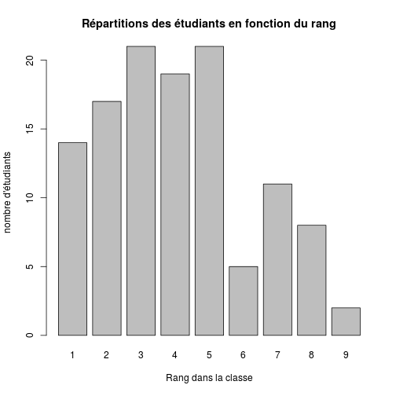
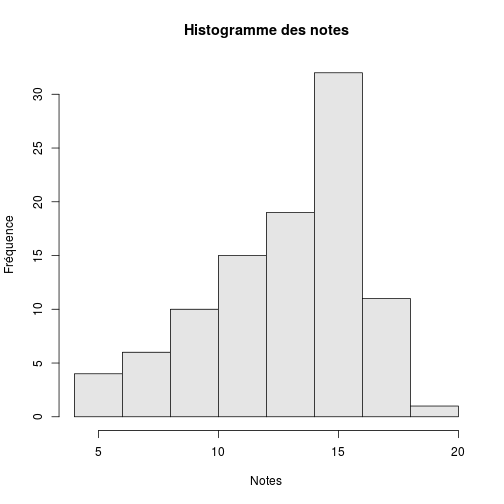
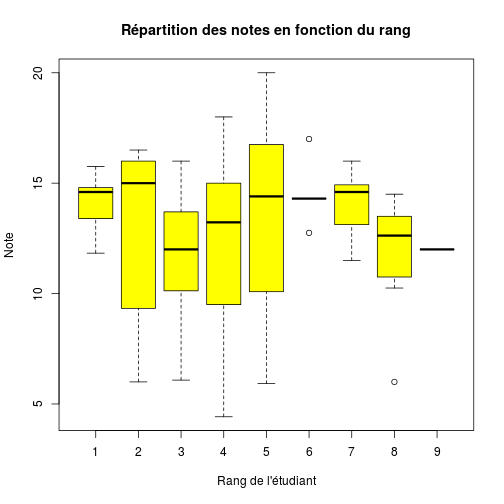

Tidy data
========================================================

- colonne NOTE: remplacer *absent* par NA
- colonne NOTE: remplacer la virgule par le point décimal


```r
load("~/Documents/CESU/UFFLER_2014/Uffler2014/data_motivation.Rda")
```


```r
source("../private.R")

d <- f
names(d)
```

```
##  [1] "NUMERO"    "ECOLE"     "PROMO"     "SEXE"      "ANNEE"    
##  [6] "QUEST.1"   "QUEST.2"   "QUEST.3"   "QUEST.4"   "QUEST.5"  
## [11] "QUEST.6"   "QUEST.7"   "QUEST.8"   "QUEST.9"   "QUEST.10" 
## [16] "QUEST.11"  "QUEST.12"  "QUEST.13"  "QUEST.14"  "QUEST.15" 
## [21] "QUEST.16"  "QUEST.17"  "QUEST.18"  "QUEST.19"  "QUEST.20" 
## [26] "QUEST.21"  "QUEST.22"  "QUEST.23"  "QUEST.24"  "QUEST.25" 
## [31] "QUEST.26"  "RANG"      "M.PLACE"   "AFFINITES" "HABITUDE" 
## [36] "PAS.BRUIT" "PRATIQUE"  "PLACE.RES" "CONCENTR"  "DECROCHE" 
## [41] "REDOUBLA"  "NOTE"
```

```r
summary(d)
```

```
##      NUMERO           ECOLE          PROMO    SEXE       ANNEE     
##  Min.   :  1.0   AUX PUER:39   2010/2014:24   F:95   Min.   :1961  
##  1st Qu.: 30.2   ETCADRE :16   2012/2014:22   M:23   1st Qu.:1979  
##  Median : 59.5   ET IADE :37   2013     :39          Median :1984  
##  Mean   : 59.5   ET IADE : 2   2013/2014:16          Mean   :1983  
##  3rd Qu.: 88.8   MAIEU   :24   2013/2015:17          3rd Qu.:1990  
##  Max.   :118.0                                       Max.   :1994  
##                                                                    
##     QUEST.1        QUEST.2        QUEST.3        QUEST.4    
##  Min.   :3.00   Min.   :2.00   Min.   :1.00   Min.   :1.00  
##  1st Qu.:6.00   1st Qu.:5.00   1st Qu.:4.25   1st Qu.:4.00  
##  Median :7.00   Median :6.00   Median :5.00   Median :5.00  
##  Mean   :6.53   Mean   :5.66   Mean   :5.26   Mean   :4.58  
##  3rd Qu.:7.00   3rd Qu.:7.00   3rd Qu.:6.00   3rd Qu.:5.00  
##  Max.   :7.00   Max.   :7.00   Max.   :7.00   Max.   :7.00  
##                                                             
##     QUEST.5        QUEST.6        QUEST.7        QUEST.8    
##  Min.   :1.00   Min.   :1.00   Min.   :1.00   Min.   :1.00  
##  1st Qu.:4.00   1st Qu.:4.00   1st Qu.:4.00   1st Qu.:5.00  
##  Median :5.00   Median :5.00   Median :6.00   Median :6.00  
##  Mean   :4.58   Mean   :4.61   Mean   :5.43   Mean   :5.48  
##  3rd Qu.:6.00   3rd Qu.:6.00   3rd Qu.:7.00   3rd Qu.:6.00  
##  Max.   :7.00   Max.   :7.00   Max.   :7.00   Max.   :7.00  
##                                                             
##     QUEST.9        QUEST.10       QUEST.11      QUEST.12       QUEST.13   
##  Min.   :1.00   Min.   :3.00   Min.   :1.0   Min.   :1.00   Min.   :3.00  
##  1st Qu.:4.00   1st Qu.:6.00   1st Qu.:2.0   1st Qu.:3.00   1st Qu.:5.00  
##  Median :5.00   Median :6.00   Median :4.0   Median :4.00   Median :6.00  
##  Mean   :4.82   Mean   :6.18   Mean   :3.9   Mean   :4.17   Mean   :6.06  
##  3rd Qu.:6.00   3rd Qu.:7.00   3rd Qu.:5.0   3rd Qu.:5.00   3rd Qu.:7.00  
##  Max.   :7.00   Max.   :7.00   Max.   :7.0   Max.   :7.00   Max.   :7.00  
##                                                                           
##     QUEST.14       QUEST.15       QUEST.16       QUEST.17   
##  Min.   :1.00   Min.   :1.00   Min.   :1.00   Min.   :1.00  
##  1st Qu.:4.00   1st Qu.:5.00   1st Qu.:4.00   1st Qu.:4.00  
##  Median :5.00   Median :6.00   Median :5.00   Median :5.00  
##  Mean   :4.82   Mean   :5.75   Mean   :4.61   Mean   :4.75  
##  3rd Qu.:6.00   3rd Qu.:7.00   3rd Qu.:5.00   3rd Qu.:6.00  
##  Max.   :7.00   Max.   :7.00   Max.   :7.00   Max.   :7.00  
##                                                             
##     QUEST.18       QUEST.19       QUEST.20       QUEST.21   
##  Min.   :2.00   Min.   :1.00   Min.   :1.00   Min.   :1.00  
##  1st Qu.:5.00   1st Qu.:5.00   1st Qu.:4.00   1st Qu.:3.00  
##  Median :6.00   Median :6.00   Median :5.00   Median :4.00  
##  Mean   :5.46   Mean   :5.51   Mean   :5.05   Mean   :3.89  
##  3rd Qu.:7.00   3rd Qu.:6.00   3rd Qu.:6.00   3rd Qu.:5.00  
##  Max.   :7.00   Max.   :7.00   Max.   :7.00   Max.   :7.00  
##  NA's   :1      NA's   :1      NA's   :1                    
##     QUEST.22       QUEST.23       QUEST.24       QUEST.25   
##  Min.   :1.00   Min.   :1.00   Min.   :1.00   Min.   :1.00  
##  1st Qu.:4.00   1st Qu.:5.00   1st Qu.:4.00   1st Qu.:3.00  
##  Median :5.00   Median :6.00   Median :5.00   Median :4.00  
##  Mean   :4.69   Mean   :5.47   Mean   :4.75   Mean   :4.14  
##  3rd Qu.:6.00   3rd Qu.:6.00   3rd Qu.:6.00   3rd Qu.:6.00  
##  Max.   :7.00   Max.   :7.00   Max.   :7.00   Max.   :7.00  
##                                                             
##     QUEST.26         RANG      M.PLACE AFFINITES HABITUDE PAS.BRUIT
##  Min.   :2.00   Min.   :1.00    : 2     :89       :90      :111    
##  1st Qu.:5.00   1st Qu.:2.00   N:29    O:29      O:28     O:  7    
##  Median :5.00   Median :4.00   O:87                                
##  Mean   :5.42   Mean   :4.08                                       
##  3rd Qu.:6.00   3rd Qu.:5.00                                       
##  Max.   :7.00   Max.   :9.00                                       
##                                                                    
##  PRATIQUE PLACE.RES CONCENTR DECROCHE REDOUBLA            NOTE      
##   :93      :103      :109     :115    Mode:logical   Min.   : 4.42  
##  O:25     O: 15     O:  9    O:  3    NA's:118       1st Qu.:11.75  
##                                                      Median :13.70  
##                                                      Mean   :12.95  
##                                                      3rd Qu.:15.07  
##                                                      Max.   :20.00  
##                                                      NA's   :20
```

```r
str(d)
```

```
## 'data.frame':	118 obs. of  42 variables:
##  $ NUMERO   : int  1 2 3 4 5 6 7 8 9 10 ...
##  $ ECOLE    : Factor w/ 5 levels "AUX PUER","ETCADRE",..: 5 5 5 5 5 5 5 5 5 5 ...
##  $ PROMO    : Factor w/ 5 levels "2010/2014","2012/2014",..: 1 1 1 1 1 1 1 1 1 1 ...
##  $ SEXE     : Factor w/ 2 levels "F","M": 1 1 1 1 1 1 1 1 1 1 ...
##  $ ANNEE    : int  1990 1990 1972 1990 1989 1990 1990 1990 1991 1990 ...
##  $ QUEST.1  : int  7 7 7 7 7 6 7 7 5 6 ...
##  $ QUEST.2  : int  6 6 6 6 4 5 4 5 6 6 ...
##  $ QUEST.3  : int  7 6 6 6 6 4 4 4 3 5 ...
##  $ QUEST.4  : int  5 4 7 5 1 3 2 5 3 4 ...
##  $ QUEST.5  : int  6 4 5 4 4 3 4 3 4 4 ...
##  $ QUEST.6  : int  7 7 2 5 4 4 4 3 6 4 ...
##  $ QUEST.7  : int  7 7 3 6 7 6 5 6 4 7 ...
##  $ QUEST.8  : int  7 7 7 6 7 5 6 3 5 4 ...
##  $ QUEST.9  : int  6 6 1 3 7 3 6 7 5 3 ...
##  $ QUEST.10 : int  7 6 7 6 6 5 5 3 4 5 ...
##  $ QUEST.11 : int  4 1 1 3 4 2 5 1 3 1 ...
##  $ QUEST.12 : int  5 4 5 2 1 3 2 2 4 4 ...
##  $ QUEST.13 : int  7 7 7 7 3 5 5 7 3 6 ...
##  $ QUEST.14 : int  7 5 4 4 3 4 4 3 3 4 ...
##  $ QUEST.15 : int  5 7 6 5 4 5 4 5 5 5 ...
##  $ QUEST.16 : int  4 5 6 4 1 3 2 3 2 4 ...
##  $ QUEST.17 : int  5 5 5 4 3 3 2 3 4 4 ...
##  $ QUEST.18 : int  7 5 7 5 3 5 4 4 5 4 ...
##  $ QUEST.19 : int  6 7 7 6 5 5 6 5 6 5 ...
##  $ QUEST.20 : int  6 4 6 3 6 4 5 7 4 4 ...
##  $ QUEST.21 : int  7 4 1 2 2 3 3 4 6 4 ...
##  $ QUEST.22 : int  7 5 4 3 2 3 3 3 4 3 ...
##  $ QUEST.23 : int  7 6 7 4 4 4 7 6 6 3 ...
##  $ QUEST.24 : int  5 2 7 4 2 3 3 3 5 4 ...
##  $ QUEST.25 : int  6 2 2 6 1 2 5 5 2 3 ...
##  $ QUEST.26 : int  6 6 7 6 6 5 4 5 5 5 ...
##  $ RANG     : int  1 1 2 2 2 2 3 3 3 3 ...
##  $ M.PLACE  : Factor w/ 3 levels "","N","O": 3 3 3 3 3 3 3 3 3 3 ...
##  $ AFFINITES: Factor w/ 2 levels "","O": 1 1 1 2 2 1 2 2 2 1 ...
##  $ HABITUDE : Factor w/ 2 levels "","O": 1 1 2 1 1 1 1 1 2 2 ...
##  $ PAS.BRUIT: Factor w/ 2 levels "","O": 1 1 1 1 1 1 1 1 1 1 ...
##  $ PRATIQUE : Factor w/ 2 levels "","O": 1 2 1 1 1 1 1 1 1 1 ...
##  $ PLACE.RES: Factor w/ 2 levels "","O": 1 1 1 1 1 1 1 1 1 1 ...
##  $ CONCENTR : Factor w/ 2 levels "","O": 2 1 1 1 1 1 2 1 1 1 ...
##  $ DECROCHE : Factor w/ 2 levels "","O": 1 1 1 1 1 1 1 1 1 1 ...
##  $ REDOUBLA : logi  NA NA NA NA NA NA ...
##  $ NOTE     : num  11.83 13.54 6.88 9.25 9.33 ...
```

```r
d$NOTE <- as.numeric(d$NOTE)
```
Etude du rang
-------------

```r
rang_nb <- tapply(d$NOTE, d$RANG, length) #nb étudiants par rang
barplot(rang_nb, ylab="nombre d'étudiants", xlab="Rang dans la classe", main = "Répartitions des étudiants en fonction du rang")
```

 


Etude de la note
----------------

```r
mean(d$NOTE, na.rm=TRUE)
```

```
## [1] 12.95
```

```r
sd(d$NOTE, na.rm=TRUE)
```

```
## [1] 3.255
```

```r
n.etudiants <- sum(!is.na(d$NOTE))
summary(d$NOTE) # nb de notes
```

```
##    Min. 1st Qu.  Median    Mean 3rd Qu.    Max.    NA's 
##    4.42   11.80   13.70   13.00   15.10   20.00      20
```

```r
tapply(d$NOTE, d$RANG, length)
```

```
##  1  2  3  4  5  6  7  8  9 
## 14 17 21 19 21  5 11  8  2
```

```r
tapply(d$NOTE, d$RANG, mean, na.rm=TRUE)
```

```
##     1     2     3     4     5     6     7     8     9 
## 14.08 13.09 12.03 12.54 13.26 14.53 14.12 11.78 12.00
```

```r
hist(d$NOTE, ylab="Fréquence", xlab="Notes", main="Histogramme des notes", col="gray90")
```

 

```r
boxplot(d$NOTE ~ d$RANG, ylab="Note", xlab="Rang de l'étudiant", main="Répartition des notes en fonction du rang", col="yellow")
```

 
Note moyenne par rang
---------------------

```r
mean_rang <- tapply(d$NOTE, d$RANG, mean, na.rm=TRUE)
mean_rang
```

```
##     1     2     3     4     5     6     7     8     9 
## 14.08 13.09 12.03 12.54 13.26 14.53 14.12 11.78 12.00
```

```r
barplot(mean_rang, main="Répartition des notes en fonction du rang", ylab="Note", xlab="Rang")
```

 

```r
boxplot(NOTE ~ RANG, data=d, main="Répartition des notes en fonction du rang", ylab="Note", xlab="Rang")
points( 1:9, mean_rang, col="red", pch=15)
legend("bottomleft", legend=c("moyenne","médiane"), col=c("red","black"), pch=15, lty=1, bty="n")
```

 

```r
f <- aov(d$NOTE ~ d$RANG)
f
```

```
## Call:
##    aov(formula = d$NOTE ~ d$RANG)
## 
## Terms:
##                 d$RANG Residuals
## Sum of Squares     0.1    1027.4
## Deg. of Freedom      1        96
## 
## Residual standard error: 3.271
## Estimated effects may be unbalanced
## 20 observations deleted due to missingness
```

```r
summary(f)
```

```
##             Df Sum Sq Mean Sq F value Pr(>F)
## d$RANG       1      0    0.13    0.01   0.91
## Residuals   96   1027   10.70               
## 20 observations deleted due to missingness
```

en fonction du sexe
-------------------

```r
summary(d$SEXE)
```

```
##  F  M 
## 95 23
```

```r
tapply(d$NOTE, d$SEXE, mean, na.rm=TRUE)
```

```
##     F     M 
## 12.66 14.11
```

```r
boxplot(d$NOTE ~ d$SEXE, ylab="Note", main="Répartition des notes en fonction du sexe", col="pink")
```

 

```r
note <- split(d$NOTE, d$SEXE)
t.test(note$F, note$M)
```

```
## 
## 	Welch Two Sample t-test
## 
## data:  note$F and note$M
## t = -1.69, df = 27.47, p-value = 0.1023
## alternative hypothesis: true difference in means is not equal to 0
## 95 percent confidence interval:
##  -3.2073  0.3086
## sample estimates:
## mean of x mean of y 
##     12.66     14.11
```

```r
f <- aov(d$NOTE ~ d$RANG)
f
```

```
## Call:
##    aov(formula = d$NOTE ~ d$RANG)
## 
## Terms:
##                 d$RANG Residuals
## Sum of Squares     0.1    1027.4
## Deg. of Freedom      1        96
## 
## Residual standard error: 3.271
## Estimated effects may be unbalanced
## 20 observations deleted due to missingness
```

```r
summary(f)
```

```
##             Df Sum Sq Mean Sq F value Pr(>F)
## d$RANG       1      0    0.13    0.01   0.91
## Residuals   96   1027   10.70               
## 20 observations deleted due to missingness
```

Corelation Note-Motivation
--------------------------

Récupération de la feuille de calcul sur _drive_ et sauvegarde dans le fichier __data_motivation.Rda__. Les données sont présentes en mémoire centrale sous le nom de __f__. On crée une colonne __motivation__ somme des questions 1 à 26. On dispose de 3 données:
- le score de motivation (quantitatif)
- la note (quantitatif)
- le rang occuppé (qualitatif)

```r
require(RCurl)
```

```
## Loading required package: RCurl
## Loading required package: bitops
```

```r
file <- "https://docs.google.com/spreadsheet/pub?key=0Aieb-IfcCNcXdExWbTlPSXNHRlFfRVpPcl80X2ZlNVE&output=csv"
f <- read.table(textConnection(getURL(file)), header=T, sep=",")
save(f, file="data_motivation.Rda")
write.table(f, file="data_motivation.csv", sep=",")
load("~/Documents/CESU/UFFLER_2014/Uffler2014/data_motivation.Rda")
```

```
## Error: argument inutilisé
## ("~/Documents/CESU/UFFLER_2014/Uffler2014/data_motivation.Rda")
```

```r
qs <- subset(f, select=c(QUEST.1:QUEST.26))
f$motivation <- rowSums(qs)
```

On peut calculer un coef.de corrélation entre 2 variables quantitatives non nulles. On forme un dataframe avec les variables _motivation_ et _note_. Puis on élimine les lignes contenant des NA avant de calculer un coef de corrélation:

```r
c <- f[,c("NOTE", "motivation")]
g <- c[complete.cases(c),]
cor(g$NOTE, g$motivation)
```

```
## [1] 0.09197
```

```r
plot(g$NOTE, g$motivation, main="Note versus Motivation", xlab="NOTE", ylab="MOTIVATION", col="blue", pch=10)
```

 
CCL: pas de corrélation entre NOTE et MOTIVATION.

Essai de modélisation
---------------------


```r
mod <- aov(f$NOTE ~ f$RANG)
mod
```

```
## Call:
##    aov(formula = f$NOTE ~ f$RANG)
## 
## Terms:
##                 f$RANG Residuals
## Sum of Squares     0.1    1027.4
## Deg. of Freedom      1        96
## 
## Residual standard error: 3.271
## Estimated effects may be unbalanced
## 20 observations deleted due to missingness
```

```r
summary(mod)
```

```
##             Df Sum Sq Mean Sq F value Pr(>F)
## f$RANG       1      0    0.13    0.01   0.91
## Residuals   96   1027   10.70               
## 20 observations deleted due to missingness
```

```r
mod <- aov(f$NOTE ~ f$RANG + f$motivation)
mod
```

```
## Call:
##    aov(formula = f$NOTE ~ f$RANG + f$motivation)
## 
## Terms:
##                 f$RANG f$motivation Residuals
## Sum of Squares       0            9      1016
## Deg. of Freedom      1            1        94
## 
## Residual standard error: 3.287
## Estimated effects may be unbalanced
## 21 observations deleted due to missingness
```

```r
summary(mod)
```

```
##              Df Sum Sq Mean Sq F value Pr(>F)
## f$RANG        1      0    0.02    0.00   0.97
## f$motivation  1      9    9.01    0.83   0.36
## Residuals    94   1016   10.81               
## 21 observations deleted due to missingness
```

```r
mod <- aov(f$NOTE ~ f$RANG * f$motivation)
summary(mod)
```

```
##                     Df Sum Sq Mean Sq F value Pr(>F)
## f$RANG               1      0    0.02    0.00   0.97
## f$motivation         1      9    9.01    0.84   0.36
## f$RANG:f$motivation  1     19   19.22    1.79   0.18
## Residuals           93    997   10.72               
## 21 observations deleted due to missingness
```

```r
mod <- aov(motivation ~ RANG, data=f)
summary(mod)
```

```
##              Df Sum Sq Mean Sq F value Pr(>F)  
## RANG          1   1455    1455    4.14  0.044 *
## Residuals   115  40383     351                 
## ---
## Signif. codes:  0 '***' 0.001 '**' 0.01 '*' 0.05 '.' 0.1 ' ' 1
## 1 observation deleted due to missingness
```

```r
y <- cut(f$motivation, quantile(f$motivation, na.rm=T))
mod <- aov(f$NOTE ~ f$RANG * y)
summary(mod)
```

```
##             Df Sum Sq Mean Sq F value Pr(>F)
## f$RANG       1      0    0.03    0.00   0.96
## y            3     29    9.77    0.90   0.45
## f$RANG:y     3     33   11.04    1.01   0.39
## Residuals   88    958   10.88               
## 22 observations deleted due to missingness
```

```r
mod <- aov(f$NOTE ~ y)
summary(mod)
```

```
##             Df Sum Sq Mean Sq F value Pr(>F)
## y            3     28    9.21    0.85   0.47
## Residuals   92    992   10.79               
## 22 observations deleted due to missingness
```

```r
mod <- aov(motivation ~ RANG, data=f)
summary(mod)
```

```
##              Df Sum Sq Mean Sq F value Pr(>F)  
## RANG          1   1455    1455    4.14  0.044 *
## Residuals   115  40383     351                 
## ---
## Signif. codes:  0 '***' 0.001 '**' 0.01 '*' 0.05 '.' 0.1 ' ' 1
## 1 observation deleted due to missingness
```

```r
mod <- aov(NOTE ~ RANG, data=f)
summary(mod)
```

```
##             Df Sum Sq Mean Sq F value Pr(>F)
## RANG         1      0    0.13    0.01   0.91
## Residuals   96   1027   10.70               
## 20 observations deleted due to missingness
```

```r
mod <- aov(NOTE ~ motivation, data=f)
summary(mod)
```

```
##             Df Sum Sq Mean Sq F value Pr(>F)
## motivation   1      9    8.67    0.81   0.37
## Residuals   95   1016   10.70               
## 21 observations deleted due to missingness
```
Il y a une relation significative entre la motivation et le rang.
