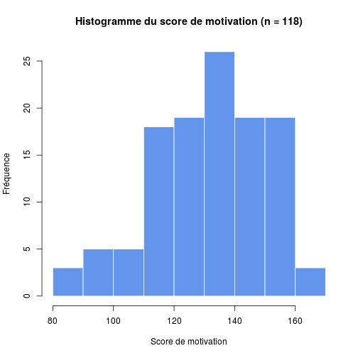
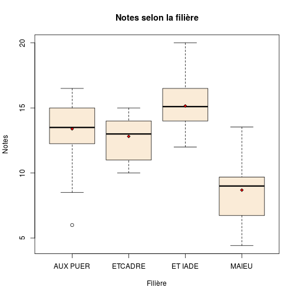
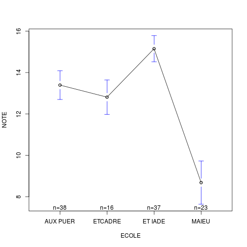
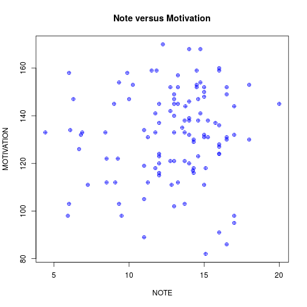

calculs
========================================================

2014-04-03

serait il possible d'analyser d'ores et déjà la corrélation entre motivation et RANG concernant cet échantillon là ?
---------------------------------------------------------------------------------------------------------------------

#### Lecture du fichier des données dans Drive
```
require(RCurl)
file <- "https://docs.google.com/spreadsheet/pub?key=0Aieb-IfcCNcXdExWbTlPSXNHRlFfRVpPcl80X2ZlNVE&output=csv"
f <- read.table(textConnection(getURL(file)), header=T, sep=",")
save(f, file="data_motivation.Rda")
write.table(f, file="data_motivation.csv", sep=",")
```


```r
load("~/Documents/CESU/UFFLER_2014/Uffler2014/data_motivation.Rda")
```

- **qs** est une matrice formée des 26 questions.  
- on forme une colonne **motivation** qui est la somme des 26 questions posées:


```
##    Min. 1st Qu.  Median    Mean 3rd Qu.    Max.    NA's 
##      82     120     133     132     147     170       1
```
La moyenne et la médiane so nt proches ce qui permet de considérer (avec l'aspet de l'histogramme) que les données sont sensiblement normales.

Il y a __118 observations__.

On a 3 variables:
  - **motivation** est une variable quantitative
  - **RANG** est une variable qualitative
  - **NOTE** est une variable quantitative

Etude du rang
--------------


```
rang
 1  2  3  4  5  6  7  8  9 
14 17 21 19 21  5 11  8  2 
```

```
[1] " les rangs 6, 8 et 9 ont moins de 10 étudiants (regrouper ?"
```

 

```
[1] "Les points sont très dispersés indiquant une corrélation faible ou nulle entre le rang et la motivation."
```

 

```
             Df Sum Sq Mean Sq F value Pr(>F)   
rang          8   7730     966    3.06 0.0038 **
Residuals   108  34108     316                  
---
Signif. codes:  0 '***' 0.001 '**' 0.01 '*' 0.05 '.' 0.1 ' ' 1
1 observation deleted due to missingness
```

```
[1] "L'analyse de la variance motivation en fonction du rang indique qu'au moins pour un rang, la motivation est différente de celle des autres rangs"
```

  

```
  Tukey multiple comparisons of means
    95% family-wise confidence level

Fit: aov(formula = motivation ~ rang, data = f)

$rang
         diff     lwr    upr  p adj
2-1 -22.91597 -43.219 -2.613 0.0149
3-1 -16.57143 -35.982  2.839 0.1593
4-1 -12.85714 -32.672  6.958 0.5099
5-1 -12.80952 -32.220  6.601 0.4862
6-1  -8.65714 -37.966 20.652 0.9904
7-1  -1.45714 -24.750 21.835 1.0000
8-1   4.14286 -20.790 29.076 0.9998
9-1  -5.35714 -47.883 37.169 1.0000
3-2   6.34454 -12.010 24.699 0.9739
4-2  10.05882  -8.722 28.840 0.7480
5-2  10.10644  -8.248 28.461 0.7186
6-2  14.25882 -14.362 42.879 0.8150
7-2  21.45882  -0.961 43.879 0.0720
8-2  27.05882   2.939 51.179 0.0160
9-2  17.55882 -24.496 59.613 0.9227
4-3   3.71429 -14.098 21.527 0.9991
5-3   3.76190 -13.599 21.123 0.9989
6-3   7.91429 -20.080 35.908 0.9928
7-3  15.11429  -6.500 36.729 0.4045
8-3  20.71429  -2.659 44.088 0.1258
9-3  11.21429 -30.416 52.845 0.9948
5-4   0.04762 -17.765 17.860 1.0000
6-4   4.20000 -24.076 32.476 0.9999
7-4  11.40000 -10.578 33.378 0.7794
8-4  17.00000  -6.710 40.710 0.3697
9-4   7.50000 -34.321 49.321 0.9997
6-5   4.15238 -23.842 32.147 0.9999
7-5  11.35238 -10.262 32.967 0.7675
8-5  16.95238  -6.421 40.326 0.3538
9-5   7.45238 -34.178 49.083 0.9997
7-6   7.20000 -23.613 38.013 0.9981
8-6  12.80000 -19.271 44.871 0.9396
9-6   3.30000 -43.768 50.368 1.0000
8-7   5.60000 -21.085 32.285 0.9991
9-7  -3.90000 -47.476 39.676 1.0000
9-8  -9.50000 -53.975 34.975 0.9990
```

```
[1] "rang 2-1 p =  0.015"
[1] "rang 8-2 p =  0.016"
```

```
[1] "Le test de Tukey montre qu'il existe une différence significative de motivation entre les rangs 1-2 et 2-8."
```

 
#### Conclusion
- il existe un effet **rang** significatif (p = 0.0038)
- le premier rang est très motivé. La motivation s'effondre au deuxime rang (score le plus mauvais) puis s'améliore progressivement juqu'à culminer à l'avant-dernier reng où le score et supérieur à celui du premier rang.
- le dernier rang a un effctif trop faible pour être pris en compte.


Résultats selon la filière
==========================

Il faut corriger ECOLE car un niveau est mal orthographié:

```r
summary(ECOLE)
```

```
## AUX PUER  ETCADRE  ET IADE ET IADE     MAIEU 
##       39       16       37        2       24
```

```r
ECOLE[as.character(ECOLE)=="ET IADE "]<-"ET IADE"
ECOLE <- factor(ECOLE)
summary(ECOLE)
```

```
## AUX PUER  ETCADRE  ET IADE    MAIEU 
##       39       16       39       24
```

```r
barplot(table(ECOLE), ylab="Effectif", main="Répartition des étudiants selon la filière")
```

 

Motivation selon la filière
----------------------------


```r
means <- tapply(motivation, ECOLE, mean, na.rm=TRUE)
means
```

```
AUX PUER  ETCADRE  ET IADE    MAIEU 
   142.7    128.1    126.0    126.0 
```

```r
boxplot(motivation~ECOLE, ylab="Motivation", xlab="Filière", main="Motivation selon la filière", col="antiquewhite")
points(1:4, means, pch = 23, cex = 0.75, bg = "red")
```

 

```r
mod <- aov(motivation ~ ECOLE)
summary(mod)
```

```
             Df Sum Sq Mean Sq F value  Pr(>F)    
ECOLE         3   6984    2328    7.55 0.00012 ***
Residuals   113  34854     308                    
---
Signif. codes:  0 '***' 0.001 '**' 0.01 '*' 0.05 '.' 0.1 ' ' 1
1 observation deleted due to missingness
```

```r
TukeyHSD(mod)
```

```
  Tukey multiple comparisons of means
    95% family-wise confidence level

Fit: aov(formula = motivation ~ ECOLE)

$ECOLE
                      diff    lwr    upr  p adj
ETCADRE-AUX PUER -14.61859 -28.22 -1.022 0.0299
ET IADE-AUX PUER -16.74359 -27.18 -6.304 0.0003
MAIEU-AUX PUER   -16.78526 -28.67 -4.904 0.0020
ET IADE-ETCADRE   -2.12500 -15.77 11.524 0.9773
MAIEU-ETCADRE     -2.16667 -16.95 12.614 0.9809
MAIEU-ET IADE     -0.04167 -11.98 11.899 1.0000
```

Notes
-----


```r
means.note <- tapply(NOTE, ECOLE, mean, na.rm=TRUE)
tapply(NOTE, ECOLE, mean, na.rm=TRUE)
```

```
AUX PUER  ETCADRE  ET IADE    MAIEU 
  13.395   12.812   15.151    8.687 
```

```r
boxplot(NOTE ~ ECOLE, ylab="Notes", xlab="Filière", main="Notes selon la filière", col="antiquewhite")
points(1:4, means.note, pch = 23, cex = 0.75, bg = "red")
```

 

```r
mod <- aov(NOTE~ECOLE)
summary(mod)
```

```
             Df Sum Sq Mean Sq F value Pr(>F)    
ECOLE         3    605   201.7    48.3 <2e-16 ***
Residuals   110    459     4.2                   
---
Signif. codes:  0 '***' 0.001 '**' 0.01 '*' 0.05 '.' 0.1 ' ' 1
4 observations deleted due to missingness
```

```r
TukeyHSD(mod)
```

```
  Tukey multiple comparisons of means
    95% family-wise confidence level

Fit: aov(formula = NOTE ~ ECOLE)

$ECOLE
                    diff     lwr    upr  p adj
ETCADRE-AUX PUER -0.5822 -2.1705  1.006 0.7744
ET IADE-AUX PUER  1.7566  0.5258  2.987 0.0018
MAIEU-AUX PUER   -4.7082 -6.1161 -3.300 0.0000
ET IADE-ETCADRE   2.3389  0.7443  3.933 0.0012
MAIEU-ETCADRE    -4.1260 -5.8609 -2.391 0.0000
MAIEU-ET IADE    -6.4648 -7.8799 -5.050 0.0000
```

```r
plotmeans(NOTE ~ ECOLE)
```

 
Il existe une différence significative entre tous les groupes. Les IADE en moyenne de meilleures notes que les Auxiliaires de puéricultures qui sont meilleures que les sage-femmes.


Rang et note
---------------------

```
    1     2     3     4     5     6     7     8     9 
13.55 12.84 12.02 12.56 13.41 14.53 14.12 11.78 12.00 
```

  

```
Call:
   aov(formula = f$NOTE ~ f$RANG)

Terms:
                f$RANG Residuals
Sum of Squares     1.1    1063.1
Deg. of Freedom      1       112

Residual standard error: 3.081
Estimated effects may be unbalanced
4 observations deleted due to missingness
```

```
             Df Sum Sq Mean Sq F value Pr(>F)
f$RANG        1      1    1.12    0.12   0.73
Residuals   112   1063    9.49               
4 observations deleted due to missingness
```
__Conclusions__: Pas de corréltion entre le rang et la note.

Motivation et note
------------------

On peut calculer un coef.de corrélation entre 2 variables quantitatives non nulles. On forme un dataframe avec les variables _motivation_ et _note_. Puis on élimine les lignes contenant des NA avant de calculer un coef de corrélation:
 

__CCL__: pas de corrélation entre NOTE et MOTIVATION (coef. de corrélation 0.0991).

