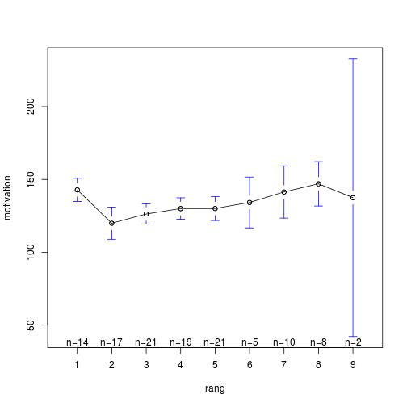

calculs
========================================================

2014-04-03

serait il possible d'analyser d'ores et déjà la corrélation entre motivation et RANG concernant cet échantillon là ?
---------------------------------------------------------------------------------------------------------------------

#### Lecture du fichier des données dans Drive

require(RCurl)
file <- "https://docs.google.com/spreadsheet/pub?key=0Aieb-IfcCNcXdExWbTlPSXNHRlFfRVpPcl80X2ZlNVE&output=csv"
f <- read.table(textConnection(getURL(file)), header=T, sep=",")
save(f, file="data_motivation.Rda")


```r
load("~/Documents/CESU/UFFLER_2014/Uffler2014/data_motivation.Rda")
```


- **qs** est une matrice formée des 26 questions.  
- on forme une colonne **motivation** qui est la somme des 26 questions posées:


```r
qs <- subset(f, select = c(QUEST.1:QUEST.26))
f$motivation <- rowSums(qs)
attach(f)
```


On a 2 variables:
  - **motivation** est une variable quantitative
  - **RANG** est une variable qualitative


```r
rang <- as.factor(RANG)
n <- nrow(f)

# nombre d'étudiants par rang:
summary(rang)
```

```
##  1  2  3  4  5  6  7  8  9 
## 14 17 21 19 21  5 11  8  2
```

```r

# scatterplot
stripchart(motivation ~ rang, method = "stack", col = "blue", ylab = "Rang")
```

 

```r

# histogramme du score de motivation
hist(motivation, xlab = "Score de motivation", ylab = "Fréquence", main = paste0("Histogramme du score de motivation (n = ", 
    n, ")"))
```

 

```r

# score de motivation en fonction du rang
boxplot(motivation ~ rang, xlab = "Rang occupé dans la salle", ylab = "Score de motivation", 
    col = "antiquewhite")
means <- tapply(motivation, rang, mean, na.rm = TRUE)
points(1:9, means, pch = 23, cex = 0.75, bg = "red")
text(1:9, means + 10, labels = formatC(means, format = "f", digits = 1), pos = 1, 
    cex = 0.9, col = "blue")
legend(7, 90, legend = c("score moyen"), col = c("red"), pch = 23)

# Analyse de la variance
r <- aov(motivation ~ rang, data = f)
s <- summary(r)
s
```

```
##              Df Sum Sq Mean Sq F value Pr(>F)   
## rang          8   7730     966    3.06 0.0038 **
## Residuals   108  34108     316                  
## ---
## Signif. codes:  0 '***' 0.001 '**' 0.01 '*' 0.05 '.' 0.1 ' ' 1
## 1 observation deleted due to missingness
```

```r

p <- simplify2array(s[[1]]["Pr(>F)"])  # siginificativité de l'Anova

library(gplots)
```

```
## Loading required package: gtools
## Loading required package: gdata
## gdata: read.xls support for 'XLS' (Excel 97-2004) files ENABLED.
## 
## gdata: read.xls support for 'XLSX' (Excel 2007+) files ENABLED.
## 
## Attaching package: 'gdata'
## 
## L'objet suivant est masqué from 'package:stats':
## 
##     nobs
## 
## L'objet suivant est masqué from 'package:utils':
## 
##     object.size
## 
## Loading required package: caTools
## Loading required package: grid
## Loading required package: KernSmooth
## KernSmooth 2.23 loaded
## Copyright M. P. Wand 1997-2009
## Loading required package: MASS
## 
## Attaching package: 'gplots'
## 
## L'objet suivant est masqué from 'package:stats':
## 
##     lowess
```

 

```r
plotmeans(motivation ~ rang)
```

 

```r

TukeyHSD(r)
```

```
##   Tukey multiple comparisons of means
##     95% family-wise confidence level
## 
## Fit: aov(formula = motivation ~ rang, data = f)
## 
## $rang
##          diff     lwr    upr  p adj
## 2-1 -22.91597 -43.219 -2.613 0.0149
## 3-1 -16.57143 -35.982  2.839 0.1593
## 4-1 -12.85714 -32.672  6.958 0.5099
## 5-1 -12.80952 -32.220  6.601 0.4862
## 6-1  -8.65714 -37.966 20.652 0.9904
## 7-1  -1.45714 -24.750 21.835 1.0000
## 8-1   4.14286 -20.790 29.076 0.9998
## 9-1  -5.35714 -47.883 37.169 1.0000
## 3-2   6.34454 -12.010 24.699 0.9739
## 4-2  10.05882  -8.722 28.840 0.7480
## 5-2  10.10644  -8.248 28.461 0.7186
## 6-2  14.25882 -14.362 42.879 0.8150
## 7-2  21.45882  -0.961 43.879 0.0720
## 8-2  27.05882   2.939 51.179 0.0160
## 9-2  17.55882 -24.496 59.613 0.9227
## 4-3   3.71429 -14.098 21.527 0.9991
## 5-3   3.76190 -13.599 21.123 0.9989
## 6-3   7.91429 -20.080 35.908 0.9928
## 7-3  15.11429  -6.500 36.729 0.4045
## 8-3  20.71429  -2.659 44.088 0.1258
## 9-3  11.21429 -30.416 52.845 0.9948
## 5-4   0.04762 -17.765 17.860 1.0000
## 6-4   4.20000 -24.076 32.476 0.9999
## 7-4  11.40000 -10.578 33.378 0.7794
## 8-4  17.00000  -6.710 40.710 0.3697
## 9-4   7.50000 -34.321 49.321 0.9997
## 6-5   4.15238 -23.842 32.147 0.9999
## 7-5  11.35238 -10.262 32.967 0.7675
## 8-5  16.95238  -6.421 40.326 0.3538
## 9-5   7.45238 -34.178 49.083 0.9997
## 7-6   7.20000 -23.613 38.013 0.9981
## 8-6  12.80000 -19.271 44.871 0.9396
## 9-6   3.30000 -43.768 50.368 1.0000
## 8-7   5.60000 -21.085 32.285 0.9991
## 9-7  -3.90000 -47.476 39.676 1.0000
## 9-8  -9.50000 -53.975 34.975 0.9990
```

```r
par(las = 2)
plot(TukeyHSD(r))
```

 

#### Conclusion
- il existe un effet **rang** significatif (p = 0.0038)
- le premier rang est très motivé. La motivation s'effondre au deuxime rang (score le plus mauvais) puis s'améliore progressivement juqu'à culminer à l'avant-dernier reng où le score et supérieur à celui du premier rang.
- le dernier rang a un effctif trop faible pour être pris en compte.


Résultats selon la filière
==========================

Il faut corriger ECOLE car un niveau est mal orthographié:

```r
summary(ECOLE)
```

```
## AUX PUER  ETCADRE  ET IADE ET IADE     MAIEU 
##       39       16       37        2       24
```

```r
ECOLE[as.character(ECOLE) == "ET IADE "] <- "ET IADE"
ECOLE <- factor(ECOLE)
summary(ECOLE)
```

```
## AUX PUER  ETCADRE  ET IADE    MAIEU 
##       39       16       39       24
```

```r
barplot(table(ECOLE))
```

 


Motivation selon la filière
----------------------------


```r
means <- tapply(motivation, ECOLE, mean, na.rm = TRUE)
means
```

```
## AUX PUER  ETCADRE  ET IADE    MAIEU 
##    142.7    128.1    126.0    126.0
```

```r
boxplot(motivation ~ ECOLE, ylab = "Motivation", xlab = "Filière", main = "Motivation selon la filière", 
    col = "antiquewhite")
points(1:4, means, pch = 23, cex = 0.75, bg = "red")
```

 


Notes
-----


```r
tapply(NOTE, ECOLE, mean, na.rm = TRUE)
```

```
## AUX PUER  ETCADRE  ET IADE    MAIEU 
##   13.395      NaN      NaN    8.687
```


